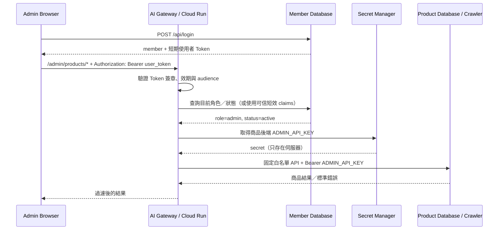

# Decorate Me Admin 商品管理安全 Proxy 三方對接規格書

文件日期：2026-07-18  
適用系統：Firebase Web Admin、AI Gateway（Cloud Run）、會員資料庫、商品／爬蟲資料庫  
目的：讓管理員只需正常登入，不再於公開前端輸入或保存長期 `ADMIN_API_KEY`。

---

## 1. 問題背景

商品後端新版管理 API 要求：

```http
Authorization: Bearer <ADMIN_API_KEY>
```

若把長期金鑰寫入 Firebase 前端的 JavaScript、設定檔或環境 bundle，任何訪客都能透過瀏覽器開發者工具取得金鑰。即使只放在 `sessionStorage`，仍會受到前端 XSS、共用電腦及操作失誤影響。

正式版必須把長期金鑰保留在可信伺服器，瀏覽器只持有登入後取得、短效且可撤銷的使用者 Token。

目前過渡版前端允許管理員在本次分頁輸入 `ADMIN_API_KEY`，但這只供新版後端串接驗收；安全 Proxy 上線後必須移除該欄位。

---

## 2. 目標架構



核心原則：

1. 瀏覽器永遠不取得商品後端長期金鑰。
2. Gateway 不接受任意目標 URL，只代理固定白名單路徑。
3. Gateway 必須確認呼叫者目前仍為 `role=admin` 且 `status=active`。
4. 商品後端仍需自行驗證 `ADMIN_API_KEY`，不能只相信 Gateway。
5. 商品新增、修改、停用必須留下真正管理員 email 的 audit log。

---

## 3. 三種憑證的界線

| 憑證 | 持有端 | 期限 | 用途 |
|---|---|---:|---|
| 會員登入 Token | 瀏覽器 | 建議 1～2 小時 | 證明目前登入者身分 |
| Cloud Run Service Identity | Gateway | Google 管理 | Gateway 呼叫私有 Cloud Run |
| `ADMIN_API_KEY` | Secret Manager + Gateway | 長期、可輪替 | Gateway 呼叫商品 Admin API |

禁止事項：

- 不可把 `ADMIN_API_KEY` 寫入 `config.local.js`。
- 不可放入 Firebase Hosting、GitHub、MD、截圖或公開聊天。
- 不可讓前端把 email 或 `role: admin` 放進 body 就視為可信。
- 不可把使用者 Token 原樣轉送成商品後端的 Admin Key。

---

## 4. Gateway 對前端公開的路徑

建議 Gateway 使用 `/admin` namespace，避免與公開商品 API 混淆。

| Method | Gateway 路徑 | 商品後端上游 | 權限 |
|---|---|---|---|
| GET | `/admin/products` | `GET /api/products` | admin |
| GET | `/admin/products/{product_id}` | `GET /api/products/{product_id}` | admin |
| POST | `/admin/products` | `POST /api/products` | admin |
| PATCH | `/admin/products/{product_id}` | `PATCH /api/products/{product_id}` | admin |
| DELETE | `/admin/products/{product_id}` | `DELETE /api/products/{product_id}` | admin |
| POST | `/admin/crawler/product-preview` | `POST /api/crawler/product-preview` | admin |
| POST | `/admin/crawler/search-preview` | `POST /api/crawler/search-preview` | admin |
| GET | `/admin/product-audit-logs` | `GET /api/admin/product-audit-logs` | admin |

若一般商品列表需要提供給未登入使用者，可繼續由前端直接呼叫公開 `GET /api/products`；只有管理寫入與敏感稽核資料必須走 Gateway。

商品 ID 為字串，例如 `foundations:1466`。Gateway 與前端必須使用 URL encode，不得轉成整數。

---

## 5. 前端請求格式

```http
PATCH /admin/products/foundations%3A1466
Authorization: Bearer <short_lived_user_token>
If-Match: 3
Content-Type: application/json
```

```json
{
  "price": 1280,
  "status": "active",
  "reviewStatus": "approved",
  "inStock": true
}
```

前端不得傳入：

- `ADMIN_API_KEY`
- `adminRole`
- 可由前端偽造並當成權限依據的 `adminEmail`

Gateway 應從驗證後的 Token／會員查詢結果取得操作者 email，並以受控 header 傳給商品後端，例如：

```http
X-Admin-Actor: admin@example.com
```

商品後端只能信任來自 Gateway 的此 header；若商品後端仍公開在 Internet，還需用第二層服務驗證或共享簽章，避免外部直接偽造 header。

---

## 6. Gateway 驗證流程

每一個 `/admin/*` 請求依序執行：

1. 檢查 `Authorization` 是否為 Bearer Token。
2. 驗證簽章、到期時間、issuer、audience。
3. 取得 Token 對應的 email／member id。
4. 向會員資料庫確認最新 `role` 與 `status`，或使用非常短效且可撤銷的可信 claims。
5. 僅 `role=admin` 且 `status=active` 放行。
6. 依白名單組成固定上游 URL。
7. 從環境變數／Secret Manager 取得 `ADMIN_API_KEY`。
8. 移除瀏覽器傳來的 `Authorization`、`X-Admin-Key`、`X-Admin-Actor`。
9. 重新建立上游 headers。
10. 限制 body 大小、Content-Type、HTTP method 與逾時。
11. 將上游錯誤過濾後回傳，不洩漏金鑰、SQL、內部檔案路徑或 stack trace。

權限錯誤：

| 狀況 | HTTP | code |
|---|---:|---|
| 沒有／無效使用者 Token | 401 | `MEMBER_AUTH_INVALID` |
| 已登入但不是 admin | 403 | `ADMIN_REQUIRED` |
| admin 已停權 | 403 | `ADMIN_SUSPENDED` |
| Gateway 未設定上游金鑰 | 503 | `ADMIN_PROXY_NOT_CONFIGURED` |

---

## 7. Gateway 白名單與 SSRF 防護

禁止實作：

```text
/proxy?url=https://任意網址
```

必須由程式固定映射：

```python
ALLOWED_ADMIN_ROUTES = {
    ("GET", "/admin/products"): ("GET", "/api/products"),
    ("POST", "/admin/products"): ("POST", "/api/products"),
    ("POST", "/admin/crawler/product-preview"): ("POST", "/api/crawler/product-preview"),
    ("POST", "/admin/crawler/search-preview"): ("POST", "/api/crawler/search-preview"),
    ("GET", "/admin/product-audit-logs"): ("GET", "/api/admin/product-audit-logs"),
}
```

動態 `{product_id}` 只能當單一路徑片段，需 encode 後拼接；拒絕 `/`、`..`、控制字元與超長 ID。

---

## 8. Header 轉送規則

允許從前端轉送到商品後端：

- `Content-Type: application/json`
- `If-Match`
- 必要的 `Accept`

Gateway 自行產生：

- `Authorization: Bearer <ADMIN_API_KEY>`
- `X-Admin-Actor: <verified email>`
- `X-Request-ID: <uuid>`

禁止轉送：

- 前端原始 `Authorization`
- 前端提供的 `X-Admin-Key`
- `Cookie`
- `X-Admin-Actor`
- `Host`
- 任意 `X-Forwarded-*`

---

## 9. Secret Manager 設定

建議 secret 名稱：

```text
product-admin-api-key
```

建立 secret（由有權限的人執行；金鑰不要出現在終端歷史紀錄）：

```powershell
gcloud secrets create product-admin-api-key --replication-policy=automatic --project=decorate-me
```

將值新增為 secret version 時，應使用安全輸入方式，不要把真實值直接寫進指令範例、Git 或聊天。

Gateway 專用服務帳號只取得：

```text
roles/secretmanager.secretAccessor
```

且權限只綁定 `product-admin-api-key`，不要給整個專案所有 secrets 的讀取權。

Cloud Run 環境變數建議：

```text
PRODUCT_DATABASE_URL=https://正式固定商品後端網址
PRODUCT_ADMIN_API_KEY=<Secret Manager reference>
ADMIN_PROXY_TIMEOUT_SECONDS=15
ADMIN_PROXY_MAX_BODY_BYTES=1048576
```

不要長期使用會在重啟後改變的 Quick Tunnel 作為正式 `PRODUCT_DATABASE_URL`；至少使用 Named Tunnel／固定網域，或直接部署商品服務至 Cloud Run。

---

## 10. 商品後端要求

商品後端必須：

1. 所有管理 API 驗證 `Authorization: Bearer ADMIN_API_KEY`。
2. 使用常數時間比較金鑰。
3. 不把金鑰寫入 access log／error log。
4. `PATCH` 強制處理 `If-Match`。
5. 版本衝突回 `409 VERSION_CONFLICT`。
6. 重複商品回 `409 PRODUCT_ALREADY_EXISTS`。
7. DELETE 採 soft delete，將商品改為 inactive 並取消推薦資格。
8. Audit Log 保存 request id、操作者、時間、商品 ID、before／after。
9. 上游錯誤採標準 `detail.error` 格式。
10. CORS 可只允許 Gateway；瀏覽器不再需要直接呼叫敏感 Admin API。

建議商品後端增加 Gateway-to-backend 第二層驗證：

- 最佳：商品服務部署為 private Cloud Run，只允許 Gateway service account invoke。
- 次佳：Named Tunnel + Access Service Token。
- 過渡：`ADMIN_API_KEY` + 嚴格 rate limit + 固定來源防護。

---

## 11. 錯誤格式

Gateway 應盡量保留商品後端的業務錯誤：

```json
{
  "detail": {
    "ok": false,
    "error": {
      "code": "VERSION_CONFLICT",
      "message": "Product version conflict",
      "retryable": false,
      "details": { "currentVersion": 4 },
      "requestId": "..."
    }
  }
}
```

Gateway 自身連線錯誤：

| HTTP | code | retryable |
|---:|---|---|
| 502 | `PRODUCT_UPSTREAM_BAD_RESPONSE` | true |
| 503 | `PRODUCT_SERVICE_UNAVAILABLE` | true |
| 504 | `PRODUCT_UPSTREAM_TIMEOUT` | true |
| 413 | `REQUEST_TOO_LARGE` | false |

前端只在 `retryable=true` 時提供手動重試，不做無限自動重試。

---

## 12. 前端改造項目

Proxy 上線後：

1. 移除「本次工作階段 Admin API Key」輸入欄位。
2. 商品管理 base URL 改為 AI Gateway。
3. 使用登入後的短期會員 Token：

```http
Authorization: Bearer <member_access_token>
```

4. CRUD、爬蟲預覽、搜尋引導、Audit Log 全部改打 `/admin/*`。
5. 公開商品列表可選擇維持直連，或一併經 Gateway。
6. 401 時清除登入狀態並要求重新登入。
7. 403 顯示「此帳號沒有管理員權限」，不要當成 Token 過期。
8. 409 `VERSION_CONFLICT` 重新讀取單筆商品後提示管理員。
9. 不在 localStorage／sessionStorage 保存 `ADMIN_API_KEY`。

---

## 13. Audit Log 欄位建議

```json
{
  "id": "audit_uuid",
  "requestId": "gateway_request_uuid",
  "action": "update",
  "productId": "lipsticks:933",
  "actorEmail": "admin@example.com",
  "actorMemberId": "member_uuid",
  "beforeData": {},
  "afterData": {},
  "createdAt": "2026-07-18T10:00:00Z",
  "source": "ai-gateway"
}
```

Audit Log 不得記錄：

- `ADMIN_API_KEY`
- 使用者完整 Bearer Token
- 密碼、Cookie、OTP
- 不必要的會員個資

---

## 14. Rate Limit 與逾時

建議每位管理員：

| 功能 | 限制建議 |
|---|---:|
| 商品搜尋／列表 | 120 次／分鐘 |
| 新增、修改、停用 | 30 次／分鐘 |
| URL 預覽 | 10 次／分鐘 |
| Google 搜尋引導 | 30 次／分鐘 |
| Audit Log | 30 次／分鐘 |

逾時建議：

- 商品 CRUD：15 秒。
- URL 預覽：15 秒（商品後端內部限制 12 秒）。
- Audit Log／列表：10～15 秒。

Gateway 不得因前端中斷而重複送出非冪等 POST；新增商品需依後端唯一鍵／idempotency 設計防止重複。

---

## 15. 部署順序

1. 商品後端確認新版 API、`ADMIN_API_KEY`、版本控制、soft delete、Audit Log。
2. 商品後端先在測試網址完成唯讀驗收。
3. 建立 `product-admin-api-key` Secret Manager secret。
4. 授權 AI Gateway service account 只能讀此 secret。
5. AI Gateway 實作固定白名單 Proxy 與 admin 角色驗證。
6. 部署 Gateway 新 revision，但先不切前端。
7. 用測試 admin Token 對 Gateway 完成 CRUD／預覽／Audit 驗收。
8. 前端改打 Gateway `/admin/*`，移除手動 Admin Key 欄位。
9. Firebase 部署並進行端到端測試。
10. 輪替舊 `ADMIN_API_KEY`，確認舊前端輸入的金鑰失效。

---

## 16. 驗收案例

### 認證與權限

- [ ] 無 Token 呼叫 `/admin/products` 回 401。
- [ ] 過期 Token 回 401。
- [ ] 一般會員 Token 回 403 `ADMIN_REQUIRED`。
- [ ] 停權 admin 回 403 `ADMIN_SUSPENDED`。
- [ ] 正常 admin 可成功操作。
- [ ] 瀏覽器 Network、JS、sessionStorage 中看不到 `ADMIN_API_KEY`。

### 商品管理

- [ ] 新增商品成功，Audit Log actor 為登入管理員。
- [ ] 相同來源／SKU／色號回 409。
- [ ] PATCH 帶正確 `If-Match` 成功且 version +1。
- [ ] 舊 version 回 409，資料未被覆蓋。
- [ ] DELETE 後狀態 inactive、推薦資格 false，資料仍存在。

### 爬蟲與安全

- [ ] 公開 HTTP/HTTPS 商品頁可預覽。
- [ ] localhost、私人 IP、內網 URL 被商品後端拒絕。
- [ ] 超時回 504 或對應 `FETCH_TIMEOUT`。
- [ ] Gateway 不接受任意上游 URL。
- [ ] 偽造 `X-Admin-Actor` 不會影響 audit actor。
- [ ] 錯誤與 logs 不包含任何 Token／Admin Key。

### 前端

- [ ] 管理員登入後不需再輸入 Admin Key。
- [ ] 401 導回登入；403 顯示權限不足。
- [ ] 版本衝突會重新載入資料。
- [ ] 搜尋、類型、狀態與 cursor 正常。
- [ ] URL 預覽只帶入表單，不直接新增。

---

## 17. 三方責任分工

| 團隊 | 必要交付 |
|---|---|
| 會員資料庫 | 穩定登入 Token；Gateway 可驗證身分、role、status；admin 變更可立即生效 |
| 商品／爬蟲資料庫 | 新版 Admin API、`ADMIN_API_KEY`、If-Match、soft delete、Audit Log、標準錯誤 |
| AI Gateway | Token 驗證、角色確認、Secret Manager、白名單 Proxy、header 清理、rate limit |
| 前端 | 使用短期 Token 呼叫 Gateway；移除 Admin Key 輸入；處理 401／403／409／retryable |
| 部署負責人 | Secret IAM、Cloud Run revision、Firebase、正式網址、回退方案 |

---

## 18. 目前阻擋條件

截至 2026-07-18，正式前端指向：

```text
https://fact-mice-prince-voltage.trycloudflare.com
```

線上實測仍屬舊版商品 API：

- `GET /api/products` 回傳舊 `products` 格式，尚未看到新版 `items/total/nextCursor`。
- `POST /api/crawler/search-preview` 回 404。

因此 Proxy 正式串接前，商品端需先提供：

1. 已部署新版 API 的固定測試／正式 URL。
2. 已設定但不得貼入文件的 `ADMIN_API_KEY`。
3. `GET /health` 與新版端點驗收結果。
4. 商品後端是否可部署 private Cloud Run，或是否使用 Named Tunnel。

在以上條件完成前，前端保留舊 session 相容模式；不得把長期 Admin Key 硬寫進 Firebase Hosting。

