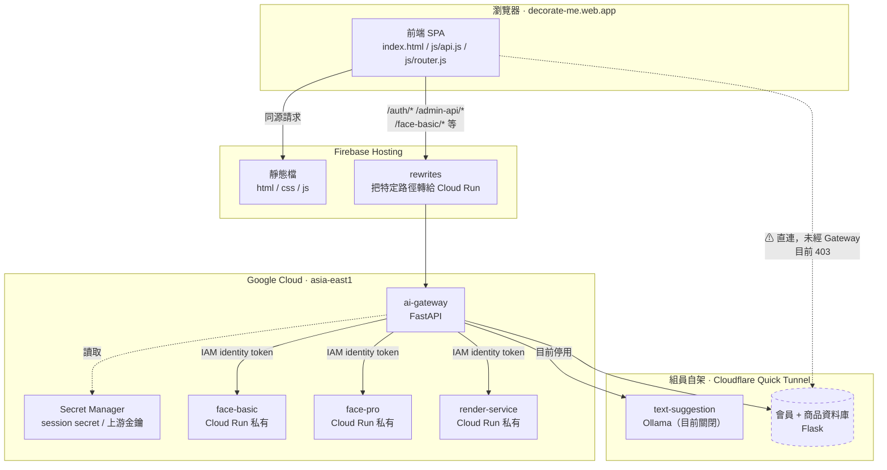
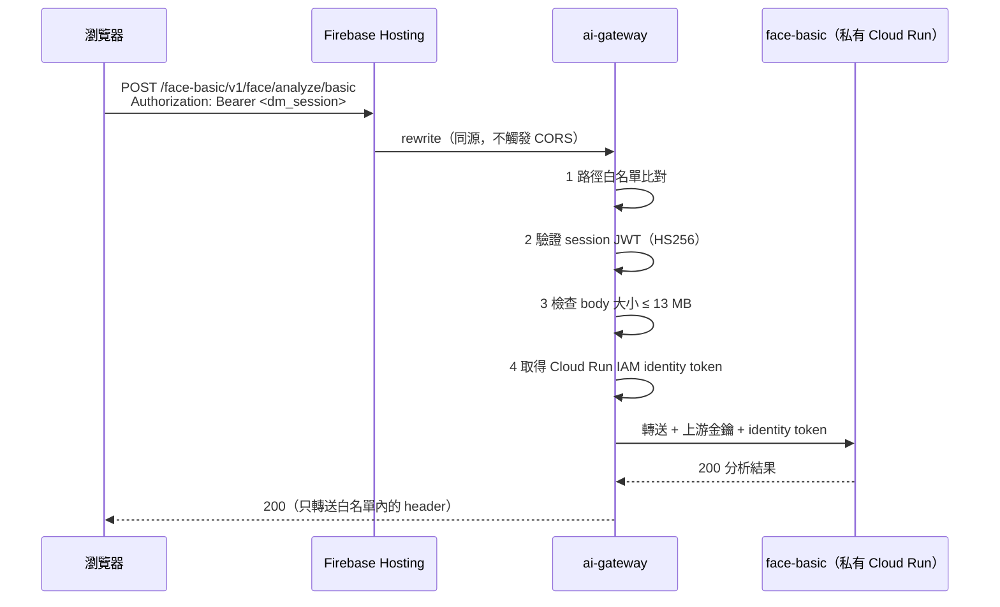
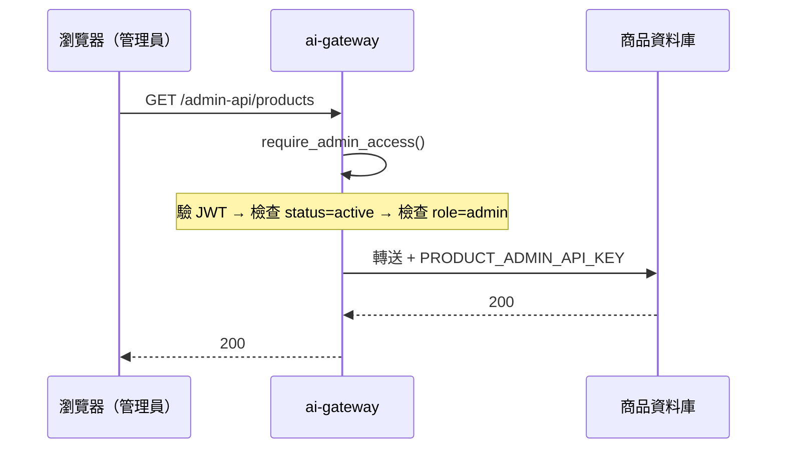
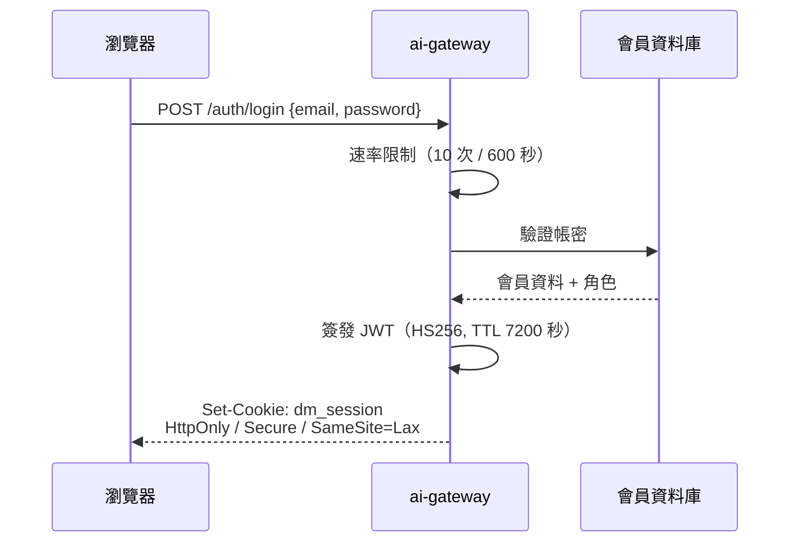
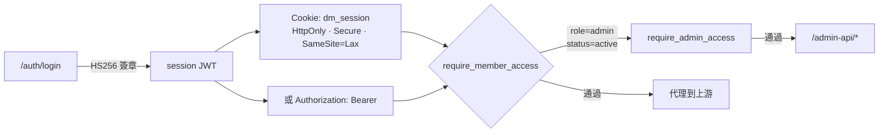
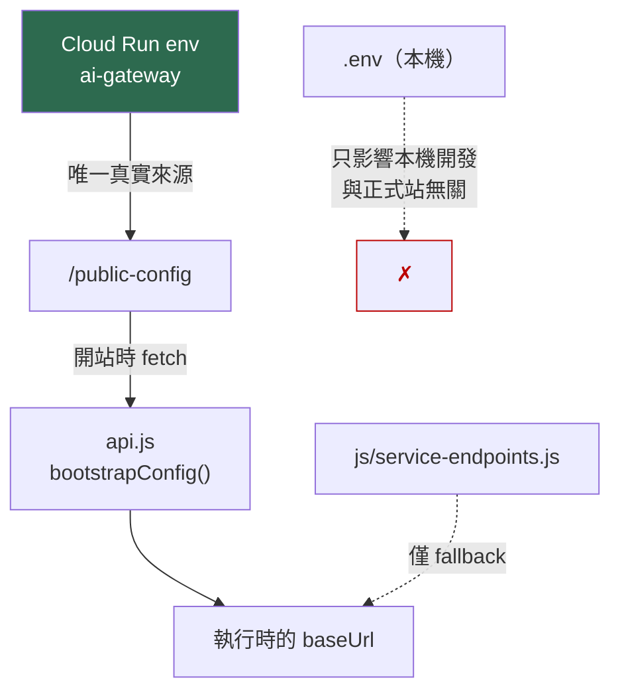
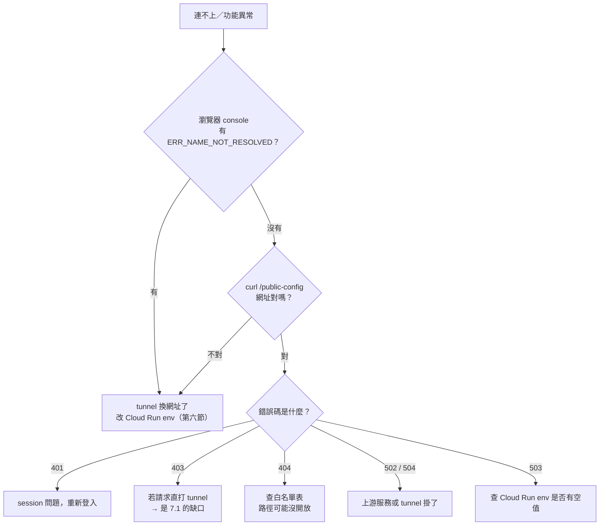

# AI Gateway：API 管理架構與流程總覽

**建立日期**：2026-07-20
**適用版本**：原始盤點為 2026-07-20；2026-07-21 更新請以本文最前方補充與《Gateway私人媒體與資料刪除部署紀錄_2026-07-21》為準。
**對象**：前端、爬蟲端、資料庫端、演算法端

> 本文所有路由、環境變數、錯誤碼都是 2026-07-20 當天從 `ai_gateway.py`、Cloud Run 實際設定與線上回應掃出來的，不是憑印象寫的。若日後與程式碼不符，以程式碼為準並回頭更新本文。

## 2026-07-21 重要更新

- 瀏覽器登入、會員、商品、管理員與媒體請求已統一走同源 Gateway；`/public-config` 不再公開資料庫 Tunnel 網址。
- 登入成功後只使用 HttpOnly session cookie；舊版 `sessionStorage` token 會被清除。
- `decorate-me-renders` 已禁止公開讀取，匿名物件網址實測為 403；會員圖片改由登入驗證後的 `/media/render/{jobId}` 讀取。
- 未收藏渲染放在 `temporary/`，2 天後由 Lifecycle 清理；收藏後移到 `retained/{opaqueOwnerId}/{jobId}`，不受暫存規則影響。
- 真正 GCS V4 Signed URL 仍待指定服務帳號的自簽 IAM 權限明確授權；目前使用安全的登入驗證串流代理，不會把 Bucket 改回公開。
- Ollama 完整 Prompt 依專題紀錄需求暫時保留於受控展示回應，不寫入一般存取 Log；待 Ollama 調整完成後再移除。
- 本文件不得保存任何實際 API key、JWT、密碼、完整 email、照片或完整分析包。

---

## 一、一句話說明

**Gateway 是全系統唯一的對外入口。** 瀏覽器只跟 `decorate-me.web.app` 講話，所有上游服務的網址與金鑰都只存在於 Cloud Run，瀏覽器永遠拿不到。

---

## 二、整體架構圖



**圖中那條虛線是目前唯一的破口**，詳見第七節。

---

## 三、三條請求路徑

### 3.1 前台 AI 功能（臉部分析、渲染）



**重點**：瀏覽器送的是 Gateway 自己簽的 session，**不是**上游金鑰。上游金鑰由 Gateway 在伺服器端補上。

### 3.2 管理後台（商品 CRUD、爬蟲預覽）



**管理員身分寫在 session JWT 的 claim 裡**（`role`、`status`），前端無法偽造，因為 JWT 由 Gateway 用 `GATEWAY_SESSION_SECRET` 簽章。

### 3.3 登入



---

## 四、Gateway 路由總表

| 路由 | 方法 | 認證 | 說明 |
|---|---|---|---|
| `/health` | GET | 無 | 健康檢查與模式回報 |
| `/public-config` | GET | 無 | 只發布 `/member-database`、`/product-api` 等同源 Gateway 路徑，不公開上游網址 |
| `/auth/login` | POST | 無（有速率限制） | 簽發 session，種 `dm_session` cookie |
| `/auth/logout` | POST | 無 | 清除 cookie |
| `/auth/register` | POST | 無 | 註冊 |
| `/auth/send-otp` | POST | 無 | 發送驗證碼 |
| `/auth/verify-otp` | POST | 無 | 驗證碼確認 |
| `/admin-api/products` | GET POST | **admin** | 商品清單／新增 |
| `/admin-api/products/{id}` | GET PATCH DELETE | **admin** | 單一商品 |
| `/admin-api/crawler/product-preview` | POST | **admin** | 爬蟲預覽 |
| `/admin-api/crawler/search-preview` | POST | **admin** | 爬蟲搜尋預覽 |
| `/admin-api/product-audit-logs` | GET | **admin** | 稽核日誌 |
| `/{service}/{path}` | GET POST DELETE | **member** | 通用代理，見下表 |

### 通用代理的服務與路徑白名單

**白名單是正則比對，沒列到的路徑一律 404**，這是刻意的最小暴露面設計。

| service | 上游環境變數 | 允許的路徑 |
|---|---|---|
| `face-basic` | `FACE_BASIC_URL` | `health`、`v1/face/pose`、`v1/face/analyze/basic`、`v1/face/jobs/basic`、`v1/face/jobs/{id}`、`v1/face/jobs/{id}/result` |
| `face-pro` | `FACE_PRO_URL` | `health`、`v1/face/analyze/pro`、`v1/face/jobs/pro`、`v1/face/jobs/{id}`、`v1/face/jobs/{id}/result` |
| `render-service` | `RENDER_URL` | `health`、`render`、`render/jobs`、`render/jobs/{id}` |
| `text-suggestion` | `TEXT_SUGGESTION_URL` | `health`、`suggest` ——**目前被開關擋住** |
| `member-database` | `MEMBER_DATABASE_URL` | `api/recommend/personal`、`api/favorites/toggle`、`api/members`、`api/members/{id}`、`api/members/{id}/points`、`api/members/{id}/check-in`、`api/members/{id}/tasks`、`api/members/{id}/tasks/{id}/claim`、`api/members/{id}/theme-shop/{id}/redeem`、`api/members/{id}/saved-looks`、`api/members/{id}/saved-looks/{id}` |

> `job id` 有格式限制：臉部是 `JOB-[0-9a-f]{12}`，渲染是 `[0-9a-f]{32}`。格式不符直接 404。

---

## 五、認證模型



| 項目 | 值 |
|---|---|
| 演算法 | HS256 |
| issuer | `decorate-me-ai-gateway` |
| audience | `decorate-me-ai` |
| 必要 claim | `exp`、`iat`、`sub` |
| TTL | `GATEWAY_SESSION_TTL_SECONDS`，預設 7200 秒（限制在 300～86400） |
| 傳遞方式 | `dm_session` cookie 優先，或 `Authorization: Bearer` |
| session-only 模式 | `GATEWAY_SESSION_ONLY=true`，瀏覽器不再需要任何 API key |

**目前線上為 session-only 模式。** 這代表前端完全不持有金鑰 —— 2026-07-20 已把最後三把（`faceApiKey`、`renderApiKey`、`textSuggestionApiKey`）從前端移除。

---

## 六、設定的單一來源

這是今天踩最多次的地方，特別拉出來講。



**換 Cloudflare tunnel 網址時，只需要改一個地方：**

```bash
gcloud run services update ai-gateway \
  --project=decorate-me --region=asia-east1 \
  --update-env-vars MEMBER_DATABASE_URL=<新網址>,PRODUCT_DATABASE_URL=<新網址>
```

前端不用改、不用重新部署。改完用這個確認：

```bash
curl https://decorate-me.web.app/public-config
```

### 常見誤區

| 你以為改這裡 | 實際效果 |
|---|---|
| 本機 `.env` | **對正式站完全無效**，只影響本機跑 `ai_gateway.py` |
| `config.local.js` | 會被 `js/service-endpoints.js` 覆蓋（載入順序在後） |
| `firebase-hosting-full/` | **整個資料夾已停用**，見該目錄的 `DEPRECATED_請勿部署.md` |

---

## 七、目前的缺口

### 7.1 會員資料庫繞過 Gateway 直連（**已改走同源 Gateway**）

> 2026-07-21 更新：瀏覽器現在只呼叫 Gateway 登入。Gateway 取得會員資料庫的 `Set-Cookie` 後加密封裝成另一枚 HttpOnly cookie，後續由伺服器解封並轉送，因此瀏覽器不再直連 Tunnel，也不依賴第三方 cookie。未設定會員 API key 時不會送出空白 `X-API-Key`；登入成功前會立即驗證上游 cookie 能讀取會員資料。

**症狀**：個人頁的打卡、任務讀取全部 403。

```
GET https://<tunnel>/api/members/<email>/check-in  →  403
Third-party cookie will be blocked.
```

**根因**：會員資料庫是 Flask + **server-side session cookie** 認證，不認 Bearer token。實測三種情況結果完全相同：

| 送出的認證 | 資料庫回應 |
|---|---|
| 無 | `302 → /login?next=...` |
| 假 Bearer | `302 → /login?next=...` |
| 帶 Origin 的跨來源請求 | `302 → /login?next=...` |

前端送的 `Authorization: Bearer <Gateway JWT>` 它從頭到尾沒有讀。

**為什麼現在才爆**：在 2026-07-20 之前，前端指向的是一條已死的 tunnel，連 DNS 都解析不到，請求根本走不到資料庫。網址修好後才露出鏈條上的下一個問題。

**為什麼不能靠 cookie 撐過去**：Chrome 正在淘汰第三方 cookie（console 已出現 `Third-party cookie will be blocked`）。跨來源直連 tunnel 帶 cookie 這條路會完全斷掉，這不是設定問題。

**長期正式方向**：目前以 Gateway 代登入並安全封裝上游 cookie，已能避免瀏覽器第三方 cookie 問題。正式商用若要支援立即撤銷、跨 instance 與更清楚的服務身分，資料庫端仍建議提供其中一種：

1. 接受 `UPSTREAM_MEMBER_API_KEY` 這類服務對服務憑證（Gateway 已有此欄位，目前未啟用）
2. 或接受 Gateway 簽的 JWT，共用 `GATEWAY_SESSION_SECRET` 驗章

目前的 cookie 封裝方案是可運作的過渡整合；資料庫端完成服務憑證後，再將 Gateway 改成正式服務對服務驗證。

### 7.2 文字建議服務停用中

`GATEWAY_ALLOW_EXTERNAL_TEXT_UPSTREAM` 目前為 `false`，這是**刻意的**。呼叫 `/text-suggestion/*` 會得到：

```json
{"error":{"code":"EXTERNAL_TEXT_UPSTREAM_DISABLED","message":"..."}}
```

依《Gateway 安全代理與 Ollama 專題展示說明》，此開關「預設及專題結束後必須為 `false`」。Ollama 的 tunnel 目前也已失效。要恢復需要先把 Ollama 搬到可信任的 Cloud Run／私有網路，而不是打開開關。

### 7.3 歷史金鑰清理

以下金鑰曾經寫在瀏覽器可下載的 `config.local.js` 中，雖已於 2026-07-20 移除，但**值本身仍在 Cloud Run 生效**：

| 歷史秘密 | Cloud Run 變數 |
|---|---|
| `[實際值禁止記錄]` | `GATEWAY_FACE_API_KEY` |
| `[實際值禁止記錄]` | `GATEWAY_RENDER_API_KEY` |
| `[實際值禁止記錄]` | `GATEWAY_TEXT_SUGGESTION_API_KEY` |

從前端移除 ≠ 失效。**應盡快輪替。**

---

## 八、環境變數總表

| 變數 | 用途 | 現況 |
|---|---|---|
| `APP_ENV` | 環境別 | `production` |
| `GATEWAY_SESSION_SECRET` | JWT 簽章金鑰 | Secret Manager |
| `GATEWAY_SESSION_ONLY` | 瀏覽器免金鑰模式 | `true` |
| `GATEWAY_SESSION_TTL_SECONDS` | session 有效期 | `7200` |
| `GATEWAY_LOGIN_RATE_LIMIT_WINDOW_SECONDS` | 登入速率窗 | `600` |
| `GATEWAY_LOGIN_RATE_LIMIT_MAX_REQUESTS` | 窗內最大次數 | `10` |
| `CORS_ORIGINS` | 允許來源 | `decorate-me.web.app`、`decorate-me.firebaseapp.com` |
| `MEMBER_DATABASE_URL` | 會員庫 | Cloudflare tunnel |
| `PRODUCT_DATABASE_URL` | 商品庫 | 同上（同一台） |
| `FACE_BASIC_URL` / `FACE_PRO_URL` / `RENDER_URL` | AI 服務 | 私有 Cloud Run |
| `TEXT_SUGGESTION_URL` | Ollama | **未設定** |
| `GATEWAY_ALLOW_EXTERNAL_TEXT_UPSTREAM` | 外部文字上游開關 | **false（必須維持）** |
| `PRODUCT_ADMIN_API_KEY` | 商品寫入 | Secret Manager |
| `UPSTREAM_FACE_API_KEY` / `UPSTREAM_RENDER_API_KEY` | 上游金鑰 | Secret Manager |
| `UPSTREAM_MEMBER_API_KEY` | 會員庫服務憑證 | **未啟用**，見 7.1 |
| `AI_GATEWAY_MAX_BODY_BYTES` | 請求上限 | `13631488`（13 MB） |
| `AI_GATEWAY_UPSTREAM_TIMEOUT_SECONDS` | 上游逾時 | `600` |
| `ADMIN_PROXY_TIMEOUT_SECONDS` | 管理代理逾時 | `15` |
| `ADMIN_PROXY_MAX_BODY_BYTES` | 管理代理上限 | `1048576`（1 MB） |

---

## 九、錯誤碼對照

| 錯誤碼 | HTTP | 意義 | 處理方向 |
|---|---|---|---|
| `MEMBER_AUTH_REQUIRED` | 401 | 沒帶 session | 重新登入 |
| `MEMBER_AUTH_INVALID` | 401 | session 過期或簽章不符 | 重新登入；檢查 session secret 是否換過 |
| `ADMIN_REQUIRED` | 403 | 非管理員 | 檢查 JWT 的 `role` claim |
| `ADMIN_SUSPENDED` | 403 | 管理員被停權 | 檢查帳號狀態 |
| `LOGIN_RATE_LIMITED` | 429 | 登入太頻繁 | 等速率窗過去 |
| `NOT_FOUND` | 404 | 服務名或路徑不在白名單 | **先查白名單表**，不是網址寫錯就是路徑沒開放 |
| `NOT_CONFIGURED` | 503 | 上游環境變數是空的 | 查 Cloud Run env |
| `ADMIN_PROXY_NOT_CONFIGURED` | 503 | 缺 `PRODUCT_DATABASE_URL` 或 `PRODUCT_ADMIN_API_KEY` | 同上 |
| `EXTERNAL_TEXT_UPSTREAM_DISABLED` | 503 | 文字上游開關關閉 | 刻意的，見 7.2 |
| `IDENTITY_TOKEN_UNAVAILABLE` | 503 | 拿不到 Cloud Run IAM token | 查服務帳號權限 |
| `PAYLOAD_TOO_LARGE` | 413 | 超過 body 上限 | 壓縮圖片 |
| `UPSTREAM_TIMEOUT` | 504 | 上游逾時 | 查上游服務或冷啟動 |
| `UPSTREAM_UNAVAILABLE` | 502 | 上游連不上 | **先查 tunnel 是否換網址** |

---

## 十、排查順序建議



**本機用 curl 測試時的陷阱**：Windows schannel 查不到 Cloudflare 憑證的撤銷清單，會回 `CRYPT_E_NO_REVOCATION_CHECK`，看起來像服務掛了。**測試一律加 `--ssl-no-revoke`**。瀏覽器不受影響。

---

## 十一、待辦

- [x] 歷史金鑰已從前端與本文件移除；正式服務秘密由 Secret Manager 管理，實際值不得再寫入文件。
- [ ] 與資料庫端確認會員 API 的服務對服務認證方式（7.1）
- [ ] 前端改走 `/member-database/*`（**需等 7.1 完成，否則無效**）
- [ ] Ollama 搬到可信任服務後再考慮開啟文字上游（7.2）
- [ ] 請資料庫端改用固定網址（Cloud Run／付費 ngrok），根除 tunnel 換址問題
