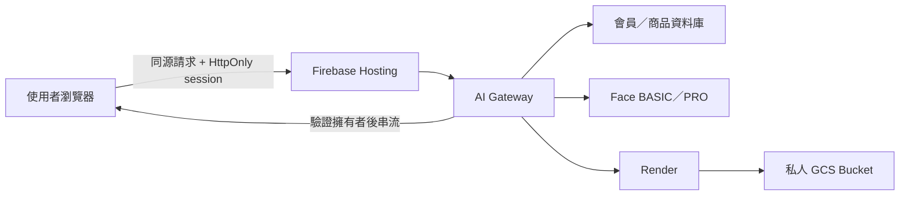

# Gateway 私人媒體與資料刪除部署紀錄

> 日期：2026-07-21
>
> 正式站：<https://decorate-me.web.app>
> 紀錄原則：不得寫入照片、完整 email、API key、JWT、密碼、完整分析包或任何秘密值。

## 一、這次解決了什麼

這次把瀏覽器、Gateway、會員／商品資料庫、Render、Face 與 GCS 的重要流程串成同一條受控路徑。瀏覽器不再直接知道資料庫 Tunnel 網址或上游金鑰；登入後由 Gateway 判斷會員身分、允許路徑與圖片擁有者，再呼叫後端服務。

## 二、使用者怎麼永久看到收藏圖

Bucket 私有不代表圖片不能永久保存。系統把「永久保存」和「每次觀看權限」分開：

1. Render 完成後，圖片先放在 `temporary/`。
2. 使用者建立妝容收藏後，Gateway 把圖片移到 `retained/{opaqueOwnerId}/{jobId}`。
3. 收藏資料保存 `renderJobId` 與穩定 Gateway 媒體路徑，不保存公開 Bucket URL。
4. 使用者每次開啟收藏，瀏覽器請求 `/media/render/{jobId}`。
5. Gateway 驗證目前 session 和圖片擁有者，成功才回傳圖片。

因此收藏圖可以長期存在，但陌生人拿到 GCS 路徑也無法直接讀取。現在使用的是登入驗證串流代理；真正 GCS V4 Signed URL 需額外的自簽 IAM 權限，尚未擅自開啟。

## 三、刪除同步

| 動作 | Gateway／資料庫 | Firestore 工作 | GCS 圖片 |
|---|---|---|---|
| 刪除一筆妝容收藏 | 刪除 saved look | 刪除對應 Render job | 刪除對應 temporary／retained 物件 |
| 刪除會員 | 轉送會員刪除並清除 session | 依 owner 清除 Render 工作；Face 仍待完整 E2E | 依 opaque owner 清除暫存與收藏圖 |
| 未收藏渲染逾期 | 不建立永久收藏 | `expiresAt` 交由 TTL 清理 | `temporary/` 2 天後由 Lifecycle 刪除 |

刪除程式已部署，但正式驗收仍需要一組可刪除的測試會員，實際確認資料庫、Firestore 與 GCS 都查不到相關資料。

## 四、Log 與 Demo 資料規則

一般 Log 只保留 request ID、方法、去識別化路徑、狀態與耗時，不保存：

- 照片或 base64。
- 完整分析包。
- 完整 email。
- API key、JWT、cookie 或其他權杖。
- Ollama／Render Prompt。

### Ollama 專題展示例外

依目前專題需求，Ollama 完整 Prompt 暫時保留在受控展示／除錯回應，方便逐次調整與寫紀錄書。本次沒有刪除這個欄位。它不得寫入一般 Log，也不得和真實照片、完整 email、權杖或完整分析包一起保存。只有在使用者明確確認 Ollama 完成後才移除。

## 五、正式部署版本

| 服務 | Revision／版本 |
|---|---|
| Firebase Hosting | `20260721-041545` |
| AI Gateway | `ai-gateway-00029-pnl`／`session-preflight-20260721-3` |
| Render | `replicate-render-00045-6qd`／`private-media-20260721-3` |
| Face BASIC | `face-basic-00024-pl8` |
| Face PRO | `face-pro-00015-qj6` |

本次已確認 Cloud Run 使用最新映像並將 100% 流量切到上述 revision，避免只有建置映像、服務卻仍跑舊版的情況。

## 六、已完成驗證

- Gateway 最新單元測試 15 項通過；前一輪 Gateway／Render 單元測試共 22 項通過。
- 前端語法、smoke test、秘密掃描通過。
- `/public-config` 只回同源路徑。
- 商品 API 回傳 1041 筆；沒有改成只顯示 50 筆，也沒有加入虛擬清單。
- Gateway 公開健康檢查為 200；Face BASIC、Face PRO、Render 已移除 `allUsers` Invoker，匿名直連健康檢查均為 403。
- 正式頁面啟動前會先呼叫 `/auth/session`；Gateway 會用封裝 cookie 實際讀取會員資料庫會員端點，確認兩層 HttpOnly session 都仍有效。匿名或失效狀態回 401，會員頁背景請求不會啟動。
- 會員資料庫沒有設定服務 API key 時，Gateway 不再送出空白 `X-API-Key`；登入成功前會立即用上游 cookie 讀取一次會員資料，不能通過就不簽發前端登入 session。
- 受保護 API 第一次回傳 401 時，前端會取消同批請求、清除殘留 session、停止 Admin 自動刷新並回到登入頁；並行請求不會重複顯示登入過期視窗。
- 匿名 GCS 物件網址 403。
- 登入驗證的 Render 私人媒體代理 200 且回傳圖片。
- 未登入媒體請求 401。

## 七、Admin 畫面出現 401 怎麼處理

新 Gateway 改成 HttpOnly cookie 後，舊版登入狀態不能直接沿用。第一次更新後若 Admin 顯示會員資料庫異常，Console 同時看到 `/member-database/... 401` 或 `/admin-api/... 401`：

新版在進入會員／Admin 畫面前會先送出一次 `/auth/session`。如果舊登入已失效，畫面直接回到登入頁，不會先啟動 points、tasks、check-in、saved-looks 或 Admin 查詢；若載入途中才失效，第一個 401 會取消同批背景請求並清除舊狀態。使用者只需用會員資料庫內有效的帳號密碼重新登入；登入成功後才會進入會員或 Admin 頁面。若 `/auth/login` 本身為 401，代表該次帳密被會員資料庫拒絕，不是 Gateway 斷線，也不能由前端繞過。

部署後第一次測試請使用 `Ctrl+F5` 強制重新整理，確認載入的是 `20260721-041545`。舊狀態的預期行為是 Console 最多看到一次 `/auth/session 401` 後回到登入頁，不應再看到 points、tasks、check-in、saved-looks 連續 401。

使用者畫面的錯誤訊息已統一中文化；已知錯誤依代碼顯示中文，未知的純英文後端細節改成通用中文提示。Console 仍保留技術錯誤碼供除錯。目前若 `/auth/login` 回 503，代表 Gateway 與會員資料庫尚未成功建立可重用的登入 session，需另外處理上游服務憑證或登入 session 契約。

若錯誤來源是 `content.js` 並含 `Failed to initialize current tab`，通常是瀏覽器擴充功能注入失敗，與 Decorate Me 後端無關；請用無痕視窗或停用對應擴充功能交叉確認。

## 八、尚待明確授權或正式帳號驗收

- [ ] 只對指定執行服務帳號授予 Service Account Token Creator，啟用真正 5～10 分鐘 GCS V4 Signed URL。
- [x] Face BASIC、Face PRO、Render 已移除 `allUsers` Invoker，只允許 Gateway 服務帳號呼叫；匿名直連實測為 403。
- [ ] 授予 Gateway 最小 Firestore 存取權，讓登入限流正式跨 instance。
- [ ] 確認所有 TTL 狀態為 `ACTIVE`。
- [ ] 以有效測試會員完成收藏建立／刪除與會員刪除端到端驗收。
- [ ] Ollama 完成後，移除展示回應中的完整 Prompt。

這些項目會放入 GitHub Issue 追蹤；Issue 不使用任何協作來源標籤。
