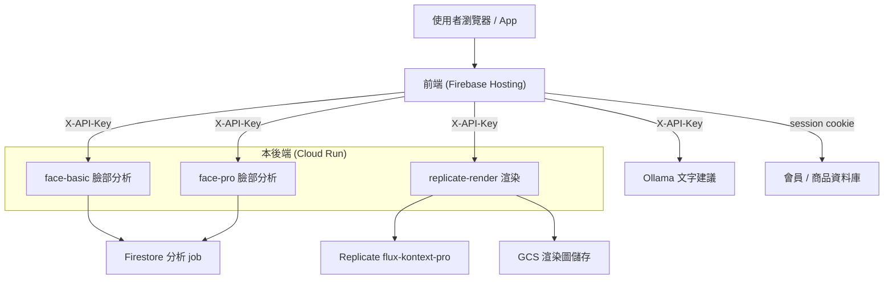

# Decorate Me — 臉部分析與 AI 妝容渲染後端

Decorate Me 是一套 AI 美妝系統：使用者上傳一張自拍，系統分析五官與膚色，生成妝容建議，再用 AI 把妝容渲染回同一張臉，並推薦對應的彩妝商品。

本後端負責兩塊核心能力，獨立成 API 供網頁前端與未來 iOS App 共用：

- **臉部分析**：偵測人臉、抽取五官與膚色特徵、判定個人色彩（四季型）。
- **AI 妝容渲染**：用擴散模型把妝容畫到原照片上，維持人物與姿勢不變。

部署在 Google Cloud Run，前端網頁見 [decorate-me.web.app](https://decorate-me.web.app)。

---

## 系統架構



---

## 技術棧

| 分類 | 使用 |
|------|------|
| 語言 / 框架 | Python 3.11、FastAPI、Uvicorn |
| 電腦視覺 | InsightFace（buffalo_l）、MediaPipe FaceMesh、OpenCV、NumPy |
| AI 渲染 | Replicate（black-forest-labs/flux-kontext-pro） |
| 儲存 | Google Cloud Storage（渲染圖）、Firestore（分析 job） |
| 部署 | Docker、Google Cloud Run（asia-east1） |

---

## 服務與端點

### 臉部分析（face-basic / face-pro）
| 方法 | 路徑 | 說明 |
|------|------|------|
| GET | `/health` | 服務健康檢查 |
| POST | `/v1/face/analyze/basic` | BASIC 分析（單張正臉），回五官與膚色 |
| POST | `/v1/face/pose` | 偵測頭部角度（yaw/pitch/roll），引導拍正臉 |
| POST | `/v1/face/analyze/pro` | PRO 分析（正臉＋側臉） |
| — | 非同步 jobs API | 建立 job、輪詢進度、取結果（存 Firestore） |

### AI 渲染（replicate-render）
| 方法 | 路徑 | 說明 |
|------|------|------|
| GET | `/health` | 健康檢查，回報 api key / 限流 / 去重設定 |
| POST | `/render` | 傳入原圖與英文 prompt，回渲染後永久網址 |

---

## 臉部分析怎麼做

1. 上傳圖縮到最長邊 1024px。
2. **InsightFace（buffalo_l）** 偵測人臉與 3D 頭部姿態。
3. **MediaPipe FaceMesh** 取 468 個臉部特徵點。
4. 以左右眼為基準把臉旋轉校正到水平，消除歪頭誤差。
5. 用特徵點的幾何比例分類臉型、眉型、眼型、鼻型、嘴型（閾值以 CelebA 資料校正）。
6. 在皮膚區取 Lab / HSV 色彩，依冷暖（undertone）與明度判定膚色分級與**四季型**（春 / 夏 / 秋 / 冬）。

另有一套 Random Forest 分類器 pipeline（scikit-learn），已建置、待更多標註資料後可切換成機器學習分類。

## AI 渲染怎麼做

1. 渲染 prompt = Ollama 生成的妝容指令 ＋ 一組「身分鎖定句」，明確要求臉型、五官、膚色、姿勢、背景、光線都不變，只上妝。
2. 呼叫 Replicate flux-kontext-pro 生成上妝圖。
3. 上傳 GCS 取得永久網址（Replicate 原始網址會過期，不用）。

---

## 安全

- 所有端點需帶 `X-API-Key`（環境變數設定；未設時為本機開發模式）。
- CORS 限定前端網域，非 `*`。
- 渲染服務有每 IP + email 的固定時間窗限流（預設每小時 10 次，超量回 429）。
- 渲染服務對相同圖片與 prompt 做去重快取，避免重複呼叫 Replicate。
- 金鑰走環境變數，不寫進程式；`.env` 不進版控。

---

## 環境變數

| 變數 | 說明 |
|------|------|
| `FACE_API_KEY` | 臉部分析服務的 X-API-Key |
| `RENDER_API_KEY` | 渲染服務的 X-API-Key |
| `REPLICATE_API_TOKEN` | Replicate token |
| `CORS_ORIGINS` | 允許的前端網域（逗號分隔） |
| `MAX_IMAGE_SIZE` | 影像處理縮放上限（預設 1024） |
| `RENDER_GUIDANCE` | 渲染 guidance（預設 4.5） |
| `RENDER_RATE_LIMIT_MAX_REQUESTS` / `RENDER_RATE_LIMIT_WINDOW_SECONDS` | 渲染限流 |
| `RENDER_DEDUP_TTL_SECONDS` | 渲染去重快取有效期（預設 600） |

---

## 本機執行與部署

```bash
# 本機執行臉部分析（範例）
pip install -r requirements.txt
uvicorn Face_analyzer_BASIC:app --port 8001

# 渲染服務：Docker build 後部署 Cloud Run
docker build -f Dockerfile.render -t replicate-render .
gcloud run deploy replicate-render --image <image> --region asia-east1
```

---

## 相關分支

同一團隊 repo，不同分支負責不同模組：

- `Isa`（本分支）：臉部分析與 AI 渲染後端（Python）
- `dev_makeup`：網頁前端
- `dev`：iOS App（SwiftUI）

---

## 團隊

畢業專題「Decorate Me」。本分支（後端）由 isach 維護。
