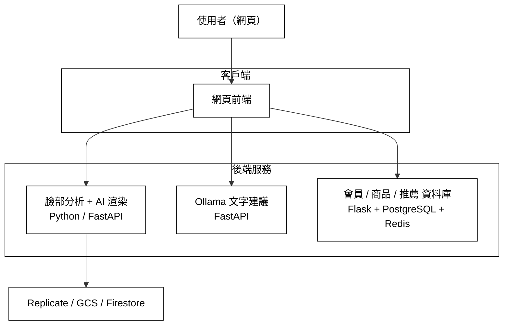

# Decorate Me — AI 美妝分析與妝容推薦系統

畢業專題。使用者上傳一張自拍，系統分析五官與膚色、生成個人化妝容建議，用 AI 把妝容渲染回同一張臉，並推薦對應的彩妝商品。

- 網頁版：[decorate-me.web.app](https://decorate-me.web.app)

---

## 系統架構

---

## 模組與分支

本 repo 以分支劃分模組，各模組獨立開發與部署：

| 模組 | 分支 | 技術 |
|------|------|------|
| 網頁前端 | `dev_makeup` | 原生 JavaScript、Firebase Hosting |
| 臉部分析 + AI 渲染後端 | `Isa` | Python、FastAPI、InsightFace、MediaPipe、Replicate、Cloud Run |
| 會員 / 商品 / 推薦 資料庫 | `lavien` | Flask、PostgreSQL、Redis、OTP |
| Ollama 文字建議服務 | `Amy` | FastAPI、Ollama |
| iOS App | `dev` | SwiftUI |

## 團隊分工

| 負責人 | 工作 |
|--------|------|
| 陳語宸 | 網頁前端、臉部分析、後台管理、版本控制、細節處理、流程更新、UAT設計 |
| 謝佳璇 | AI 渲染 |
| 江欣晏 | 商品爬蟲、推薦演算法 |
| 呂佩慈 | 資料庫、推薦演算法 |
| 黃姵錚 | Ollama 文字建議服務 |
| 陳昀捷 | 前端前置設計、資料收集、臉部分析定義 |
| 林語喬 | 前端前置設計、資料收集 |

---

## 核心技術

- **臉部分析**：InsightFace（人臉偵測與姿態）+ MediaPipe FaceMesh（468 特徵點），以幾何比例分類五官，Lab 色彩判定膚色與四季型個人色彩。
- **AI 妝容渲染**：Replicate flux-kontext-pro 擴散模型，prompt 加身分鎖定確保「只上妝、不改人」，結果存 GCS 永久網址。
- **文字建議**：本地 Ollama LLM 生成妝容建議與英文渲染指令。
- **推薦**：以膚色 / 唇色 Lab 值算 ΔE 找最接近的商品色號。
- **部署**：前端 Firebase Hosting；後端 Docker + Google Cloud Run；資料庫服務走 Cloudflare Tunnel。

---

## 各模組說明

各分支有各自的 README，切換分支查看細節：

- [`dev_makeup`](../../tree/dev_makeup) — 網頁前端
- [`Isa`](../../tree/Isa) — 臉部分析與 AI 渲染後端
- [`lavien`](../../tree/lavien) — 會員 / 商品資料庫
- [`Amy`](../../tree/Amy) — Ollama 文字建議服務
- [`dev`](../../tree/dev) — iOS App
