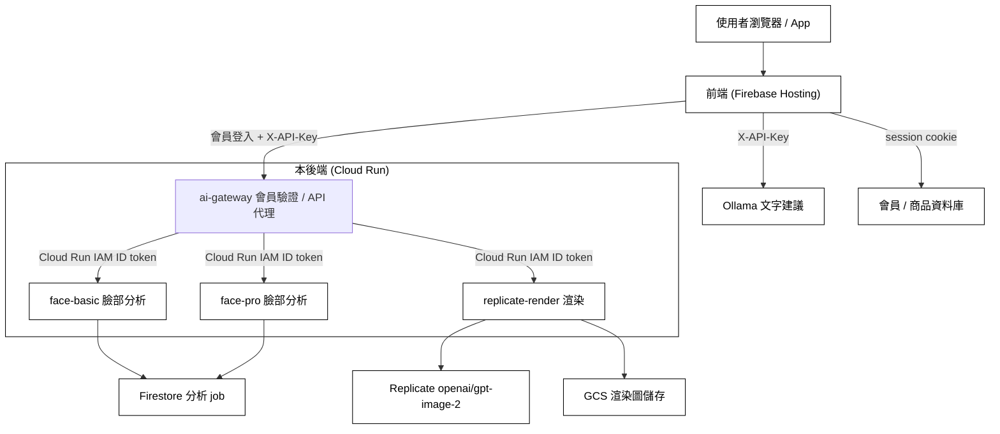

# Decorate Me — 臉部分析與 AI 妝容渲染後端

Decorate Me 是一套 AI 美妝系統：使用者上傳一張自拍，系統分析五官與膚色，生成妝容建議，再用 AI 把妝容渲染回同一張臉，並推薦對應的彩妝商品。

本後端負責兩塊核心能力，獨立成 API 供網頁前端與未來 iOS App 共用：

- **臉部分析**：偵測人臉、抽取五官與膚色特徵、判定個人色彩（四季型）。
- **AI 妝容渲染**：用擴散模型把妝容畫到原照片上，維持人物與姿勢不變。

部署在 Google Cloud Run，前端網頁見 [decorate-me.web.app](https://decorate-me.web.app)。

---

## 系統架構



---

## 技術棧

| 分類 | 使用 |
|------|------|
| 語言 / 框架 | Python 3.10（BASIC / PRO / suggestion）、Python 3.11（render）、FastAPI、Uvicorn |
| 電腦視覺 | InsightFace（buffalo_l）、MediaPipe FaceMesh、OpenCV、NumPy |
| AI 渲染 | Replicate（openai/gpt-image-2） |
| 儲存 | Google Cloud Storage（渲染圖）、Firestore（分析 job） |
| 部署 | Docker、Google Cloud Run（asia-east1） |

---

## 服務與端點

### 臉部分析（face-basic / face-pro）
| 方法 | 路徑 | 說明 |
|------|------|------|
| GET | `/health` | 服務健康檢查 |
| POST | `/v1/face/analyze/basic` | BASIC 分析（單張正臉），回五官與膚色 |
| POST | `/v1/face/pose` | 偵測頭部角度（yaw/pitch/roll），引導拍正臉 |
| POST | `/v1/face/analyze/pro` | PRO 分析（正臉＋側臉） |
| — | 非同步 jobs API | 建立 job、輪詢進度、取結果（存 Firestore；建立時回 `resultToken`，輪詢需帶回） |

### AI 渲染（replicate-render）
| 方法 | 路徑 | 說明 |
|------|------|------|
| GET | `/health` | 健康檢查，回報 api key / 限流 / 去重設定 |
| POST | `/render` | 傳入原圖與白名單 `styleId`；英文 prompt 由後端產生，回渲染後永久網址 |
| POST/GET | `/render/jobs` | 建立渲染 job、用 `jobId` + `resultToken` 輪詢 |
| DELETE | `/render/jobs/{job_id}` | 以 job token 刪除已完成 job 與對應 GCS 圖片 |

---

## 專案結構

```
Face_analyzer_BASIC.py       BASIC 臉部分析服務（FastAPI）
Face_analyzer_PRO.py         PRO 臉部分析服務
replicate_render_api.py      AI 渲染服務（FastAPI）
replicate_render.py          Replicate 呼叫 + GCS 上傳
ai_gateway.py                會員 AI token + 私有 Cloud Run 代理
Ollama_suggestion.py         妝容文字建議
analysis_package.py          分析結果資料結構
job_store.py                 非同步 job（Firestore）
dev_server_utils.py          CORS / 本機開發工具
Dockerfile, Dockerfile.render, Dockerfile.gateway   容器化與部署
requirements.txt, requirements.render.txt, requirements.gateway.txt   依賴
tools/                       ML 資料工程腳本（標註 / 分類 / 整理訓練資料，非服務本體）
```

---

## 臉部分析怎麼做

1. 上傳圖縮到最長邊 1024px。
2. **InsightFace（buffalo_l）** 偵測人臉與 3D 頭部姿態。
3. **MediaPipe FaceMesh** 取 468 個臉部特徵點。
4. 以左右眼為基準把臉旋轉校正到水平，消除歪頭誤差。
5. 用特徵點的幾何比例分類臉型、眉型、眼型、鼻型、嘴型（閾值以 CelebA 資料校正）。
6. 在皮膚區取 Lab / HSV 色彩，依冷暖（undertone）與明度判定膚色分級與**四季型**（春 / 夏 / 秋 / 冬）。

另有一套 Random Forest 分類器 pipeline（scikit-learn），已建置、待更多標註資料後可切換成機器學習分類。

## AI 渲染怎麼做

1. 渲染 prompt = Ollama 生成的妝容指令 ＋ 一組「身分鎖定句」，明確要求臉型、五官、膚色、姿勢、背景、光線都不變，只上妝。
2. 透過 Replicate 呼叫 openai/gpt-image-2 生成上妝圖。
3. 上傳 GCS 取得永久網址（Replicate 原始網址會過期，不用）。

---

## 安全

- 正式前端只呼叫 AI Gateway；face-basic、face-pro、replicate-render 已啟用 Cloud Run IAM，匿名直連回 `403`。
- Gateway 代理路徑同時要求 `X-API-Key` 與會員登入後取得的短期 Bearer token；API key 只作第二層防護，不再視為會員身分。
- Gateway 使用專用服務帳號和 Google 簽署的 ID token 呼叫私有核心服務，session 簽章金鑰存 Secret Manager。
- 非同步 job 建立時會回 `resultToken`；輪詢或取結果需帶 `X-Job-Token: <resultToken>`（或 `?result_token=`），避免只靠 jobId 被猜到結果。
- CORS 限定前端網域，非 `*`；正式環境可用 `APP_ENV=production` 或 `REQUIRE_EXPLICIT_CORS=1` 強制檢查。
- 渲染服務有每 IP + email 的固定時間窗限流（預設每小時 10 次，超量回 429）。
- 渲染服務另有每日 provider quota（預設 30 次）；有 Firestore 時使用固定窗口原子計數，跨 Cloud Run instance 仍能共同計數，開發環境才退回程序內 fallback。
- 相同圖片、後端 prompt 與 strength 的請求會做並發鎖與 Firestore 去重；重複進行中回 `409 DUPLICATE_IN_PROGRESS`，避免多次扣 Replicate 額度。
- 渲染服務限制 base64 圖片與 prompt 大小，避免超大 JSON body 造成記憶體壓力。
- 渲染非同步 job 有 timeout、retention、最大數量與 guarded status transition；背景 worker 遺失或逾時會回寫可重試的錯誤，不會被晚到的 worker 覆蓋。
- 渲染服務對相同圖片與 prompt 做去重快取，避免重複呼叫 Replicate。
- GCS 圖片只寫入 `rendered/` 前綴，服務提供刪除 endpoint；`gcs-lifecycle.json` 預設 30 天自動刪除，部署時可用 `-GcsBucketName` 套用。
- API 錯誤統一為 `{ "error": { "code", "message", "retryable" } }`，並回傳 `X-Request-ID`；請求只記錄 method/path/status/duration，不記錄密碼、圖片或 token。
- 前端不再把密碼寫入 `sessionStorage`；舊版 `beautyAuthCreds` 會在登入、登出或讀取 profile 時清除。登入逾時需重新登入，Bearer token / HttpOnly session 仍由會員後端負責。
- 金鑰走環境變數，不寫進程式；`.env` 不進版控。

---

## 環境變數

| 變數 | 說明 |
|------|------|
| `FACE_API_KEY` | 臉部分析服務的 X-API-Key |
| `RENDER_API_KEY` | 渲染服務的 X-API-Key |
| `SUGGESTION_API_KEY` | Ollama 建議服務的 X-API-Key |
| `GATEWAY_FACE_API_KEY` / `GATEWAY_RENDER_API_KEY` | Gateway 對瀏覽器驗證的第二層 API key |
| `UPSTREAM_FACE_API_KEY` / `UPSTREAM_RENDER_API_KEY` | Gateway 呼叫核心服務時使用的應用層 key |
| `FACE_BASIC_URL` / `FACE_PRO_URL` / `RENDER_URL` | Gateway 的三個私有 Cloud Run 目標 |
| `MEMBER_DATABASE_URL` | Gateway 重驗會員帳密的後端網址 |
| `GATEWAY_SESSION_SECRET` | AI access token 簽章金鑰；正式環境由 Secret Manager 掛載 |
| `GATEWAY_SESSION_TTL_SECONDS` | AI access token 效期，正式環境為 7200 秒 |
| `REPLICATE_API_TOKEN` | Replicate token |
| `CORS_ORIGINS` | 允許的前端網域（逗號分隔） |
| `APP_ENV` / `REQUIRE_EXPLICIT_CORS` | 正式環境強制要求明確 CORS 設定 |
| `MAX_IMAGE_SIZE` | 影像處理縮放上限（預設 1024） |
| `MAX_RENDER_IMAGE_CHARS` / `MAX_RENDER_IMAGE_BYTES` | 渲染輸入圖大小上限 |
| `RENDER_JOB_TIMEOUT_SECONDS` / `RENDER_JOB_RETENTION_SECONDS` / `RENDER_JOB_MAX_COUNT` | 渲染 job 逾時、保留時間與數量上限 |
| `JOB_STORE_SCAN_LIMIT` | Firestore job cleanup/stat 單次最多掃描筆數（預設 500） |
| `RENDER_GUIDANCE` | 渲染 guidance（預設 3.0，偏向保留真人照片質感） |
| `RENDER_RATE_LIMIT_MAX_REQUESTS` / `RENDER_RATE_LIMIT_WINDOW_SECONDS` | 渲染限流 |
| `RENDER_QUOTA_MAX_REQUESTS` / `RENDER_QUOTA_WINDOW_SECONDS` | 渲染 provider 額度；預設每日 30 次 |
| `RENDER_LIMIT_MAX_KEYS` | 限流與 quota 程序內 key 上限，避免記憶體無限成長 |
| `RENDER_DEDUP_TTL_SECONDS` | 渲染去重快取有效期（預設 600） |
| `RENDER_DURABLE_DEDUP_ENABLED` | 是否查 Firestore 做跨 instance 去重（預設開啟） |
| `GCS_RENDER_BUCKET` / `GCS_RENDER_RETENTION_DAYS` | 渲染圖片 bucket 與保留天數（預設 30 天；仍需套用 GCS lifecycle） |
| `MAX_RENDER_IMAGE_PIXELS` / `MAX_IMAGE_PIXELS` | 渲染與臉部分析的影像像素上限（預設 16MP） |
| `MAX_ANALYSIS_PACKAGE_CHARS` | analysisPackage / faceAnalysis JSON 大小上限 |
| `ROI_SHADOW_EXPOSE_RESPONSE` | 內部驗收時才把 ROI shadow 模型分類欄位回傳；預設只寫 log |

---

## 本機執行與部署

```bash
# 本機執行臉部分析（範例）
pip install -r requirements.txt
uvicorn Face_analyzer_BASIC:app --port 8001

# 渲染服務：Docker build 後部署 Cloud Run
docker build -f Dockerfile.render -t replicate-render .
gcloud run deploy replicate-render --image <image> --region asia-east1

# 套用 GCS 30 天生命週期（部署腳本也可用 -GcsBucketName 執行）
gcloud storage buckets update gs://<GCS_RENDER_BUCKET> --lifecycle-file=gcs-lifecycle.json
```

---

## 相關分支

同一團隊 repo，不同分支負責不同模組：

- `Isa`（本分支）：臉部分析與 AI 渲染後端（Python）
- `dev_makeup`：網頁前端
- `dev`：iOS App（SwiftUI）
