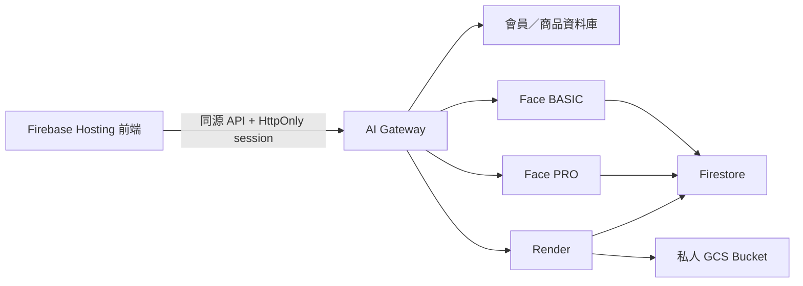

# Decorate Me 後端與 Gateway

Decorate Me 是妝容分析、商品推薦、圖片渲染與會員收藏系統。本分支 `Isa` 保存 Python 後端、AI Gateway、Cloud Run 部署設定、Firestore 工作紀錄與 GCS 私人媒體流程。

正式前端：<https://decorate-me.web.app>

## 目前架構



瀏覽器只連正式網站的同源路徑。資料庫網址、上游 API key 與模型權杖只存在 Cloud Run／Secret Manager，不得寫入前端、文件或一般 Log。

## 主要服務

| 服務 | 入口 | 用途 |
|---|---|---|
| AI Gateway | `ai_gateway.py` | 登入、權限、路徑白名單、會員／商品代理、Face／Render 代理與私人媒體 |
| Face BASIC | `Face_analyzer_BASIC.py` | 基礎臉部分析與非同步工作 |
| Face PRO | `Face_analyzer_PRO.py` | 進階臉部分析與非同步工作 |
| Render | `replicate_render_api.py` | 妝容渲染、工作狀態、收藏保留與媒體刪除 |
| Render 核心 | `replicate_render.py` | 模型呼叫、GCS 上傳、暫存與收藏物件管理 |
| Job Store | `job_store.py` | Firestore 工作資料、TTL 與狀態轉換 |

## 2026-07-21 正式安全狀態

- Gateway 已成為瀏覽器的單一 API 入口；`/public-config` 只回同源路徑。
- 登入只使用 `HttpOnly + Secure + SameSite=Lax` cookie，不在前端保存會員 Bearer token。
- `decorate-me-renders` 已禁止公開存取；匿名 GCS 物件網址回 403。
- 未收藏渲染保存於 `temporary/`，2 天後自動刪除；收藏後移至 `retained/{opaqueOwnerId}/{jobId}`。
- 會員經 `/media/render/{jobId}` 觀看自己的私人圖片。
- 收藏刪除與會員刪除會同步清理 Render job 與 GCS 物件。
- Face BASIC／PRO 缺少或錯誤金鑰時一致回 401。
- Replicate 與文字建議服務秘密由 Secret Manager 注入，README 不記錄實際值。

真正的 GCS V4 Signed URL 尚待指定服務帳號自簽權限的明確授權；目前採登入驗證串流代理，Bucket 不會為了顯示圖片而改回公開。

### Ollama 專題展示例外

目前 Ollama 完整 Prompt 依專題紀錄需求保留在受控展示／除錯回應，本次不移除。Prompt 不得寫進一般存取 Log，也不得與真實照片、完整 email、權杖或完整分析包一起保存；待使用者明確確認 Ollama 完成後再移除。

## 本機驗證

```powershell
python -m py_compile ai_gateway.py Face_analyzer_BASIC.py Face_analyzer_PRO.py replicate_render.py replicate_render_api.py job_store.py
python -m unittest ai_gateway_test.py render_api_test.py
```

正式部署前還要執行秘密掃描，並確認測試輸出、PowerShell 歷史與文件都沒有實際金鑰或權杖。

## Cloud Run 與 GCS

| 項目 | 目前正式版本 |
|---|---|
| AI Gateway | `ai-gateway-00030-29l` |
| Render | `replicate-render-00045-6qd` |
| Face BASIC | `face-basic-00024-pl8` |
| Face PRO | `face-pro-00015-qj6` |
| GCS Lifecycle | 只刪除 2 天以上的 `temporary/` 物件 |

部署後必須確認新映像已切到 100% 流量，不可只確認 Cloud Build 成功。

## 仍待完成

- 移除 Face BASIC、Face PRO、Render 的公開 Cloud Run Invoker，只允許 Gateway 服務帳號。
- 授予 Gateway 最小 Firestore 權限，讓登入限流跨 Cloud Run instance。
- 等所有 Firestore TTL 狀態變成 `ACTIVE`。
- 使用有效測試會員完成收藏刪除、會員刪除、Firestore 與 GCS 清除的端到端驗收。
- 若明確同意指定 IAM 權限，再將私人媒體代理升級為 5～10 分鐘 GCS V4 Signed URL。
- Ollama 完成後移除完整 Prompt 展示。

## 文件

- [Gateway 架構總覽](Gateway_API管理架構與流程總覽_2026-07-20.md)
- [私人媒體與資料刪除部署紀錄](Gateway私人媒體與資料刪除部署紀錄_2026-07-21.md)
- [系統資安、效率與流程改善清單](系統資安效率流程改善清單.md)
- [歷史流程更改追蹤](歷史流程更改追蹤.md)

## 分支分工

| 分支 | 內容 |
|---|---|
| `Isa` | Python 後端、Gateway、Face、Render 與雲端部署 |
| `dev_makeup` | Web 前端與 Firebase Hosting |
| `dev` | iOS App |
