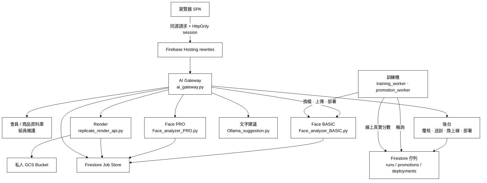
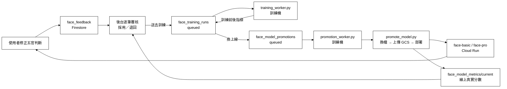

# 妝識你的美-DecorateMeAI｜後端與 AI Gateway

[](https://www.python.org/)
[](https://fastapi.tiangolo.com/)
[](https://cloud.google.com/run)
[](https://cloud.google.com/firestore)
[](https://docs.docker.com/compose/)

> 本分支 `Isa` 是 **妝識你的美（DecorateMeAI）** 的 Python 後端與 AI Gateway。
> 內容包含瀏覽器的單一 API 入口、臉部特徵分析（BASIC / PRO）、妝容渲染與私人媒體管線、
> 文字建議服務，以及 Cloud Run 部署設定與 Firestore 工作紀錄。
>
> 還有一條**閉環**：使用者說「這個判斷不對」→ 管理員逐筆覆核 → 重新訓練 →
> 帶著誤差範圍與線上模型比較 → 換上線 → 回頭量使用者的同意率有沒有提高。
> 那是這個專題想證明的事——模型不是交出去就結束，它要能被使用者的意見推著往前。
>
> 正式前端：<https://decorate-me.web.app>（前端原始碼在 `dev_makeup` 分支）

---

## 系統架構

瀏覽器只連正式網站的同源路徑。資料庫網址、上游 API 金鑰與模型權杖只存在
Cloud Run 環境變數與 Secret Manager，不寫入前端、文件或一般 Log。



後台只**登記決定**，不執行：模型檔在訓練機的檔案系統上，Cloud Run 讀不到，
所以佇列是兩邊唯一的接觸面。訓練機沒開機時請求就排隊等著——
這件事在畫面上會直說，不會假裝進度在前進。

---

## 核心功能模組

### 1. AI Gateway：瀏覽器的單一入口 (`ai_gateway.py`)

* **Session-only 驗證**：登入後只發 `HttpOnly + Secure + SameSite=Lax` 的 `__session` cookie。
  瀏覽器不持有任何上游長期金鑰，也不保存會員 Bearer token。
* **上游路徑白名單**：每個上游服務各自列舉允許的路徑（`UPSTREAMS`），
  不在清單上的路徑一律 404。渲染的所有權敏感路由刻意不在白名單內，
  由 Gateway 內部組網址呼叫，瀏覽器沒有理由也沒有辦法直接存取。
* **雙層寫入防線**：
  * `X-Expected-Actor`：寫入請求必須帶上該分頁 pin 到的不可逆 actor 識別碼，
    與 session 內的身分對不上就拒絕，避免跨分頁換帳號時寫到別人的資料。
  * **CSRF double-submit**：管理端的寫入額外檢查 `dm_csrf` cookie 與 `X-CSRF-Token` 標頭。
* **分桶限流**：登入失敗才消耗登入額度；註冊、寄驗證碼與驗證碼確認走獨立的桶，
  避免任何一方的失敗把另一方一起鎖死。額度優先寫入 Firestore，
  單機退回記憶體，跨 instance 才會一致。
* **私人媒體代理**：`/media/render/{jobId}` 以短效簽章確認擁有者後串流圖片，
  GCS Bucket 全程保持私有，不因為要顯示圖片而開放公開讀取。
* **去識別化稽核**：管理端的高風險操作寫入稽核紀錄，操作者與目標一律以雜湊記錄，
  不保存完整 email。

### 2. 臉部特徵分析（`Face_analyzer_BASIC.py` / `Face_analyzer_PRO.py`）

* **BASIC**：以 MediaPipe 取得地標後切出五官 ROI，經 DINOv2 特徵萃取與分類頭，
  輸出臉型、眉型、眼型、鼻型、唇型與個人色彩季型。
* **PRO**：加入多角度拍攝流程，量測 yaw / pitch 與穩定持續時間，
  自動擷取正面與左右 45 度，建立更完整的輪廓與側面資料。
* **非同步工作**：兩者都以提交後輪詢的方式運作，工作狀態與逾時由 Job Store 管理，
  避免長時間佔用連線。
* **皮膚取樣的三道防線**：臉頰多邊形先避開髮際線；MediaPipe `selfie_multiclass`
  分割出頭髮像素（一張測試照佔畫面 28.3%）；分割不可用時退回材質啟發式。
  分析結果會標出**取樣來源**（segmentation／texture／unfiltered），
  先前這三條退路是靜默的，同一個人的兩張照片可以給出不同答案而畫面上毫無線索。
* **誠實說出這個改善的大小**：跨三個來源七張照片，分割只讓 L\* 平均動 +0.17，
  沒有任何季型或色階標籤改變。真正主宰誤差的是**拍攝條件**——兩張照片十種光線變化，
  ΔE 中位數 5.76、最大 11.15（ΔE 2.3 就是肉眼可辨的門檻），十種裡六種改了色階標籤、
  兩種改了季型。**輸入的精度撐不起建立在它上面的判斷**，調排序修不了這件事。
* **模型檔不進 Git**：權重靠 `tools/face_models_manifest.json` 描述，從 GCS 取得。
  manifest 記著每個檔案的 sha256，`face/Dockerfile` 會跑
  `download_face_models.py --verify-only`——換了模型卻沒更新 manifest，
  build 會以一個「看起來像下載壞掉」的訊息失敗。

### 3. 妝容渲染與私人媒體（`replicate_render_api.py` / `replicate_render.py`）

* **生成與工作管理**：呼叫上游模型產圖，工作狀態、逾時與保留期限統一由 Job Store 控管。
* **兩段式物件生命週期**：未收藏的結果存在 `temporary/`，由 GCS 生命週期規則在
  兩天後自動刪除；使用者收藏後才移到 `retained/{opaqueOwnerId}/{jobId}` 長期保存。
* **刪除連動**：取消收藏或刪除會員時，資料庫紀錄、Render 工作與 GCS 物件一併清除，
  不留下無主的臉部影像。

### 4. 文字建議服務（`Ollama_suggestion.py`）

* 依臉部分析結果與選定風格組出提示詞，交由 Ollama 產生六段式繁體中文妝容建議。
* 具備 `/suggest` 與 `/suggest/stream` 兩種輸出，服務金鑰缺少時拒絕啟動（fail closed）。
* **簽章的渲染提示詞**：回應中第二段英文是給渲染端用的。它帶著共用密鑰的簽章與契約版本，
  渲染端**驗證**而不是自己重新生成——兩邊各自組一次提示詞，遲早會對同一張臉講出不同的妝。
  `REQUIRE_PERSONALIZED_RENDER_PROMPT` 開啟時，拿不到可信提示詞就明確失敗；
  關閉時退回固定風格句，但會說出來。先前那個退路是靜默的，
  「個人化失敗」與「個人化成功」在畫面上長得一模一樣。
* **部署位置**：這支跑在組員的機器上，經 Cloudflare Tunnel 對外。網址每次重啟都會換，
  用 `web_frontend/update-ollama-url.ps1` 同時更新 Gateway 的 `TEXT_SUGGESTION_URL`
  與 render 的 `SUGGESTION_SERVICE_URL`——**兩個都要改**，只改一個的話渲染會安靜地退回通用妝容。

### 5. 五官判斷回饋（`face_feedback.py`）

* `POST /v1/face/jobs/{job_id}/feedback`，BASIC 與 PRO 各掛一條，內容由
  `face_feedback.register_route()` 統一提供。
* 驗證沿用其他 job 路由那套 `X-Job-Token`——少了它，任何人都能對別人的 jobId 灌標籤，
  而這批資料是要拿去重訓的（issue #24）。
* 修正值一律對照 `models/basic_features_roi/*_classes.json` 驗證，不自己抄一份清單。
* 使用者說「判斷正確」時**刪除**既有紀錄而不是略過——他可能是把先前的修正改回去，
  只是不寫的話那筆錯誤標註會永遠留在訓練集裡。
* 只收類別字串，永遠不碰照片。影像在渲染端，靠渲染 job 上的 `faceJobId` 對應。
* 詳見 `五官判斷回饋_端對端流程說明_2026-07-27.md`。

### 6. 影像安全（`image_safety.py`）

* 上傳影像先驗證真實格式與尺寸上限，拒絕偽裝副檔名與過大的檔案。
* 移除 EXIF 與 XMP 中的位置資訊後才進入分析管線，避免拍攝地點隨照片一起流入後端。

### 7. 共用基礎設施

| 模組 | 職責 |
|---|---|
| `job_store.py` | Firestore 工作資料、TTL、狀態轉換與限流視窗額度 |
| `api_errors.py` | 統一的結構化錯誤格式、服務金鑰 fail-closed 檢查、固定時間比較 |
| `admin_audit.py` | 管理端操作稽核紀錄 |
| `face_feedback.py` | 五官判斷回饋：對照 `*_classes.json` 驗證、寫入 `face_feedback` 集合，並提供 BASIC／PRO 共用的路由註冊 |
| `analysis_package.py` | 分析結果封裝，供前端與文字建議共用 |
| `training/training_run_store.py` | 訓練批次的 Firestore 讀寫、worker 心跳、`macro_std_error`（訓練端與換上線端共用同一個誤差算式） |
| `tools/promote_model.py` | 換模型上線：類別檢查、以線上分數重算、備份、重寫 manifest |
| `tools/online_trust_score.py` | 依模型版本分組的線上同意率，附 Wilson 區間 |
| `dev_server_utils.py` | 本機開發伺服器啟動、連接埠占用偵測與 CORS 來源 |

---

## 模型持續改善迴路

使用者說「這個判斷不對」之後會發生什麼事。整條線的設計原則只有一句：
**後台下令，本機執行**——模型檔在訓練機的檔案系統上，Cloud Run 碰不到它，
而 ConvNeXt 訓練是好幾分鐘的 CPU 工作，一個 HTTP request 裝不下。



### 為什麼要人按兩次

`training_worker` **刻意不把訓練出來的模型換上線**——「要不要換是決策，不是計算」。
所以「送去訓練」與「換上線」是兩個獨立的決定，各自要有人按。
先前只有前者，結果是 37 批產出躺在 `models/training_runs/`，
線上目錄一個位元組都沒動過，其中包括一個比線上高 11.7 分的鼻型模型。

### 同一張考卷

跨批次比較只有在「考卷固定」時才成立。`holdout_split_v2.json` 定案後不再重跑：

| | |
|---|---|
| 總量 | 2298 張 → 保留 613 張、197 個身分（ratio 0.2、seed 42） |
| 每個部位實際可用 | **76～169 張**（只有帶該標註的影像算數） |
| 鍵 | sha256，不是路徑——搬機器或搬資料夾都不影響 |

`training_worker` 會把這份切分複製進 `*_plus_feedback` 快取目錄，
訓練腳本自己也再補一次。少了它，訓練會在第一個 epoch 前就 `FileNotFoundError`，
而「重新送訓」只是在重複同一個錯誤。兩處都**只複製、不重新亂數切**——
換一份新的隨機切分等於安靜地終結跨批次比較。

### 數字要帶誤差

macro accuracy 是各類別 recall 的平均，所以

```
Var(macro) = (1/K²) · Σ_c  recall_c · (1 - recall_c) / n_c
```

在 76～169 張的規模下，單次量測的 95% 誤差是 **±7～9 個百分點**。
所以這套量測**分辨不出 10 個百分點以內的差異**——讀任何一個 delta 都要記得這件事。

`promote_model` 因此只在「差距大到誤差解釋不掉」時才擋下換上線。
先前是任何負數都整批拒絕，等於把雜訊當成證據：2026-09-04 有一批被 −2.6 擋掉，
而那個部位的誤差是 ±10.1。誤差算不出來時回 `None` 而不是 `0`
（`0` 會被讀成「量得毫無誤差」），並退回保守的舊規則。

### 換上線時擋在前面的四件事

| 檢查 | 擋掉什麼 |
|---|---|
| `classes.json` 一致 | 2026-08-24 加了第四類眉型而代碼表沒跟上，一萬張線上照片有 964 張的答案被丟成 unknown，而且不報錯 |
| 以**線上真實分數**重算 | 後台的歷史基準換過一次模型就過期，會把 −4.5 畫成 +2.3 |
| 備份被替換的檔案 | 換到一半失敗時線上目錄是新舊混合，要能回去 |
| 重寫 manifest 的 sha256 | 否則下一次 build 會以「像下載壞掉」的訊息失敗 |

`--allow-regression` 留給刻意的回退。

### 兩台守候程式

| 程式 | 排程工作 | 職責 |
|---|---|---|
| `tools/training_worker.py` | `DecorateMe 訓練機` | 撿 queued 批次去訓練，回寫訓練前後指標 |
| `tools/promotion_worker.py` | `DecorateMe 換模型機` | 撿換上線與部署請求，一路做到 Cloud Run |

兩者都由 `tools/start_*_worker.ps1` 包起來（日誌輪替、UTF-8、指數退避重啟），
再由 Windows 工作排程每 5 分鐘拉一次——**死掉的行程自己會回來**。

看門狗救不了「行程還活著但程式是舊的」，所以 `promotion_worker` 會在每輪閒下來時
比對自己的原始碼指紋，變了就以結束碼 `86` 退出，外殼立刻用新版重啟。
檢查點刻意放在該輪工作全部做完之後——換模型中途結束會留下一筆卡在 `running`
而背後沒有任何行程的請求。

啟動排程：`powershell -ExecutionPolicy Bypass -File tools\setup_training_task.ps1`

### 換完之後怎麼知道有沒有變好

`tools/online_trust_score.py --by-version` 依模型版本分組計算使用者的同意率——
「換模型之後大家是不是更同意了」正是整個回饋迴路存在的理由。
每個比率旁邊印 Wilson 區間：以兩週內拿得到的樣本數，它們會重疊，
**那才是誠實的答案**，不是一個看起來像進展的數字。

---

## 技術棧

### 後端

* **核心框架**：Python 3.11 + FastAPI 0.139.2 + Uvicorn
* **臉部分析**：MediaPipe + InsightFace + ONNX Runtime + OpenCV
* **模型訓練與評估**：scikit-learn + pandas + NumPy
* **雲端服務**：Cloud Run + Cloud Build + Firestore + Cloud Storage + Secret Manager
* **驗證與加密**：PyJWT + cryptography（Fernet）
* **容器化**：Docker + Docker Compose，基底映像連 digest 一起釘住

### 前端（`dev_makeup` 分支）

* Vanilla JS（ES6）單頁應用 + Fetch API
* Firebase Hosting，以 rewrites 將同源路徑導向 Cloud Run

---

## 專案目錄結構

```text
PythonProject12/                  # 分支 Isa
├── ai_gateway.py                 # AI Gateway：瀏覽器的單一 API 入口
├── Face_analyzer_BASIC.py        # 基礎臉部分析服務
├── Face_analyzer_PRO.py          # 進階臉部分析服務（多角度）
├── Ollama_suggestion.py          # 文字建議服務
├── replicate_render_api.py       # 妝容渲染 API
├── replicate_render.py           # 渲染核心：模型呼叫與 GCS 物件管理
├── analysis_package.py           # 分析結果封裝
├── image_safety.py               # 影像格式驗證與位置資訊移除
├── job_store.py                  # Firestore 工作紀錄與限流額度
├── api_errors.py                 # 錯誤格式與服務金鑰檢查
├── admin_audit.py                # 管理端稽核紀錄
├── dev_server_utils.py           # 本機開發伺服器工具
├── face_roi.py                   # 五官 ROI 切割
├── basic_roi_shadow.py           # ROI 影子比對
├── face_feedback.py              # 五官判斷回饋：驗證、儲存與 BASIC／PRO 共用路由
├── rule_features.py              # 規則式特徵
├── models/                       # 分類頭與形狀模型（納入版控）
│   ├── basic_features_roi/
│   ├── final_features_20260719/
│   └── pro_nose_side/
├── tools/                        # 模型匯出與資料處理工具
├── Dockerfile                    # 臉部分析與文字建議共用
├── Dockerfile.gateway            # AI Gateway
├── Dockerfile.render             # 渲染服務
├── cloudbuild.gateway.yaml       # Gateway 映像建置
├── cloudbuild.render.yaml        # 渲染映像建置
├── docker-compose.yml            # 本機一鍵啟動
├── .gcloudignore                 # Cloud Build 上傳白名單（見下方說明）
└── requirements*.txt             # 依服務拆分的依賴清單
```

---

## 快速開始

### 方案 A：本機虛擬環境

#### 1. 建立環境

```bash
git clone https://github.com/vivi930319/DecorateMeAI.git
cd DecorateMeAI
git checkout Isa

python -m venv .venv
source .venv/bin/activate        # Windows: .venv\Scripts\activate

pip install -r requirements.txt
pip install -r requirements.gateway.txt
```

#### 2. 設定環境變數

Gateway 至少需要下列項目，實際值不要寫進版控：

```bash
# 上游服務位址
MEMBER_DATABASE_URL=
PRODUCT_DATABASE_URL=
FACE_BASIC_URL=
FACE_PRO_URL=
RENDER_URL=
TEXT_SUGGESTION_URL=

# 驗證與 session
GATEWAY_SESSION_SECRET=
GATEWAY_SESSION_ONLY=true
GATEWAY_SESSION_TTL_SECONDS=7200

# 上游金鑰
UPSTREAM_FACE_API_KEY=
UPSTREAM_RENDER_API_KEY=
UPSTREAM_TEXT_SUGGESTION_API_KEY=
PRODUCT_ADMIN_API_KEY=

# 限流
GATEWAY_LOGIN_RATE_LIMIT_WINDOW_SECONDS=600
GATEWAY_LOGIN_RATE_LIMIT_MAX_REQUESTS=10
GATEWAY_SIGNUP_RATE_LIMIT_WINDOW_SECONDS=600
GATEWAY_SIGNUP_RATE_LIMIT_MAX_REQUESTS=40

# 文字建議總開關，未開啟時 /text-suggestion/* 一律 503
GATEWAY_ALLOW_EXTERNAL_TEXT_UPSTREAM=
```

`MEMBER_DATABASE_URL` 與 `PRODUCT_DATABASE_URL` 目前是 Cloudflare Quick Tunnel 網址，
每次上游重啟都會更換，換址後必須同步更新 Cloud Run 上的設定。

#### 3. 啟動服務

各服務有預設連接埠，可用 `{前綴}_PORT` 覆寫：

| 服務 | 啟動指令 | 預設埠 |
|---|---|---|
| AI Gateway | `python ai_gateway.py` | 8015 |
| Face BASIC | `python Face_analyzer_BASIC.py` | 8001 |
| Face PRO | `python Face_analyzer_PRO.py` | 8002 |
| 文字建議 | `python Ollama_suggestion.py` | 8010 |
| 渲染 | `uvicorn replicate_render_api:app --port 8020` | 8020 |

前端從 `localhost` 開啟時，未設定 `aiGatewayUrl` 會自動指向本機 Gateway 的 8015 埠。

### 方案 B：Docker Compose

```bash
cp .env.example .env             # 若不存在，依上一節自行建立
docker compose up -d             # 啟動臉部分析 BASIC / PRO 與文字建議
docker compose --profile optional up -d replicate_render   # 需要渲染時另外啟動

docker compose ps
docker compose logs -f face_analysis_basic
```

本機 compose 在未提供金鑰時預設放行（`ALLOW_INSECURE_LOCAL_DEV=1`）。
這個旗標在 `APP_ENV=production` 下一律失效，不會影響正式站的驗證。

---

## 測試與診斷工具

```bash
python -m unittest ai_gateway_test
python -m unittest image_safety_test
python backend_smoke_test.py
```

| 檔案 | 用途 |
|---|---|
| `ai_gateway_test.py` | Gateway 的驗證、路徑白名單、限流分桶、session 與稽核行為 |
| `image_safety_test.py` | 影像格式驗證與位置資訊移除 |
| `backend_smoke_test.py` | 後端整體煙霧測試，含影像安全的拒絕路徑 |
| `render_api_test.py` | 渲染 API 與工作狀態 |
| `ollama_suggestion_smoke_test.py` | 文字建議的提示詞組裝 |
| `Face_test.py` | 臉部分析流程 |

---

## 部署

### 建置映像並更新 Cloud Run

```bash
IMAGE="gcr.io/decorate-me/ai-gateway:$(date +%Y%m%d-%H%M%S)"

gcloud builds submit --config=cloudbuild.gateway.yaml \
    --substitutions="_IMAGE=${IMAGE}" --project=decorate-me

gcloud run services update ai-gateway \
    --region=asia-east1 --project=decorate-me \
    --image="${IMAGE}" --quiet
```

### 部署後必須確認的事

* 新映像已切到 100% 流量，不能只確認 Cloud Build 成功。
* 實際打線上路徑驗證，不要只看部署指令的輸出：

```bash
curl -s -o /dev/null -w "%{http_code}\n" "https://decorate-me.web.app/product-api/api/products?limit=1"
curl -s -o /dev/null -w "%{http_code}\n" "https://decorate-me.web.app/public-config"
```

### 三份白名單的陷阱

這個 repo 有**三份**「`*` 全擋 + 逐項放行」的清單，新增一支會被 import 或 `COPY` 的檔案時
**三份都要加**：

| 檔案 | 管什麼 | 漏掉的症狀 |
|---|---|---|
| `.gitignore` | 進不進版控 | **最難發現。** 本機跑得動、`gcloud builds submit` 也上得去（它從本機磁碟打包，不是從 git），線上一切正常——但別人 clone 下來就 `ImportError` |
| `.dockerignore` | 本機 `docker build` 的 context | `COPY failed: file not found in build context` |
| `.gcloudignore` | `gcloud builds submit` 上傳的 context | 同上，但只在雲端建置時出現 |

2026-07-28 加 `face_feedback.py` 時只補了後兩份，於是它被部署上線、四個服務都正常，
卻整整一天不在版控裡。CI 也照不到——它只跑 `ai_gateway_test` / `render_api_test` /
`image_safety_test`，沒有一組會 import analyzer。

**檢查方式：** 把三個 Dockerfile 的 `COPY` 清單跟三份白名單取差集，差的就是會炸的檔案。

## 資安原則

* 前端、版控與文件都不保存實際 API 金鑰、JWT、密碼或 OTP。
* Log 不記錄照片、完整分析包、完整 email、權杖或提示詞。
* GCS Bucket 不為了顯示圖片而改成公開；會員只能透過 Gateway 讀取自己的圖片。
* 刪除收藏或會員時，資料庫、Render 工作與 GCS 物件必須同步清除。
* 服務金鑰缺少時拒絕啟動，不以「先跑起來再說」的方式降級。

---

## 相關文件

**這個 repo 裡只有 `README.md` 與 `docs/agents/`。** 其餘 `.md` 依專案慣例不進版控
（`.gitignore` 是白名單，第二行就是 `*`），所以工作文件留在本機：

| 位置 | 內容 |
|---|---|
| `docs/專案管理與交接/歷史流程更改追蹤.md` | **除錯時第一個要讀的**。逐次記錄問題、根因、修正與**驗證界線**，包括當時推論錯在哪 |
| `docs/專案管理與交接/演算法文件書.md`、`資料庫文件書.md` | 演算法與資料庫的完整說明 |
| `docs/專案管理與交接/Gateway_API測試與驗收操作手冊.md` | 線上 Gateway 的驗收步驟 |
| `補充文件md檔案/` | 給資料庫端、演算法端、前端的規格書與實測報告 |

歷史紀錄裡有一條反覆出現的教訓值得寫在這裡：**看狀態碼不夠，要看 `error.code`**。
同樣是 401，「沒登入」與「上游拒絕我們」是兩件事，混在一起會把三天花在錯的方向上。

---

## 分支分工

| 分支 | 內容 |
|---|---|
| `Isa` | Python 後端、AI Gateway、臉部分析、渲染與雲端部署 |
| `dev_makeup` | Web 前端與 Firebase Hosting |
| `lavien` | 會員、商品與推薦資料庫 |
| `dev` | iOS App |
| `Amy` | 組員開發線 |

`origin` 上同時有多條組員的線，`main` 不一定是最新的內容。
