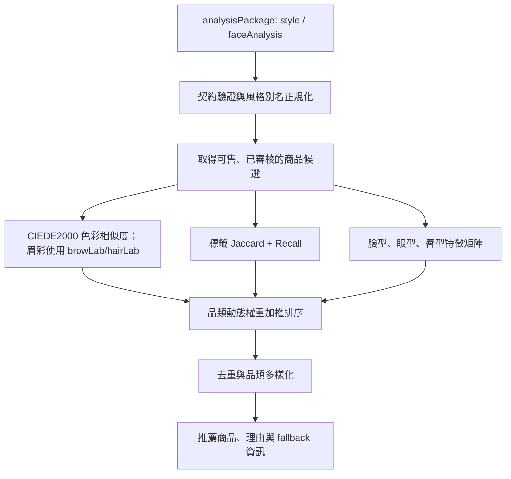

# 妝識你的美 - Decorate Me

[](https://www.python.org/)
[](https://flask.palletsprojects.com/)
[](https://www.postgresql.org/)
[](https://redis.io/)
[](https://docs.docker.com/compose/)

> **妝識你的美（Decorate Me）** 是結合會員服務、彩妝商品管理、妝容紀錄與個人化推薦的 Web 平台。後端以 Flask 提供 API 與 Jinja 頁面，資料層使用 PostgreSQL 18 與 Redis，並透過 CIEDE2000 色彩距離、風格關鍵字與五官特徵進行可解釋的商品推薦。

---

## 線上展示

暫時展示網址：<https://reality-brief-telephony-divorce.trycloudflare.com>

> 此網址由 Cloudflare Tunnel 提供，Tunnel 重新啟動後可能改變或失效；它是展示用網址，不是永久正式網域。

---

## 快速開始（Getting Started）

### 1. 環境需求

- Docker Desktop（建議）或 Python 3.11+
- PostgreSQL 18
- Redis 7
- SMTP 寄信帳號及應用程式密碼（註冊／重設密碼 OTP 必要）

### 2. 設定環境變數

複製 Docker 環境範本：

```powershell
Copy-Item .env.docker.example .env
```

正式環境至少應設定：

```dotenv
SECRET_KEY=請改成高熵亂數
DB_PASSWORD=請改成安全密碼
SMTP_USER=寄件帳號
SMTP_PASS=寄件應用程式密碼
UPSTREAM_MEMBER_API_KEY=Gateway金鑰
GATEWAY_KEY_LOOSE_MODE=false
```

### 3. Docker 部署（推薦）

```powershell
docker compose up -d --build
docker compose ps
Invoke-WebRequest http://127.0.0.1:5000/health
```

預設服務埠：Flask API `5000`、PostgreSQL `5432`、Redis `6379`。

### 4. 首次初始化資料庫

Docker Compose 會建立 PostgreSQL 18 容器與資料卷，但**不會自動匯入** `postgre.sql`。新資料卷需要先確認 SQL 檔版本後再初始化：

```powershell
Get-Content .\postgre.sql -Raw | docker compose exec -T db psql -U postgres -d empower_beauty
```

若 `.env` 使用不同帳號或資料庫名稱，請同步修改命令。既有正式資料庫不可直接重複匯入 dump；請先備份並使用 Migration 或經審核的 SQL。

---

## 核心功能模組

### 1. 會員帳號與安全防護系統

- **驗證後才成為會員**：註冊資料會先保存在 `pending_registrations`；只有 OTP 驗證成功才寫入 `members`。
- **Email 網域檢查**：驗證格式、MX 記錄與一次性信箱黑名單；`admin@decorateme.local` 是唯一允許的非標準網域帳號。
- **OTP 防護與品牌 Email**：Redis 儲存有效期限、驗證嘗試與寄送時間窗；OTP HTML Email 使用 CID 內嵌 `static/brand/decorate-me-logo.jpg`，同時保留純文字備援內容。
- **密碼與登入**：以 Flask-Bcrypt 雜湊密碼；登入建立 PostgreSQL `member_sessions`，回傳 HttpOnly/Secure/SameSite Cookie 與 Bearer Token。
- **角色與授權**：使用者只能存取自己的資源；管理者可進行會員、商品與爬蟲資料管理。
- **請求安全**：CORS 僅允許設定來源；Cookie 驗證的寫入請求檢查 `Origin` 與 `Sec-Fetch-Site`；API 錯誤回應含 `code`、`message` 與 `requestId`。

### 2. 智慧色彩與風格推薦演算法

- **七種妝容風格**：Soft Baddie、千金、港風、韓系亞裔、病嬌、日雜清透、男士白開水。
- **CIEDE2000 色彩比對**：將 HEX 色票轉為 sRGB、XYZ(D65)、CIELAB，再以 ΔE00 取代舊 CIE76 色差。
- **風格標籤比對**：使用 Jaccard 與 Recall，並對 `avoidTags` 命中加入扣分。
- **五官特徵評分**：以臉型、眼型、唇型及品類矩陣給予修飾分數。
- **品類動態權重**：底妝偏重色彩；眼妝與腮紅偏重風格；修容偏重臉部特徵。
- **眉彩不再錯用膚色**：眉彩僅在 `faceAnalysis.browLab` 或 `hairLab` 存在時使用 CIEDE2000 比色；缺少可靠眉色時不會硬推主推商品，並回傳 `BROW_COLOR_UNAVAILABLE`。
- **新商品自動納入**：新商品通過商品契約且進入 `product_catalog` 後，會成為推薦候選；未知分類採預設權重，不會因未寫死分類被忽略。
- **資料庫檢索欄位與狀態**：以商品 `name`、`brand`、`description`、`specs`、`styleTags`／`tags` 與分類比對；只納入 `active`、`approved`、`in_stock`、`recommendation_ready` 全部成立的商品。
- **可重跑排序**：移除隨機微擾；相同分析資料與相同候選商品會得到相同排序，能重跑 Precision@K。
- **可解釋輸出**：每筆商品包含 `matchScore`、`matchedKeywords`、推薦理由、fallback 狀態與覆蓋資訊；回應有每類一件的 `primary`、80 分以上的 `alternates`、`threshold: 0.80`，並保留輸入的 `id`、`schemaVersion`、`faceAnalysis`。

#### 推薦流程圖



### 3. 商品、收藏、試妝與會員服務

- 商品瀏覽、商品 CRUD、色票查詢及商品分類 API。
- 收藏新增、切換、刪除；購物車讀取、新增、更新、刪除。
- 試妝紀錄、保存妝容、分析歷史及推薦頁面。
- 每日簽到、點數、任務領取、主題兌換與推薦碼。

### 4. 爬蟲商品暫存與管理稽核

- 商品預覽 API 會驗證 URL、過濾不安全網路目標並解析商品資料，以降低 SSRF 風險。
- 爬蟲資料先寫入 `crawler_staging_products`，管理者才可核准或拒絕。
- 商品新增、修改、刪除與暫存審核均可留下產品／管理稽核紀錄。
- 管理者可查詢會員、更新會員、刪除會員、檢視稽核與產品紀錄。

---

## 技術棧（Technology Stack）

| 類別 | 技術 | 用途 |
|---|---|---|
| 後端 | Python 3.11、Flask 3.1.3、Gunicorn | API 與 Web 服務 |
| ORM | Flask-SQLAlchemy、SQLAlchemy 2、psycopg2-binary | ORM 與 PostgreSQL 連線 |
| 資料庫 | PostgreSQL 18 | 資料表、JSONB、Function、Trigger、View、Index |
| 快取 | Redis 7、redis-py | OTP、TTL、嘗試計數與限流 |
| 安全 | Flask-Bcrypt、Flask-Login、Flask-WTF、Flask-CORS、dnspython | 密碼、登入、表單、跨域與 MX 驗證 |
| 爬蟲/預覽 | requests、BeautifulSoup4、httpx、Playwright、Selenium | 商品頁解析與動態網頁支援 |
| 數值/影像 | NumPy、OpenCV-headless、Pillow | 色彩與影像處理 |
| 部署 | Docker、Docker Compose | Flask、PostgreSQL、Redis 容器化 |

> `qdrant-client`、`OLLAMA_HOST` 與 `SD_HOST` 目前僅作為可擴充介面；核心推薦不會呼叫 Qdrant、Ollama 或 Stable Diffusion。

---

## 資料庫模型總覽

### 會員與驗證

| 模型/資料表 | 說明 |
|---|---|
| `members` | 會員、角色、等級、Email 驗證、狀態與 Session 版本 |
| `pending_registrations` | 等待 Email OTP 驗證的註冊資料 |
| `otp_codes` | OTP 目的、雜湊、到期與嘗試狀態 |
| `member_sessions` | 雜湊 Session Token、到期、撤銷與來源識別 |
| `member_deletion_jobs` | 會員刪除作業狀態 |

### 商品、互動與稽核

`postgre.sql` 目前定義 **29 張資料表**，包括 `products`、`product_catalog`、八個商品分類表、`crawler_staging_products`、收藏、購物車、簽到、點數、任務、推薦碼、妝容／分析歷史與各類稽核表。

- **Function**：`enforce_product_contract`、`register_product_catalog_item`、`product_hex_to_lab`、簽到／收藏／會員等級相關函式。
- **Trigger**：商品契約檢查、新商品登錄全域商品目錄、簽到重複防護、收藏與會員等級歷程。
- **View**：`view_member_activity`、`view_member_dashboard`、`view_product_list`、`view_product_popularity`。
- **Index**：針對商品推薦狀態、爬蟲審核、會員 Session/OTP、稽核、點數、任務等高頻查詢建立索引。

---

## API 概覽

`app.py` 有 66 個明確宣告路由，另依 `MAKEUP_CATEGORIES` 動態註冊 8 個商品分類端點；連同不同 HTTP 方法，提供超過 70 項操作。

| 類別 | 代表端點 |
|---|---|
| 健康 | `GET /health`、`GET /healthz` |
| 認證 | `POST /api/register`、`/api/send-otp`、`/api/verify-otp`、`/api/login`、`/api/logout`、`GET /api/me` |
| 會員 | `GET/PATCH/DELETE /api/members/<email>`、點數、任務、主題、推薦碼、稽核、統計 |
| 收藏/購物車 | 收藏 CRUD/toggle、歷史、`GET/PUT /cart`、購物車品項 CRUD |
| 商品/爬蟲 | 商品 CRUD、商品分類、色票、預覽、爬蟲暫存查詢/核准/拒絕、產品稽核 |
| 推薦 | `POST /api/tryon/save`、`POST /recommend-products` |

推薦請求範例：

```json
{
  "analysisPackage": {
    "id": "AN-001",
    "schemaVersion": "2026-08-v2",
    "style": "richGirl",
    "faceAnalysis": {"skinTone": {"lab": [65.2, 8.1, 18.4]}, "faceShape": "oval"}
  },
  "limit": 12
}
```

### 推薦錯誤契約

| 情況 | HTTP | code / 回應 |
|---|---:|---|
| `limit` 不是整數或不在 1–50 | 400 | `INVALID_REQUEST` |
| 缺少或無效 `analysisPackage` | 422 | `INVALID_ANALYSIS_PACKAGE` |
| 未知妝容風格 | 422 | `UNKNOWN_MAKEUP_STYLE` |
| 合法請求但查無可用商品 | 200 | `RECOMMENDATION_EMPTY`，`products: []` |
| 商品資料庫無法使用 | 502 | `PRODUCT_DB_UNAVAILABLE` |
| 商品資料庫查詢逾時 | 504 | `PRODUCT_DB_TIMEOUT` |

錯誤與空結果絕不產生虛構商品；前端應優先讀取 `analysisPackage.recommendations.products`。

---

## 專案目錄結構

```text
Backend database/
├── app.py                    # Flask 路由、驗證、會員/商品/推薦整合
├── models.py                 # SQLAlchemy ORM 模型
├── recommendation.py         # CIEDE2000、相似度、權重、排序
├── makeup_keywords.py        # 七種風格關鍵字與別名
├── postgre.sql               # PostgreSQL 18 schema、Function、Trigger、View、Index
├── otp_utils.py / OTP.py     # OTP、Redis、SMTP 輔助
├── static/brand/              # OTP Email 內嵌 Decorate Me Logo
├── crawler_preview.py        # 商品預覽與 SSRF 防護
├── config.py / forms.py      # 設定與表單驗證
├── docker-compose.yml        # Flask + PostgreSQL 18 + Redis
├── Dockerfile                # API 映像建置
├── wait_for_services.py      # 容器啟動等待 DB / Redis
├── templates/                # Jinja 網頁模板
├── tests/recommendation/     # Precision@K 評估與推薦契約反向測試
├── backups/                  # 升級前資料庫備份
└── test_*.py、*_test.py      # 開發診斷腳本，非正式服務核心
```

---

## 測試、限制與安全提醒

```powershell
python -m py_compile app.py recommendation.py
python -m unittest tests\recommendation\test_recommendation_contract.py
python tests\recommendation\evaluate_precision_at_k.py gold.json predictions.json
docker compose ps
```

- `test_recommendation_contract.py` 驗證 styleId／顯示名稱相容、未知風格、停用或欄位不足商品排除、眉彩不以膚色比色，以及推薦結果可重跑。
- 評估工具可計算 Precision@5/10、重複率、停用商品率與幻覺商品率；尚未建立人工金標集前，不宣稱準確率數字。
- 不可提交 `.env`、SMTP 密碼、Gateway/Bearer Key、真實個資、正式資料庫 dump 或 Docker Volume。
- `backups/` 是 PostgreSQL 升級前還原點；先做異地加密備份，再考慮清理。
- 正式上線應設定固定 HTTPS 網域、`GATEWAY_KEY_LOOSE_MODE=false`、由 Gateway 傳送 `X-Gateway-Key`，並執行權限、CORS、OTP、備份還原與資安測試。

---
