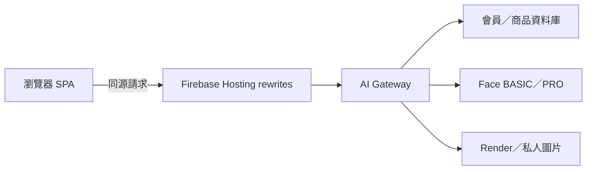

# Decorate Me Web 前端

本分支 `dev_makeup` 是 Decorate Me 的正式 Web 前端與 Firebase Hosting 部署來源。

正式網站：<https://decorate-me.web.app>

## 前端現在怎麼連後端

前端只呼叫正式網站的同源路徑，不直接保存資料庫 Tunnel 網址、Face／Render 服務網址或任何上游 API key。



常用同源入口：

| 路徑 | 用途 |
|---|---|
| `/auth/*` | 登入、註冊、OTP 與登出 |
| `/member-database/*` | 會員、收藏、點數、任務與主題 |
| `/product-api/*` | 公開商品資料 |
| `/admin-api/*` | 管理員會員與商品操作 |
| `/face-basic/*`、`/face-pro/*` | 臉部分析 |
| `/render-service/*` | 圖片渲染工作 |
| `/media/render/{jobId}` | 登入後讀取本人的私人渲染圖 |

## 2026-07-21 重要變更

- 登入只呼叫 Gateway，並使用 HttpOnly session cookie。
- 舊版前端 token key 會被清除，不在 `sessionStorage` 保存會員 Bearer token。
- `/public-config` 只使用同源路徑；即使後端資料庫 Tunnel 更換，前端也不需要再寫入新網址。
- 商品頁維持讀取完整資料；正式 API 驗證為 1041 筆，沒有加入虛擬清單或只顯示 50 筆。
- 完整分析包只在本分頁 `sessionStorage` 暫存，30 分鐘後失效。
- 收藏圖使用穩定 `/media/render/{jobId}` 路徑；Bucket 保持私人，前端不保存永久公開 GCS URL。
- Admin audit 顯示去識別化 actor ID，不顯示完整管理員 email。

### Ollama 專題展示例外

目前 Ollama 完整 Prompt 依專題紀錄需求保留在受控展示／除錯回應，本次不移除。一般 access log 仍不得記錄 Prompt、照片、完整分析包、完整 email 或權杖。待使用者明確確認 Ollama 完成後再移除展示全文。

## 主要檔案

| 檔案 | 用途 |
|---|---|
| `index.html` | 正式 SPA 入口與資產版本 |
| `js/api.js` | Gateway 設定、登入、會員、商品與 Admin API |
| `js/router.js` | 前台／後台頁面與互動流程 |
| `js/service-endpoints.js` | 同源服務路徑 fallback，不保存秘密 |
| `firebase.json` | Hosting rewrites、快取與安全標頭 |
| `frontend_smoke_check.js` | 重要安全與 API 契約檢查 |
| `deploy.ps1` | 部署前檢查、秘密掃描與 Firebase 發布 |

`config.local.js` 只供本機公開設定使用，不得放 API key、JWT、密碼或其他秘密；範例請看 `config.local.example.js`。

## 驗證與部署

```powershell
node --check js/api.js
node --check js/router.js
node frontend_smoke_check.js
./deploy.ps1
```

`deploy.ps1` 會先執行語法檢查、smoke test 與秘密掃描，再部署 Firebase Hosting。部署後仍要檢查：

- `https://decorate-me.web.app/public-config` 只回同源路徑。
- 未登入私人媒體回 401。
- 登入後會員、商品與 Admin 功能可正常讀取。
- 線上資產版本與本次部署標記一致。

## Admin 更新後顯示 401

新版 Gateway 使用 HttpOnly cookie，舊版登入狀態不能沿用。更新後第一次進 Admin 若看到會員資料庫或稽核 API 401，請先登出、重新整理，再用管理員帳號重新登入。

Console 若顯示 `content.js` 的 `Failed to initialize current tab`，通常是瀏覽器擴充功能錯誤，不是 Decorate Me API；可以用無痕視窗交叉確認。

## 資安原則

- 前端與 GitHub 不保存實際 API key、JWT、密碼或 OTP。
- Log 不保存照片、完整分析包、完整 email、權杖或 Prompt。
- GCS Bucket 不為了顯示圖片而改成公開。
- 會員只能透過 Gateway 取得自己的圖片。
- 刪除收藏或會員時，前端、資料庫、Render 工作與圖片必須同步清除。
