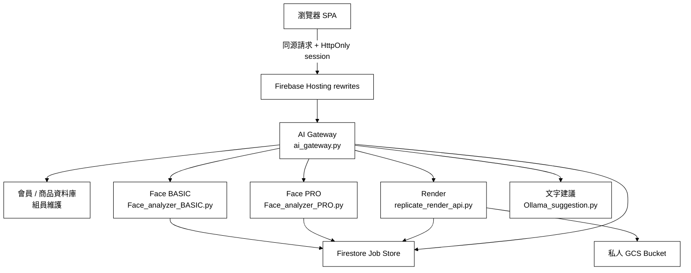

# 妝識你的美-DecorateMeAI｜後端與 AI Gateway

[](https://www.python.org/)
[](https://fastapi.tiangolo.com/)
[](https://cloud.google.com/run)
[](https://cloud.google.com/firestore)
[](https://docs.docker.com/compose/)

> 本分支 `Isa` 是 **妝識你的美（DecorateMeAI）** 的 Python 後端與 AI Gateway。
> 內容包含瀏覽器的單一 API 入口、臉部特徵分析（BASIC / PRO）、妝容渲染與私人媒體管線、
> 文字建議服務，以及 Cloud Run 部署設定與 Firestore 工作紀錄。
>
> 正式前端：<https://decorate-me.web.app>（前端原始碼在 `dev_makeup` 分支）

---

## 系統架構

瀏覽器只連正式網站的同源路徑。資料庫網址、上游 API 金鑰與模型權杖只存在
Cloud Run 環境變數與 Secret Manager，不寫入前端、文件或一般 Log。



---

## 核心功能模組

### 1. AI Gateway：瀏覽器的單一入口 (`ai_gateway.py`)

* **Session-only 驗證**：登入後只發 `HttpOnly + Secure + SameSite=Lax` 的 `__session` cookie。
  瀏覽器不持有任何上游長期金鑰，也不保存會員 Bearer token。
* **上游路徑白名單**：每個上游服務各自列舉允許的路徑（`UPSTREAMS`），
  不在清單上的路徑一律 404。渲染的所有權敏感路由刻意不在白名單內，
  由 Gateway 內部組網址呼叫，瀏覽器沒有理由也沒有辦法直接存取。
* **雙層寫入防線**：
  * `X-Expected-Actor`：寫入請求必須帶上該分頁 pin 到的不可逆 actor 識別碼，
    與 session 內的身分對不上就拒絕，避免跨分頁換帳號時寫到別人的資料。
  * **CSRF double-submit**：管理端的寫入額外檢查 `dm_csrf` cookie 與 `X-CSRF-Token` 標頭。
* **分桶限流**：登入失敗才消耗登入額度；註冊、寄驗證碼與驗證碼確認走獨立的桶，
  避免任何一方的失敗把另一方一起鎖死。額度優先寫入 Firestore，
  單機退回記憶體，跨 instance 才會一致。
* **私人媒體代理**：`/media/render/{jobId}` 以短效簽章確認擁有者後串流圖片，
  GCS Bucket 全程保持私有，不因為要顯示圖片而開放公開讀取。
* **去識別化稽核**：管理端的高風險操作寫入稽核紀錄，操作者與目標一律以雜湊記錄，
  不保存完整 email。

### 2. 臉部特徵分析（`Face_analyzer_BASIC.py` / `Face_analyzer_PRO.py`）

* **BASIC**：以 MediaPipe 取得地標後切出五官 ROI，經 DINOv2 特徵萃取與分類頭，
  輸出臉型、眉型、眼型、鼻型、唇型與個人色彩季型。
* **PRO**：加入多角度拍攝流程，量測 yaw / pitch 與穩定持續時間，
  自動擷取正面與左右 45 度，建立更完整的輪廓與側面資料。
* **非同步工作**：兩者都以提交後輪詢的方式運作，工作狀態與逾時由 Job Store 管理，
  避免長時間佔用連線。
* **模型檔納入版控**：`models/` 下的分類頭與形狀檔隨專案保存，換機器不需重訓。
  DINOv2 主幹（88MB）刻意不收，需要時以 `tools/export_dinov2_heads.py` 重新匯出。

### 3. 妝容渲染與私人媒體（`replicate_render_api.py` / `replicate_render.py`）

* **生成與工作管理**：呼叫上游模型產圖，工作狀態、逾時與保留期限統一由 Job Store 控管。
* **兩段式物件生命週期**：未收藏的結果存在 `temporary/`，由 GCS 生命週期規則在
  兩天後自動刪除；使用者收藏後才移到 `retained/{opaqueOwnerId}/{jobId}` 長期保存。
* **刪除連動**：取消收藏或刪除會員時，資料庫紀錄、Render 工作與 GCS 物件一併清除，
  不留下無主的臉部影像。

### 4. 文字建議服務（`Ollama_suggestion.py`）

* 依臉部分析結果與選定風格組出提示詞，交由 Ollama 產生六段式繁體中文妝容建議。
* 具備 `/suggest` 與 `/suggest/stream` 兩種輸出，服務金鑰缺少時拒絕啟動（fail closed）。
* **目前狀態**：Gateway 的 `GATEWAY_ALLOW_EXTERNAL_TEXT_UPSTREAM` 未開啟，
  `/text-suggestion/*` 一律回 503。等上游端完成金鑰輪替並提供固定網址後才會啟用。

### 5. 影像安全（`image_safety.py`）

* 上傳影像先驗證真實格式與尺寸上限，拒絕偽裝副檔名與過大的檔案。
* 移除 EXIF 與 XMP 中的位置資訊後才進入分析管線，避免拍攝地點隨照片一起流入後端。

### 6. 共用基礎設施

| 模組 | 職責 |
|---|---|
| `job_store.py` | Firestore 工作資料、TTL、狀態轉換與限流視窗額度 |
| `api_errors.py` | 統一的結構化錯誤格式、服務金鑰 fail-closed 檢查、固定時間比較 |
| `admin_audit.py` | 管理端操作稽核紀錄 |
| `analysis_package.py` | 分析結果封裝，供前端與文字建議共用 |
| `dev_server_utils.py` | 本機開發伺服器啟動、連接埠占用偵測與 CORS 來源 |

---

## 技術棧

### 後端

* **核心框架**：Python 3.11 + FastAPI 0.139.2 + Uvicorn
* **臉部分析**：MediaPipe + InsightFace + ONNX Runtime + OpenCV
* **模型訓練與評估**：scikit-learn + pandas + NumPy
* **雲端服務**：Cloud Run + Cloud Build + Firestore + Cloud Storage + Secret Manager
* **驗證與加密**：PyJWT + cryptography（Fernet）
* **容器化**：Docker + Docker Compose，基底映像連 digest 一起釘住

### 前端（`dev_makeup` 分支）

* Vanilla JS（ES6）單頁應用 + Fetch API
* Firebase Hosting，以 rewrites 將同源路徑導向 Cloud Run

---

## 專案目錄結構

```text
PythonProject12/                  # 分支 Isa
├── ai_gateway.py                 # AI Gateway：瀏覽器的單一 API 入口
├── Face_analyzer_BASIC.py        # 基礎臉部分析服務
├── Face_analyzer_PRO.py          # 進階臉部分析服務（多角度）
├── Ollama_suggestion.py          # 文字建議服務
├── replicate_render_api.py       # 妝容渲染 API
├── replicate_render.py           # 渲染核心：模型呼叫與 GCS 物件管理
├── analysis_package.py           # 分析結果封裝
├── image_safety.py               # 影像格式驗證與位置資訊移除
├── job_store.py                  # Firestore 工作紀錄與限流額度
├── api_errors.py                 # 錯誤格式與服務金鑰檢查
├── admin_audit.py                # 管理端稽核紀錄
├── dev_server_utils.py           # 本機開發伺服器工具
├── face_roi.py                   # 五官 ROI 切割
├── basic_roi_shadow.py           # ROI 影子比對
├── rule_features.py              # 規則式特徵
├── models/                       # 分類頭與形狀模型（納入版控）
│   ├── basic_features_roi/
│   ├── final_features_20260719/
│   └── pro_nose_side/
├── tools/                        # 模型匯出與資料處理工具
├── Dockerfile                    # 臉部分析與文字建議共用
├── Dockerfile.gateway            # AI Gateway
├── Dockerfile.render             # 渲染服務
├── cloudbuild.gateway.yaml       # Gateway 映像建置
├── cloudbuild.render.yaml        # 渲染映像建置
├── docker-compose.yml            # 本機一鍵啟動
├── .gcloudignore                 # Cloud Build 上傳白名單（見下方說明）
└── requirements*.txt             # 依服務拆分的依賴清單
```

---

## 快速開始

### 方案 A：本機虛擬環境

#### 1. 建立環境

```bash
git clone https://github.com/vivi930319/DecorateMeAI.git
cd DecorateMeAI
git checkout Isa

python -m venv .venv
source .venv/bin/activate        # Windows: .venv\Scripts\activate

pip install -r requirements.txt
pip install -r requirements.gateway.txt
```

#### 2. 設定環境變數

Gateway 至少需要下列項目，實際值不要寫進版控：

```bash
# 上游服務位址
MEMBER_DATABASE_URL=
PRODUCT_DATABASE_URL=
FACE_BASIC_URL=
FACE_PRO_URL=
RENDER_URL=
TEXT_SUGGESTION_URL=

# 驗證與 session
GATEWAY_SESSION_SECRET=
GATEWAY_SESSION_ONLY=true
GATEWAY_SESSION_TTL_SECONDS=7200

# 上游金鑰
UPSTREAM_FACE_API_KEY=
UPSTREAM_RENDER_API_KEY=
UPSTREAM_TEXT_SUGGESTION_API_KEY=
PRODUCT_ADMIN_API_KEY=

# 限流
GATEWAY_LOGIN_RATE_LIMIT_WINDOW_SECONDS=600
GATEWAY_LOGIN_RATE_LIMIT_MAX_REQUESTS=10
GATEWAY_SIGNUP_RATE_LIMIT_WINDOW_SECONDS=600
GATEWAY_SIGNUP_RATE_LIMIT_MAX_REQUESTS=40

# 文字建議總開關，未開啟時 /text-suggestion/* 一律 503
GATEWAY_ALLOW_EXTERNAL_TEXT_UPSTREAM=
```

`MEMBER_DATABASE_URL` 與 `PRODUCT_DATABASE_URL` 目前是 Cloudflare Quick Tunnel 網址，
每次上游重啟都會更換，換址後必須同步更新 Cloud Run 上的設定。

#### 3. 啟動服務

各服務有預設連接埠，可用 `{前綴}_PORT` 覆寫：

| 服務 | 啟動指令 | 預設埠 |
|---|---|---|
| AI Gateway | `python ai_gateway.py` | 8015 |
| Face BASIC | `python Face_analyzer_BASIC.py` | 8001 |
| Face PRO | `python Face_analyzer_PRO.py` | 8002 |
| 文字建議 | `python Ollama_suggestion.py` | 8010 |
| 渲染 | `uvicorn replicate_render_api:app --port 8020` | 8020 |

前端從 `localhost` 開啟時，未設定 `aiGatewayUrl` 會自動指向本機 Gateway 的 8015 埠。

### 方案 B：Docker Compose

```bash
cp .env.example .env             # 若不存在，依上一節自行建立
docker compose up -d             # 啟動臉部分析 BASIC / PRO 與文字建議
docker compose --profile optional up -d replicate_render   # 需要渲染時另外啟動

docker compose ps
docker compose logs -f face_analysis_basic
```

本機 compose 在未提供金鑰時預設放行（`ALLOW_INSECURE_LOCAL_DEV=1`）。
這個旗標在 `APP_ENV=production` 下一律失效，不會影響正式站的驗證。

---

## 測試與診斷工具

```bash
python -m unittest ai_gateway_test
python -m unittest image_safety_test
python backend_smoke_test.py
```

| 檔案 | 用途 |
|---|---|
| `ai_gateway_test.py` | Gateway 的驗證、路徑白名單、限流分桶、session 與稽核行為 |
| `image_safety_test.py` | 影像格式驗證與位置資訊移除 |
| `backend_smoke_test.py` | 後端整體煙霧測試，含影像安全的拒絕路徑 |
| `render_api_test.py` | 渲染 API 與工作狀態 |
| `ollama_suggestion_smoke_test.py` | 文字建議的提示詞組裝 |
| `Face_test.py` | 臉部分析流程 |

---

## 部署

### 建置映像並更新 Cloud Run

```bash
IMAGE="gcr.io/decorate-me/ai-gateway:$(date +%Y%m%d-%H%M%S)"

gcloud builds submit --config=cloudbuild.gateway.yaml \
    --substitutions="_IMAGE=${IMAGE}" --project=decorate-me

gcloud run services update ai-gateway \
    --region=asia-east1 --project=decorate-me \
    --image="${IMAGE}" --quiet
```

### 部署後必須確認的事

* 新映像已切到 100% 流量，不能只確認 Cloud Build 成功。
* 實際打線上路徑驗證，不要只看部署指令的輸出：

```bash
curl -s -o /dev/null -w "%{http_code}\n" "https://decorate-me.web.app/product-api/api/products?limit=1"
curl -s -o /dev/null -w "%{http_code}\n" "https://decorate-me.web.app/public-config"
```

### `.gcloudignore` 的白名單陷阱

`gcloud builds submit` 上傳來源時看的是 `.gcloudignore`，**不是** `.dockerignore`。
這份檔案第一行是 `*`（全部排除）加上逐項放行，所以新增一支會被 `COPY` 的檔案時，
必須同步加上 `!檔名`。漏掉的話建置會停在
`COPY failed: file not found in build context`，而檔案其實好端端在本機。

---

## 資安原則

* 前端、版控與文件都不保存實際 API 金鑰、JWT、密碼或 OTP。
* Log 不記錄照片、完整分析包、完整 email、權杖或提示詞。
* GCS Bucket 不為了顯示圖片而改成公開；會員只能透過 Gateway 讀取自己的圖片。
* 刪除收藏或會員時，資料庫、Render 工作與 GCS 物件必須同步清除。
* 服務金鑰缺少時拒絕啟動，不以「先跑起來再說」的方式降級。

---

## 相關文件

| 文件 | 內容 |
|---|---|
| `後端完整技術文件_2026-07-25.md` | 架構、端點、資安機制與環境變數的完整參考 |
| `Demo前設定與走查清單_2026-07-25.md` | Demo 前一天的設定與走查步驟 |
| `搬機地雷補充_2026-07-21.md` | 換機器時容易踩到的問題 |
| `給資料庫端_待修清單_2026-07-25.md` | 對資料庫端的待修項目與實測證據 |
| `給Ollama端_文字建議服務接入規格書_2026-07-25.md` | 文字建議服務的接入規格 |
| `給資料庫端_緊急_會員端點全面401_2026-07-27.md` | 2026-07-27 會員端點全面 401 的事故紀錄 |

---

## 分支分工

| 分支 | 內容 |
|---|---|
| `Isa` | Python 後端、AI Gateway、臉部分析、渲染與雲端部署 |
| `dev_makeup` | Web 前端與 Firebase Hosting |
| `lavien` | 會員、商品與推薦資料庫 |
| `dev` | iOS App |
| `Amy` | 組員開發線 |

`origin` 上同時有多條組員的線，`main` 不一定是最新的內容。
