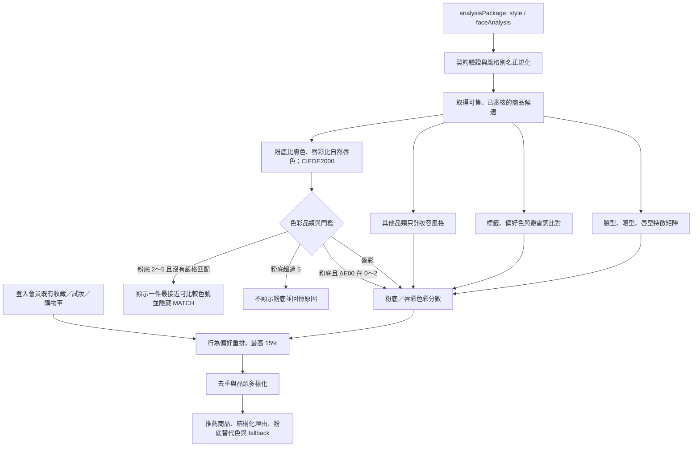

# 妝識你的美 - Decorate Me

[](https://www.python.org/)
[](https://flask.palletsprojects.com/)
[](https://www.postgresql.org/)
[](https://redis.io/)
[](https://docs.docker.com/compose/)

> **妝識你的美（Decorate Me）** 是結合會員服務、彩妝商品管理、妝容紀錄與個人化推薦的 Web 平台。後端以 Flask 提供 API 與 Jinja 頁面，資料層使用 PostgreSQL 18 與 Redis；粉底／唇彩使用 CIEDE2000 色彩距離，其餘品類依妝容風格進行可解釋推薦。

---

## 快速開始（Getting Started）

### 1. 環境需求

- Docker Desktop（建議）或 Python 3.11+
- PostgreSQL 18
- Redis 7
- SMTP 寄信帳號及應用程式密碼（註冊／重設密碼 OTP 必要）

### 2. 設定環境變數

複製 Docker 環境範本：

```powershell
Copy-Item .env.docker.example .env
```

正式環境至少應設定：

```dotenv
SECRET_KEY=請改成高熵亂數
DB_PASSWORD=請改成安全密碼
SMTP_USER=寄件帳號
SMTP_PASS=寄件應用程式密碼
UPSTREAM_MEMBER_API_KEY=Gateway金鑰
GATEWAY_KEY_LOOSE_MODE=false
```

### 3. Docker 部署（推薦）

```powershell
docker compose up -d db redis
docker compose ps
```

預設服務埠：Flask API `5000`、PostgreSQL `5432`、Redis `6379`。

若主機上的 `5432` 或 `6379` 已被占用，可在 `.env` 調整 `DB_PORT_PUBLISHED` 或 `REDIS_PORT_PUBLISHED`；容器內服務埠不需改動。

### 4. 首次初始化資料庫

Docker Compose 不會自動匯入資料庫。專案中的 `postgre.sql` 雖然使用 `.sql` 副檔名，實際上是以 `PGDMP` 開頭的 PostgreSQL **custom-format 備份檔**，必須使用 `pg_restore`，不可用 `psql` 或 `Get-Content` 匯入。

只應對全新空白資料庫執行：

```powershell
docker cp .\postgre.sql empower-beauty-db:/tmp/decorate-me.dump
docker compose exec -T db sh -lc 'pg_restore --verbose --no-owner --no-privileges -U "$POSTGRES_USER" -d "$POSTGRES_DB" /tmp/decorate-me.dump'
docker compose up -d --build app
Invoke-WebRequest http://127.0.0.1:5000/health
```

命令會直接使用容器中的 `POSTGRES_USER` 與 `POSTGRES_DB`，不需把帳密寫進終端。既有資料庫不可重複還原整份備份；應先備份，再另外製作並審核 migration。現行備份已包含粉底 `series_id`、`depth_index`、非負限制及相鄰色階索引，但欄位內容仍須由品牌正式資料回填，不得從色號文字猜測。

### 5. 不使用 Docker 的本機啟動

先建立虛擬環境、安裝依賴，並由 `.env.example` 建立 `.env`：

```powershell
python -m venv .venv
.\.venv\Scripts\Activate.ps1
python -m pip install -r requirements.txt
Copy-Item .env.example .env
python run_local_5000.py
```

本機模式必須自行準備 PostgreSQL、Redis 與資料庫 Schema。`.env.example` 的 `DATABASE_URL`／`DB_*`、Redis 和 SMTP 設定需依實際環境修改。`run_local_5000.py` 會執行 `db.create_all()`，但只能建立 ORM 已宣告的表，不會完整建立 dump 中的 Function、Trigger、View 與全部索引，因此不能取代正式資料庫還原流程。

### 6. 重要環境變數

| 變數 | 必要性 | 用途 |
|---|---|---|
| `DATABASE_URL` 或 `DB_USER`／`DB_PASSWORD`／`DB_HOST`／`DB_PORT`／`DB_NAME` | 必填 | PostgreSQL 連線；`DATABASE_URL` 優先。 |
| `SECRET_KEY` | 必填 | Flask Session 與安全功能；正式環境不可使用預設值。 |
| `JWT_SECRET`、`JWT_ISSUER`、`JWT_EXPIRES_IN` | 建議設定 | Bearer Token 簽章、簽發者與期限；未設定 `JWT_SECRET` 時沿用 `SECRET_KEY`。 |
| `REDIS_URL` 或 `REDIS_HOST`／`REDIS_PORT`／`REDIS_PASSWORD` | 必填 | OTP、TTL、寄送與驗證嘗試限制。 |
| `SMTP_USER`、`SMTP_PASS`、`SMTP_HOST`、`SMTP_PORT` | Email 功能必填 | OTP 郵件寄送；預設 Gmail SMTP 587。 |
| `OTP_EXPIRE_SECONDS`、`OTP_SEND_WINDOW_SECONDS`、`OTP_SEND_MAX_ATTEMPTS` | 選填 | OTP 到期與限流參數。 |
| `PENDING_REGISTRATION_EXPIRE_SECONDS`、`OTP_VERIFIED_WINDOW_SECONDS` | 選填 | 待驗證註冊及驗證完成狀態期限。 |
| `CORS_ALLOWED_ORIGINS` | 正式環境必填 | 逗號分隔的允許前端來源。 |
| `UPSTREAM_MEMBER_API_KEY`、`GATEWAY_KEY_LOOSE_MODE` | 正式環境必填 | Gateway 驗證；正式環境應關閉 loose mode。 |
| `PRODUCT_ADMIN_API_KEY` | 商品管理建議設定 | 商品寫入及管理端 API 金鑰。 |
| `CRAWLER_*` | 選填 | 商品預覽連線逾時、大小、重新導向與限流。 |
| `OTP_DEV_MODE` | 僅本機開發 | 開啟時可略過正式寄信流程，正式環境不得啟用。 |
| `PORT`、`FLASK_DEBUG` | 選填 | 服務埠與除錯模式。 |

---

## 核心功能模組

### 1. 會員帳號與安全防護系統

- **驗證後才成為會員**：註冊資料會先保存在 `pending_registrations`；只有 OTP 驗證成功才寫入 `members`。
- **Email 網域檢查**：驗證格式、MX 記錄與一次性信箱黑名單；`admin@decorateme.local` 是唯一允許的非標準網域帳號。
- **OTP 防護與品牌 Email**：Redis 儲存有效期限、驗證嘗試與寄送時間窗；OTP HTML Email 使用 CID 內嵌 `static/brand/decorate-me-logo.jpg`，同時保留純文字備援內容。
- **密碼與登入**：以 Flask-Bcrypt 雜湊密碼；登入建立 PostgreSQL `member_sessions`，回傳 HttpOnly/Secure/SameSite Cookie 與 Bearer Token。
- **角色與授權**：使用者只能存取自己的資源；管理者可進行會員、商品與爬蟲資料管理。
- **請求安全**：CORS 僅允許設定來源；Cookie 驗證的寫入請求檢查 `Origin` 與 `Sec-Fetch-Site`；API 錯誤回應含 `code`、`message` 與 `requestId`。

### 2. 智慧色彩與風格推薦演算法

- **七種妝容風格**：Soft Baddie、千金、港風、韓系亞裔、病嬌、日雜清透、男士白開水。
- **CIEDE2000 色彩比對**：只有粉底使用 `skinTone.lab`、唇彩使用 `lipLab`；將色彩轉為 CIELAB 後計算 ΔE00。粉底正式匹配門檻為 `0 ≤ ΔE00 ≤ 2.0`；若目前商品清單沒有符合者，可顯示一件 `2 < ΔE00 ≤ 5.0` 的最接近可比較色號，但不得顯示 MATCH 或宣稱正式匹配。眼影、腮紅、修容、打亮與眉彩不使用膚色色差排序。
- **風格與色系偏好**：使用 Jaccard 與 Recall；`avoidTags` 會檢查商品名稱、品牌、描述、規格、色號及標籤並扣分，`preferredColors` 命中則加分。
- **品類邊界清楚**：粉底通過膚色色差 `0～2` 才能稱為正式匹配；找不到時只顯示一件 `2～5` 的最接近可比較色號並附未達門檻提醒。唇彩以自然唇色與妝容風格匹配；其他品類以妝容風格為主。
- **五官欄位保留但不影響其他品類排名**：`faceShape`、`eyeShape`、`browShape` 等仍可用於使用者說明或後續研究，目前非粉底／唇彩商品不以五官或膚色色差加權。
- **伺服器端行為個人化**：登入會員的收藏、試妝紀錄與購物車會彙整為類別／品牌偏好；不把 Email、會員 ID、Token 或影像傳入演算法。
- **預算與品牌偏好**：前端可選擇傳送 `recommendationOptions` 的預算範圍、喜愛品牌與避免品牌；預算及喜愛品牌用於重排，`avoidedBrands` 則採硬性排除。
- **冷啟動保護**：匿名使用者或尚無互動紀錄的會員，維持內容式推薦；行為權重為 0，不會因資料不足而被扣分。
- **眉彩採純風格導向**：眉彩不使用膚色、`browLab` 或 `hairLab` 排序；即使上游日後提供眉色，現行契約仍以妝容風格選品。
- **新商品自動納入**：新商品通過商品契約且進入 `product_catalog` 後，會成為推薦候選；未知分類採預設權重，不會因未寫死分類被忽略。
- **資料庫檢索欄位與狀態**：以商品 `name`、`brand`、`description`、`specs`、`styleTags`／`tags` 與分類比對；只納入 `active`、`approved`、`in_stock`、`recommendation_ready` 全部成立的商品。
- **可重跑排序**：移除隨機微擾；相同分析資料與相同候選商品會得到相同排序，能重跑 Precision@K。
- **可解釋輸出**：每筆商品包含 `matchScore`、八項 `scoreBreakdown`、結構化 `matchReasons`，以及供前端直接呈現的 `recommendationPresentation`；正式匹配畫面固定標示「根據臉部分析結果」，並把臉部分析、妝容風格與主要理由翻譯成自然語句。
- **粉底相鄰色號**：主推薦粉底須先符合膚色色差 `0～2`；同品牌同系列具備 `seriesId` 與正式 `depthIndex` 時，`shadeRecommendation` 依正式順序提供淺一階與深一階，舊資料則在同品牌、同產品系列內使用 LAB 的 L* 近似。替代色相對主推薦色可放寬至 `ΔE00 ≤ 5.0`；不符合時回傳 `null`，不跨品牌補色，也不冒充品牌正式色階。
- **降級與覆蓋資訊**：回應提供 `fallbackReasons`、`skinToneLabReliable`、品類 `coverage`、每類一件的 `primary`、80 分以上的 `alternates` 與 `threshold: 0.80`；有可用商品但因 `limit` 未回傳時，會明確標示「本次 limit 已用完」，不誤報資料庫無商品。

#### 推薦流程圖



### 3. 商品、收藏、試妝與會員服務

- 商品瀏覽、商品 CRUD、色票查詢及商品分類 API。
- 收藏新增、切換、刪除；購物車讀取、新增、更新、刪除。
- 收藏與購物車讀取會保留已刪除商品的會員紀錄並回傳 `unavailable: true`，不會讓整份清單失敗。
- 試妝紀錄、保存妝容、分析歷史及推薦頁面。
- 每日簽到、點數、任務領取、主題兌換與推薦碼。

### 4. 爬蟲商品暫存與管理稽核

- 商品預覽 API 會驗證 URL、過濾不安全網路目標並解析商品資料，以降低 SSRF 風險。
- 爬蟲資料先寫入 `crawler_staging_products`，管理者才可核准或拒絕。
- 商品新增、修改、刪除與暫存審核均可留下產品／管理稽核紀錄。
- 管理者可查詢會員、更新會員、刪除會員、檢視稽核與產品紀錄。

---

## 技術棧（Technology Stack）

| 類別 | 技術 | 用途 |
|---|---|---|
| 後端 | Python 3.11、Flask 3.1.3、Gunicorn | API 與 Web 服務 |
| ORM | Flask-SQLAlchemy、SQLAlchemy 2、psycopg2-binary | ORM 與 PostgreSQL 連線 |
| 資料庫 | PostgreSQL 18 | 資料表、JSONB、Function、Trigger、View、Index |
| 快取 | Redis 7、redis-py | OTP、TTL、嘗試計數與限流 |
| 安全 | Flask-Bcrypt、Flask-Login、Flask-WTF、Flask-CORS、dnspython | 密碼、登入、表單、跨域與 MX 驗證 |
| 爬蟲/預覽 | requests、BeautifulSoup4、httpx、Playwright、Selenium | 商品頁解析與動態網頁支援 |
| 數值/影像 | NumPy、OpenCV-headless、Pillow | 色彩與影像處理 |
| 部署 | Docker、Docker Compose | Flask、PostgreSQL、Redis 容器化 |

> `qdrant-client`、`OLLAMA_HOST` 與 `SD_HOST` 目前僅作為可擴充介面；核心推薦不會呼叫 Qdrant、Ollama 或 Stable Diffusion。

---

## 資料庫模型總覽

### 會員與驗證

| 模型/資料表 | 說明 |
|---|---|
| `members` | 會員、角色、等級、Email 驗證、狀態與 Session 版本 |
| `pending_registrations` | 等待 Email OTP 驗證的註冊資料 |
| `otp_codes` | OTP 目的、雜湊、到期與嘗試狀態 |
| `member_sessions` | 雜湊 Session Token、到期、撤銷與來源識別 |
| `member_deletion_jobs` | 會員刪除作業狀態 |

### 商品、互動與稽核

目前 PostgreSQL Schema 有 **34 張資料表**，包括 `products`、`product_catalog`、八個商品分類表、`crawler_staging_products`、收藏、購物車、簽到、點數、任務、推薦碼、妝容／分析歷史與各類稽核表。

- **專案 Function（11 個）**：`enforce_product_contract`、`register_product_catalog_item`、`product_hex_to_lab`、`daily_member_stats`、簽到／收藏／會員等級與 `sp_*` 查詢函式；此外 `pgcrypto` extension 會提供自己的函式。
- **Trigger（21 個，不含 PostgreSQL 內部 Trigger）**：商品契約檢查、新商品登錄全域商品目錄、簽到重複防護、收藏與會員等級歷程。
- **View**：`view_member_activity`、`view_member_dashboard`、`view_product_list`、`view_product_popularity`。
- **Index**：目前資料庫共 98 個索引（包含主鍵及唯一限制自動建立者），涵蓋商品推薦狀態、正式粉底色階、爬蟲審核、會員 Session/OTP、稽核、點數與任務查詢。

---

## API 概覽

Flask 實際載入後目前有 **81 條 URL 規則**（包含 Flask 內建 static route），合計 **87 個 HTTP 操作**；同一路徑可能依 HTTP method 對應不同處理函式。

| 類別 | 代表端點 |
|---|---|
| 健康 | `GET /health`、`GET /healthz` |
| 認證 | `POST /api/register`、`POST /api/send-otp`、`POST /api/verify-otp`、`POST /api/login`、`POST /api/logout`、`GET /api/me` |
| 會員管理 | `GET /api/members`、`GET/PATCH/DELETE /api/members/<email>`、`GET /api/members/<email>/audit-log`、`GET /api/members/<phone>/stats` |
| 點數與會員活動 | `GET /points`、`POST /points/adjust`、每日簽到 GET/POST、任務 GET/claim、主題 GET/redeem、推薦碼 GET |
| 收藏與購物車 | 收藏列表、toggle、單筆刪除；購物車 GET/PUT、品項 POST/PATCH/DELETE |
| 妝容資料 | 保存妝容 GET/POST/DELETE、分析歷史 GET/POST、`POST /api/tryon/save` |
| 商品目錄 | 商品 GET/POST、單筆 GET/PATCH/DELETE、全分類、八個分類 GET、色票及相似商品 |
| 爬蟲與稽核 | 商品預覽、爬蟲暫存列表／核准／拒絕、產品稽核紀錄 |
| 推薦 | `POST /recommend-products`、`GET /tryon-recommendations` |
| Jinja 頁面 | 首頁、註冊、登入、忘記／重設／變更密碼、收藏、歷史、個人資料、商品及管理頁 |

> `GET/POST /api/members/<email>/referral` 是保留給舊前端的相容路徑，目前固定回傳 HTTP 501；正式推薦碼功能請使用 `GET /api/members/<email>/referral-code`。

### 商品列表與相似商品

`GET /api/products` 支援下列查詢參數：

| 參數 | 說明 |
|---|---|
| `query` / `q` | 搜尋商品名稱、品牌、描述或銷售頁 ID |
| `category` / `type` | 依分類或前端品類名稱篩選，例如 `lip`、`lipsticks` |
| `brand` | 品牌完整名稱，不分英文字母大小寫 |
| `inStock` | `true`／`false`／`1`／`0` |
| `limit` | 每頁 1–100 筆；帶入後回傳游標分頁格式 |
| `cursor` | 上一頁的 `nextCursor` |

未傳 `limit` 時回傳 `{ "products": [...] }`；傳入 `limit` 時會額外回傳 `items`、`total` 與 `nextCursor`。

`GET /api/products/<id>/similar?limit=6` 回傳同品類的相似商品，`limit` 範圍為 1–20。每筆結果包含：

- `similarity` 與色彩、風格、品類、品牌、價格的 `similarityBreakdown`
- `relation`：`same_style_alt`、`lighter_variant`、`darker_variant`、`same_brand` 或 `budget_alt`
- `matchReason`：供前端顯示相似原因

### 個人化推薦

推薦請求範例：

```json
{
  "analysisPackage": {
    "id": "AN-001",
    "schemaVersion": "2026-08-v2",
    "style": "richGirl",
    "faceAnalysis": {
      "faceShape": "oval",
      "browShape": "arched",
      "eyeShape": "almond",
      "lipShape": "full",
      "skinTone": {
        "lab": [65.2, 8.1, 18.4],
        "season": "warm",
        "level": "medium",
        "labReliable": true
      }
    },
    "generativeText": {
      "styleTags": ["luxury", "soft"],
      "preferredColors": ["champagne", "玫瑰"],
      "avoidTags": ["glitter"]
    }
  },
  "limit": 12,
  "recommendationOptions": {
    "preferredBrands": ["3CE", "heme"],
    "avoidedBrands": ["不想看到的品牌"],
    "pricePreference": {"min": 300, "max": 1200, "mode": "value"}
  }
}
```

`analysisPackage.faceAnalysis` 是必填物件；`limit` 必須是 1–50 的整數。`recommendationOptions` 為選填欄位，品牌陣列各最多 20 筆，`pricePreference.mode` 僅接受 `value`、`low`、`high`，且 `min` 不得大於 `max`。

請求的任何巢狀位置均不得放入 Email、姓名、會員 ID、電話、Token、Cookie、原始照片或 Base64 影像。會員身分與既有互動資料只由後端從有效 Session／Bearer Token 取得。

推薦回應中，商品的 `scoreBreakdown` 除了既有的 `colorScore`、`styleScore`、`featureScore`、`availabilityScore` 外，還包含：

| 欄位 | 用途 |
|---|---|
| `priceFit` | 與選填預算區間的契合程度；未設定預算時為中性值。 |
| `brandAffinity` | 與顯式喜愛／避免品牌的契合程度。 |
| `behaviorScore` | 後端從收藏、試妝、購物車彙整的類別／品牌偏好。 |
| `contentScore` | 色彩、風格、五官特徵、庫存與顯式偏好的內容分數。 |
| `personalization` | 回應層級欄位，說明是否套用個人化、互動筆數與行為權重（最高 `0.15`）。 |

其他重要輸出：

| 欄位 | 用途 |
|---|---|
| `matchReason` | 相容既有前端的中文推薦理由字串。 |
| `matchReasons` | 結構化理由陣列，包含 `priority`、`reasonCode`、`personalized`、`text` 與 `evidence`。 |
| `recommendationPresentation` | 前端呈現模型：系統演算法標籤、MATCH 顯示值、自然語句、適用特徵與非準確率聲明。 |
| `recommendationPresentation.colorDifferenceExplanation` | 僅粉底／唇彩回傳的 CIEDE2000 色差白話說明、區間與 QA；其他品類為 `null`。 |
| `foundationSkinMatch` | 每件粉底相對膚色的 ΔE00 與正式 `0～2` 判定；`accepted: false` 但 `displayStatus: closest_available` 代表目前商品清單沒有相近色時顯示的 `2～5` 可比較色號。 |
| `skinToneLabReliable` | 後端依 LAB 型別、三軸完整性及合法值域重新判定的可信狀態。 |
| `colorDifferencePolicy` | 回傳三層用途：膚色 vs. 正式匹配 `0～2`、無嚴格匹配時顯示最接近色號 `2～5`、主推薦 vs. 明暗替代色同品牌同系列 `0～5`。 |
| `foundationMatchStatus` | 粉底門檻狀態、原因、合格／已評估筆數與最接近色差；可能為 `matched`、`closest_available`、`no_match`、`unavailable` 或 `not_requested`。 |
| `fallbackReasons` | 無可靠膚色 LAB 時回傳 `SKIN_TONE_LAB_UNRELIABLE`；顯示 `2～5` 最接近色號時回傳 `FOUNDATION_CLOSEST_AVAILABLE`；所有色號皆超過 5 時回傳 `FOUNDATION_SKIN_DELTA_E_NO_MATCH`。 |
| `shadeRecommendation` | 粉底主推薦與相鄰色；所有模式限定同品牌同產品系列且 `alternativeMaxDeltaE = 5.0`。`official_depth_index` 才顯示淺／深一階，`lab_lightness_approximation` 僅依 L* 提供明暗替代色；不符合時該方向為 `null`。`anchorDeltaE` 是替代色相對主推薦色的色差，`lightnessDifference` 是 L* 明度差。 |

> `matchScore` 是排序分數，不是「商品適合度百分比」或模型準確率。準確率應以人工金標資料、Precision@K 等離線評估另行計算。

### 推薦錯誤契約

| 情況 | HTTP | code / 回應 |
|---|---:|---|
| JSON 語法錯誤或 body 不是物件 | 400 | `INVALID_REQUEST` |
| `limit` 不是整數或不在 1–50 | 400 | `INVALID_REQUEST` |
| 品牌陣列超過 20 筆、價格區間顛倒或 mode 無效 | 400 | `INVALID_REQUEST` |
| 缺少或無效 `analysisPackage` | 422 | `INVALID_ANALYSIS_PACKAGE` |
| 請求含身分、憑證或原始影像欄位 | 422 | `IDENTITY_DATA_NOT_ALLOWED` |
| 未知妝容風格 | 422 | `UNKNOWN_MAKEUP_STYLE` |
| 合法請求但查無可用商品 | 200 | `RECOMMENDATION_EMPTY`，`products: []` |
| 商品資料庫無法使用 | 502 | `PRODUCT_DB_UNAVAILABLE` |
| 商品資料庫查詢逾時 | 504 | `PRODUCT_DB_TIMEOUT` |

錯誤與空結果絕不產生虛構商品；前端應優先讀取 `analysisPackage.recommendations.products`。

---

## 專案目錄結構

```text
Backend database/
├── app.py                     # Flask app、81 條 URL 規則、驗證與各模組整合
├── models.py                  # SQLAlchemy ORM 模型
├── extensions.py              # 共用 db、bcrypt、login_manager 實例
├── config.py                  # .env 載入與 PostgreSQL SQLAlchemy URI 組裝
├── forms.py                   # 註冊、登入、密碼等 WTForms 驗證
├── recommendation.py          # CIEDE2000、動態權重、個人化、理由與粉底相鄰色
├── makeup_keywords.py         # 七種妝容風格定義、別名及關鍵字
├── crawler_preview.py         # 商品頁解析、URL/SSRF 防護與爬蟲限流
├── otp_utils.py               # OTP 產生、雜湊、Redis 與 SMTP/CID 郵件
├── OTP.py                     # 舊啟動相容入口；實際 OTP 路由仍由 app.py 提供
├── sql.py                     # 舊式 CSV／測試資料批次匯入工具
├── seed_data.py               # 呼叫 sql.py 執行開發測試資料匯入
├── postgre.sql                # PostgreSQL 18 custom-format 完整備份，使用 pg_restore
├── run_local_5000.py          # 無 reloader 的本機開發啟動器
├── wait_for_services.py       # 容器啟動前等待 PostgreSQL 與 Redis
├── Dockerfile                 # Linux API 映像及 Gunicorn 啟動設定
├── docker-compose.yml         # Flask、PostgreSQL 18、Redis 服務與資料卷
├── .env.example               # 非 Docker 本機環境變數範本
├── .env.docker.example        # Docker Compose 環境變數範本
├── requirements.txt           # 鎖定版 Python 相依套件
├── Procfile                   # 支援 Procfile 平台的 Gunicorn 啟動命令
├── DOCKER.md                  # Docker 常用操作的精簡補充
├── templates/                 # Jinja 頁面：會員、商品、推薦、後台等
├── static/brand/              # OTP Email 使用的 Decorate Me Logo
├── static/uploads/            # 使用者上傳或試妝產生的執行期檔案
├── tests/recommendation/      # 22 項推薦契約測試與 Precision@K 評估工具
│   └── validate_feedback_aggregate.py # 五官回饋彙總的隱私與結構檢查
├── tests/test_catalog_availability.py # 收藏／購物車商品參照可用性測試
├── 五官回饋彙總_演算法端驗收與使用決議_2026-08-26.md # 資料驗收、用途界線與下一批規格
├── 回覆前端_推薦契約眉型與下架商品標記_2026-08-26.md # 眉型契約、下架商品與前端驗收回覆
├── 回覆前端_shadeRecommendation與coverage修正_2026-08-26.md # 色號三階與品類覆蓋第一次修正紀錄
├── 回覆前端_shadeRecommendation替代色同系列修正_2026-08-26.md # 替代色範圍、ΔE 上限與校對清單
├── 給前端_色差解釋QA顯示改善_2026-08-26.md # 色差說明欄位、QA UI 與驗收規則
├── 給前端_粉底膚色色差0至2與替代色0至5_2026-08-27.md # 兩層色差門檻、空結果與前端驗收
├── backups/                   # PostgreSQL 升級／變更前備份，不納入部署映像
├── catch_errors.py、check_login.py、full_diagnostic.py
│                                # 問題排查腳本
└── *_test.py、test_*.py、quick_test.py 等
                                 # 歷史手動 smoke test；正式測試以 tests/ 為準
```

`Redis.msi` 是 Windows 本機安裝檔，不是應用程式執行時相依項；Docker 使用者不需要執行它。`OTP.env` 是舊式 OTP 設定樣板，現行程式以根目錄 `.env` 與作業系統環境變數為準。README 不建議把這兩個檔案納入正式部署產物。

---

## 測試、限制與安全提醒

```powershell
python -m py_compile app.py recommendation.py
$env:PYTHONPATH='.'
python tests/recommendation/test_recommendation_contract.py
python tests/recommendation/validate_feedback_aggregate.py <彙總JSON路徑>
python tests\recommendation\evaluate_precision_at_k.py gold.json predictions.json
docker compose ps
```

- `test_recommendation_contract.py` 現有 22 項測試，涵蓋粉底正式匹配 `ΔE00 0～2`、沒有嚴格匹配時顯示 `2～5` 最接近可比較色號但隱藏 MATCH、替代色相對主推薦放寬至 `0～5`、只有粉底／唇彩使用輸入色彩、風格品類不受膚色影響、limit 覆蓋原因、官方色階與 LAB 降級不得混用，以及替代色不得跨品牌／跨產品系列；商品參照另有 1 項可用性測試。
- 路由層還應在可連線的 PostgreSQL／Redis 環境驗證商品過濾、相似商品、502 `PRODUCT_DB_UNAVAILABLE` 與 504 `PRODUCT_DB_TIMEOUT`。純演算法單元測試不會模擬資料庫離線。
- 評估工具可計算 Precision@5/10、重複率、停用商品率與幻覺商品率；尚未建立人工金標集前，不宣稱準確率數字。
- 不可提交 `.env`、SMTP 密碼、Gateway/Bearer Key、真實個資、正式資料庫 dump 或 Docker Volume。
- `backups/` 是 PostgreSQL 升級前還原點；先做異地加密備份，再考慮清理。
- 正式上線應設定固定 HTTPS 網域、`GATEWAY_KEY_LOOSE_MODE=false`、由 Gateway 傳送 `X-Gateway-Key`，並執行權限、CORS、OTP、備份還原與資安測試。
- 協同過濾、Learning-to-Rank、MDP／強化學習與完整曝光／點擊／購買事件表仍是未來擴充項目；目前正式使用的是可重現、可解釋的內容式＋有限行為重排推薦。

---
