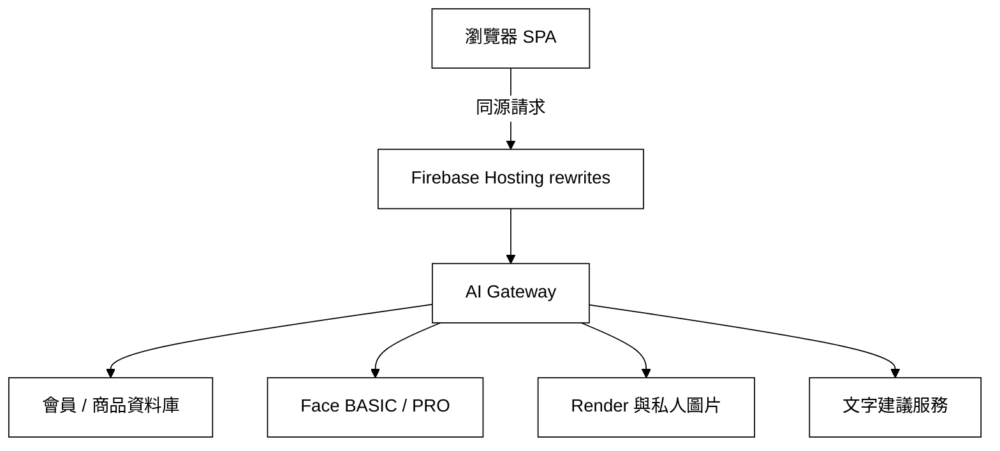

# 妝識你的美-DecorateMeAI｜Web 前端

[](https://firebase.google.com/docs/hosting)
[](https://developer.mozilla.org/docs/Web/JavaScript)
[](#技術棧)
[](#測試與診斷工具)

> 本分支 `dev_makeup` 是 **妝識你的美（DecorateMeAI）** 的正式 Web 前端與 Firebase Hosting 部署來源。
> 以原生 JavaScript 撰寫的單頁應用，沒有打包步驟，瀏覽器直接載入原始碼。
>
> 正式網站：<https://decorate-me.web.app>（後端原始碼在 `Isa` 分支）

---

## 前端如何連接後端

前端只呼叫正式網站的同源路徑，不保存資料庫網址、上游服務網址或任何 API 金鑰。
所有外部服務都由 AI Gateway 代理，瀏覽器只帶登入後的 HttpOnly session cookie。



走同源的原因有兩個：不必處理跨網域，而且 Gateway 種的 `SameSite=Lax` session cookie
才送得出去。上游網址更換時前端不需要改動，也不需要重新部署。

### 同源入口

| 路徑 | 用途 |
|---|---|
| `/auth/*` | 登入、註冊、OTP、登出與 session 狀態 |
| `/member-database/*` | 會員資料、收藏、購物車、點數、任務與主題 |
| `/product-api/*` | 公開商品資料 |
| `/admin-api/*` | 管理員的會員與商品操作 |
| `/face-basic/*`、`/face-pro/*` | 臉部分析 |
| `/render-service/*` | 妝容渲染工作 |
| `/text-suggestion/*` | 文字建議（服務目前關閉，回 503） |
| `/media/render/{jobId}` | 登入後讀取本人的私人渲染圖 |
| `/public-config` | 由 Gateway 發布的同源路徑設定 |

---

## 核心功能模組

### 1. 身分與寫入防線（`js/api.js`）

* **Session-only 登入**：登入後由 Gateway 種 HttpOnly cookie，前端不保存 Bearer token。
  登入完成會再打一次 `/auth/session` 確認，並把不含 email 的 actor 識別碼
  pin 在**這一個分頁**的 `sessionStorage`。
* **寫入前先確認身分**：每一條會改變資料的請求，送出前先確認 cookie 裡的身分
  就是這個分頁以為的那個人。cookie 是整個網域共用、`sessionStorage` 是分頁各自的，
  在另一個分頁登入別的帳號會蓋掉 cookie，被動等到 403 才發現時，
  第一筆寫入已經帶著別人的憑證送出去了。
* **擋下與登出分開處理**：沒有可用的身分時只擋下該次寫入；
  只有在確實偵測到換帳號（Gateway 回 409，或 session 讀回來的身分與本機不符）
  才停止動作並清除本機資料。
* **錯誤訊息統一中文化**：後端保留穩定的英文錯誤碼供程式判斷，
  前端集中翻譯成使用者看得懂的說明，不把內部服務細節丟進彈窗。

### 2. 臉部分析與妝容流程（`js/router.js`、`pages/`）

* **BASIC 與 PRO 兩種模式**：BASIC 上傳單張照片，PRO 透過多角度引導拍攝
  建立更完整的輪廓資料。兩者都是提交後輪詢工作狀態。
* **分析包只留在本分頁**：完整分析結果暫存於 `sessionStorage`，30 分鐘後失效，
  關閉分頁即消失。
* **妝容風格與渲染**：依分析結果與選定風格產生妝容建議與渲染圖，
  渲染次數依會員方案計算，訪客不可使用。
* **私人圖片**：收藏圖一律走 `/media/render/{jobId}`，前端不保存公開的儲存空間網址。

### 3. 會員成長系統

* 點數、每日簽到、任務進度、主題商店與推薦碼，全部透過 Gateway 讀寫資料庫端，
  不在瀏覽器自行核發權益。
* 收藏與購物車採伺服器為準的跨裝置同步；登入前的訪客購物車在登入後合併一次。

### 4. 管理後台（`pages/admin.html`）

* 會員權限與等級管理、商品新增與修改、商品網址匯入、操作稽核紀錄。
* 進入後台的判斷只依據後端 `/auth/session` 回傳的角色，
  不採信本機 `sessionStorage` 中可被竄改的欄位。
* 稽核紀錄顯示去識別化的操作者識別碼，不顯示完整管理員 email。

---

## 技術棧

* **應用結構**：原生 JavaScript（ES6）單頁應用，以 hash 路由切換頁面，無打包步驟
* **樣式**：單一 `css/main.css`，以 CSS 變數提供多組會員主題
* **資料存取**：Fetch API + HttpOnly cookie
* **影像處理**：Web Worker（`js/image-worker.js`）在背景處理上傳影像，避免卡住畫面
* **託管**：Firebase Hosting，以 rewrites 將同源路徑導向 Cloud Run
* **驗證工具**：Node 語法檢查 + 自製 smoke check，無第三方測試框架

---

## 專案目錄結構

```text
web_frontend/                     # 分支 dev_makeup
├── index.html                    # SPA 入口與資產版本戳記
├── 404.html
├── css/
│   └── main.css                  # 全站樣式與主題變數
├── js/
│   ├── api.js                    # Gateway 設定、登入、會員、商品與 Admin API
│   ├── router.js                 # 頁面切換與前台後台的互動流程
│   ├── service-endpoints.js      # 同源服務路徑，不保存秘密
│   ├── config.js                 # 公開設定
│   ├── data.js                   # 靜態資料與對照表
│   └── image-worker.js           # 影像處理 Web Worker
├── pages/                        # 各分頁片段
│   ├── dashboard.html
│   ├── analysis.html             # 臉部分析
│   ├── style.html                # 風格選擇
│   ├── suggestion.html           # 妝容建議
│   ├── ai-render.html            # 妝容渲染
│   ├── products.html
│   ├── favorites.html
│   ├── history.html
│   ├── compare.html
│   ├── profile.html
│   └── admin.html                # 管理後台
├── firebase.json                 # Hosting rewrites、快取與安全標頭
├── frontend_smoke_check.js       # 安全與 API 契約檢查
├── deploy.ps1                    # 部署前檢查、秘密掃描與發布
├── update-db-url.ps1             # 更新 Gateway 的資料庫網址
├── dev_server.py                 # 本機靜態伺服器
├── config.local.js               # 本機公開設定（不放任何秘密）
├── config.local.example.js       # 設定範例
└── docs/                         # 規格書與交接文件
```

---

## 快速開始

### 1. 取得原始碼

```bash
git clone https://github.com/vivi930319/DecorateMeAI.git
cd DecorateMeAI
git checkout dev_makeup
```

### 2. 本機設定

複製設定範例後依需要調整。這個檔案會被部署、瀏覽器直接下載得到，
**只放公開資訊，不要放任何金鑰**：

```bash
cp config.local.example.js config.local.js
```

從 `localhost` 或 `127.0.0.1` 開啟時，若未指定 `aiGatewayUrl`，
前端會自動指向本機 Gateway 的 8015 埠，不需要額外設定。

### 3. 啟動本機伺服器

```bash
python dev_server.py
```

不要直接以 `file://` 開啟 `index.html`，分頁片段是以 fetch 載入的，
`file://` 協定會被瀏覽器阻擋。

---

## 測試與診斷工具

```bash
node --check js/api.js
node --check js/router.js
node frontend_smoke_check.js
```

`frontend_smoke_check.js` 檢查的是契約與安全行為，不是畫面外觀：
寫入防線的回傳形狀、被擋下時的原因代碼、以及前端不得出現的秘密欄位。

---

## 部署

```powershell
.\deploy.ps1
```

`deploy.ps1` 會依序執行：

1. `js/api.js` 與 `js/router.js` 的語法檢查
2. `frontend_smoke_check.js`
3. 秘密掃描：確認公開前端沒有上游金鑰欄位或臨時通道網址
4. 確認工作目錄乾淨（緊急部署需明確加上 `-AllowDirty`）
5. 將 `index.html` 中本地 JS 的版本查詢字串戳成當下時間戳
6. `firebase deploy`

### 部署後的驗證

本專案位於 OneDrive 同步資料夾下，部署有可能傳到尚未同步完成的舊檔，
因此**必須實際抓線上檔案確認**，不能只看部署指令的輸出：

```bash
curl -s "https://decorate-me.web.app/js/router.js?v=<本次版本戳>" | grep -c "<這次新增的識別字串>"
curl -s "https://decorate-me.web.app/public-config"
```

同時確認未登入時私人媒體回 401，登入後會員、商品與後台功能可正常讀取。

---

## 常見狀況

| 現象 | 說明 |
|---|---|
| 更新後進後台出現 401 | 舊的登入狀態不能沿用，請先登出、重新整理，再以管理員帳號登入 |
| Console 出現 `content.js` 的錯誤 | 瀏覽器擴充套件造成，非本站程式碼，可用無痕視窗交叉確認 |
| 文字建議顯示服務暫停 | 上游文字建議服務尚未啟用，Gateway 一律回 503，不影響其他功能 |
| 商品讀得到但會員功能失效 | 兩者走不同上游，通常是會員資料庫端的問題，先確認 `/auth/session` 的狀態碼 |

---

## 資安原則

* 前端與版控都不保存實際 API 金鑰、JWT、密碼或 OTP。
* 不記錄照片、完整分析包、完整 email、權杖或提示詞。
* 儲存空間不為了顯示圖片而改成公開；會員只能取得自己的圖片。
* 刪除收藏或會員時，前端、資料庫、渲染工作與圖片必須同步清除。
* 顯示管理後台與否只依後端驗證過的角色，不採信本機可竄改的欄位。

---

## 分支分工

| 分支 | 內容 |
|---|---|
| `dev_makeup` | Web 前端與 Firebase Hosting |
| `Isa` | Python 後端、AI Gateway、臉部分析、渲染與雲端部署 |
| `lavien` | 會員、商品與推薦資料庫 |
| `dev` | iOS App |
| `Amy` | 組員開發線 |
