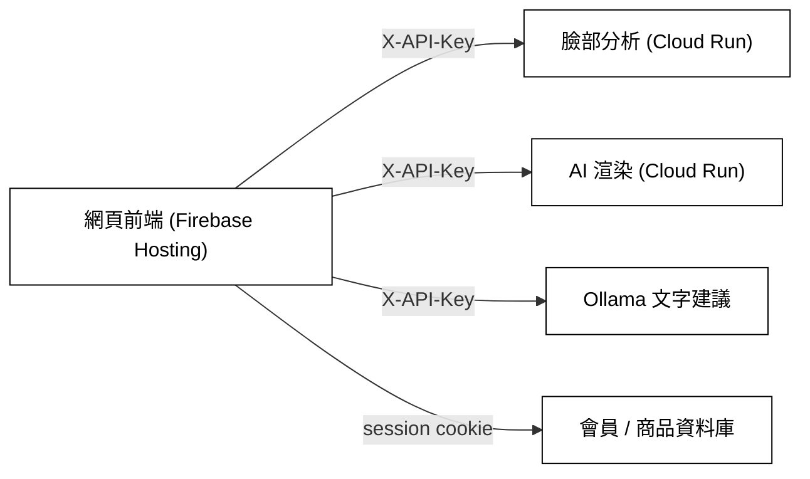
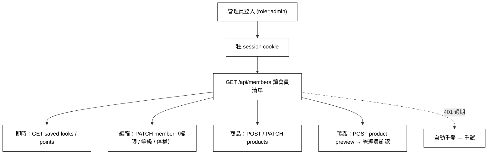

# Decorate Me — 網頁前端

Decorate Me 是一套 AI 美妝系統：使用者上傳一張自拍，系統分析五官與膚色、生成妝容建議，再用 AI 把妝容渲染回同一張臉，並推薦對應的彩妝商品。

本專案是這套系統的**網頁前端**，用原生 JavaScript 開發，部署在 Firebase Hosting。

- 線上：[decorate-me.web.app](https://decorate-me.web.app)

---

## 架構

前端不含後端邏輯，透過 API 串接各服務：



---

## 技術

| 分類 | 使用 |
|------|------|
| 語言 | 原生 JavaScript（不使用框架）、HTML、CSS |
| 部署 | Firebase Hosting |
| 影像處理 | Canvas + Web Worker（上傳前壓縮到 1024px / JPEG 0.78、Gamma 亮度校正） |
| 認證 | 後端 session cookie（`credentials: 'include'`），401 自動重登 |
| 狀態 | sessionStorage（登入）、localStorage（收藏 / 購物車 / 歷史 / 草稿快取） |

---

## 專案結構

```
index.html            進入點，載入各 JS
config.local.js       服務網址與金鑰（本機檔，不進版控）
js/
  config.js           讀取 window.DECORATE_ME_CONFIG
  data.js             風格資料
  api.js              所有 API 呼叫（Api / Auth / AdminStore / Fav / Cart …）
  router.js           Hash 路由、頁面邏輯
  image-worker.js     影像壓縮 Web Worker
pages/                各頁面 HTML（router 動態載入）
css/main.css
deploy.ps1            部署腳本（自動戳版本號後 firebase deploy）
```

---

## 主要功能

- 臉部分析（BASIC / PRO，含相機拍照）
- 妝容建議與 AI 妝容對比圖，可收藏
- 商品推薦與收藏、購物車
- 會員中心（等級、點數、簽到、任務、主題）
- 後台管理（會員權限、商品、即時檢視收藏與點數）

---

## 後台管理（Admin）

僅 `role: admin` 的帳號可進入管理中台（非管理員自動導回首頁）。管理員登入後只顯示獨立後台，不載入一般會員導覽；所有讀寫都走管理員 session cookie。

功能：

- **會員清單**：`GET /api/members`（僅 admin 可讀，匿名 401、非 admin 403）
- **即時檢視**：逐會員顯示妝容收藏數與點數；切回分頁自動刷新（3 秒節流）
- **會員管理**：改角色 / 會員等級 / 停權 / 功能權限（`PATCH /api/members/{email}`）
- **等級連動**：選 VIP / PRO 會員時，自動勾選「PRO 分析」「渲染不限次數」權限
- **商品管理**：新增 / 編輯商品（`POST` / `PATCH /api/products`）
- **爬蟲匯入**：輸入單一商品網址，呼叫 `POST /api/crawler/product-preview` 取得預覽，再帶入商品表單確認上架
- **韌性**：搜尋 200ms debounce；session 過期（401）時自動重登並重試

流程：



---

## 本機執行與部署

```bash
# 1. 設定：複製範本填入實際網址 / 金鑰
cp config.local.example.js config.local.js

# 2. 本機預覽（任一靜態伺服器，例如）
python dev_server.py     # 或 firebase emulators / live server

# 3. 部署（自動戳 JS 版本號避免快取，再 firebase deploy）
./deploy.ps1
```

設定檔 `config.local.js` 只存在本機、不進版控，換環境只改它、不動程式。

---

## 相關分支

同一團隊 repo，不同分支負責不同模組：

- `dev_makeup`（本分支）：網頁前端
- `Isa`：臉部分析與 AI 渲染後端（Python）
- `dev`：iOS App（SwiftUI）
