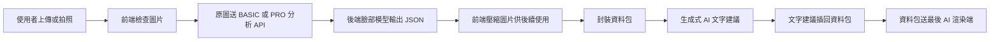

# Teacher Notes Implementation

本文件整理 2026-06-08 會議提醒事項，先以不破壞現有功能為原則完成前端可先做的部分。

## 已先完成

- 臉部分析 API 維持使用原圖，避免降維影響 landmark、鼻型、臉型等判斷。
- 分析完成後，才壓縮圖片並封裝進資料包，供後續生成式 AI 文字建議與圖片渲染使用。
- BASIC / PRO 分析都會包成同一種分析資料物件，保留後續精細分類、妝容生成、商品推薦欄位。
- 分析流程加入暫存草稿 `beautyAnalysisDraft`，方便中斷後檢查最後一次分析狀態。
- loading 狀態拆成 `preparing-image`、`analyzing`、`completed`、`failed`。
- 每張輸入圖都有角色與流水號，例如 `front`、`left45`、`right45`、`side`。

## 分析資料物件

```js
{
  schemaVersion: '2026-06-v1',
  id: 'AN-...',
  mode: 'basic | pro',
  client: 'web',
  userId: null,
  status: 'draft | image-selected | queued | analyzing | completed | failed',
  images: {
    front: {
      role: 'front',
      serial: 'front-...',
      originalName: '',
      originalType: '',
      originalSize: 0,
      compressedName: '',
      compressedType: 'image/jpeg',
      compressedSize: 0,
      compressedWidth: 0,
      compressedHeight: 0,
      compressionRatio: 0
    }
  },
  faceAnalysis: {
    version: 'BASIC | PRO',
    faceShape: null,
    browShape: null,
    eyeShape: null,
    noseFront: null,
    lipShape: null,
    skinTone: null,
    raw: null
  },
  analysis: {
    basic: null,
    pro: null,
    confidence: {},
    warnings: []
  },
  generativeText: {
    provider: 'pending | ollama',
    prompt: null,
    suggestion: null,
    model: null,
    status: 'pending | completed | failed',
    error: null
  },
  render: {
    status: 'pending | completed | failed',
    provider: 'pending | replicate',
    replicateTempUrl: null,
    afterImageUrl: null,
    afterImageDataUrl: null,
    beforeImageId: null,
    afterImageId: null,
    styleId: null,
    ollamaPrompt: null,
    makeupOutput: null,
    error: null
  },
  recommendations: {
    style: null,
    products: [],
    tips: [],
    ads: []
  },
  async: {
    jobId: null,
    progress: 0,
    stage: null,
    startedAt: null,
    completedAt: null,
    durationMs: null,
    error: null
  }
}
```

## 資料流程



## 已預留但尚未正式串接

- 資料庫容量與上限：目前只用 localStorage 草稿與 20 筆歷史紀錄，正式版需要後端 DB quota。
- 非同步任務：前端已改成 `POST /v1/face/jobs/basic|pro` 後輪詢 `GET /v1/face/jobs/{jobId}`，目前只是第一版記憶體 job 狀態；正式上線仍需升級成 Redis/Celery/RQ 或其他共享 queue。
- 臉部模型版本：物件已有 `faceAnalyzerVersion`，未來可記錄模型名稱、參數版本、置信度。
- 生成式 AI 文字建議：已預留 `generativeText.prompt`、`generativeText.suggestion`、`generativeText.model`。
- 生成圖與妝容輸出：已預留 `render.ollamaPrompt`、`render.makeupOutput`、`beforeImageId`、`afterImageId`。
- 小廣告、tips、小禮物：已預留在 `recommendations.ads` 與 `recommendations.tips`。
- 男性妝容、台灣水妝容：可在 `STYLES` 增加新風格，不需改分析資料包格式。

## 後續建議

- 後端新增 `/jobs` 或 `/analysis-tasks`，避免大型分析卡住前端。
- DB 圖片表建議只存處理後圖片與原始圖 metadata，原圖可設定保存期限。
- 每次分析保存 `analysisPackageId`，讓圖片、模型輸出、推薦商品、生成圖可以追蹤同一筆流程。
- 若圖片沒有成功送出，前端應顯示資料包狀態與錯誤訊息，避免使用者不知道卡在哪一步。
