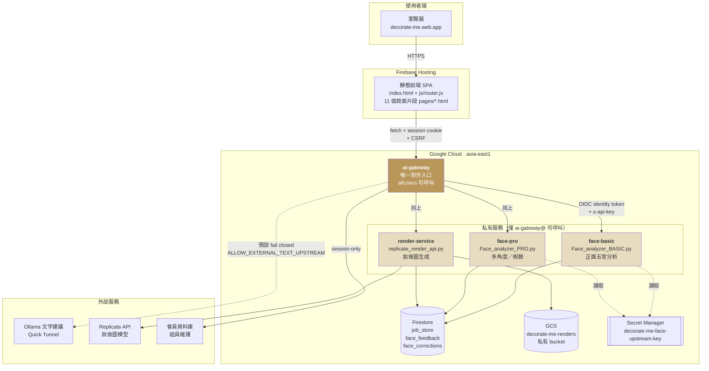
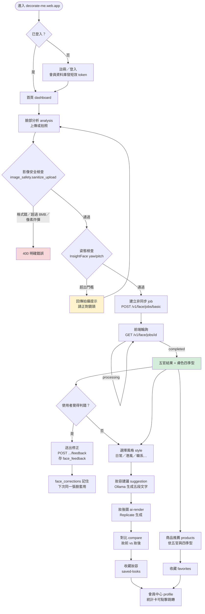
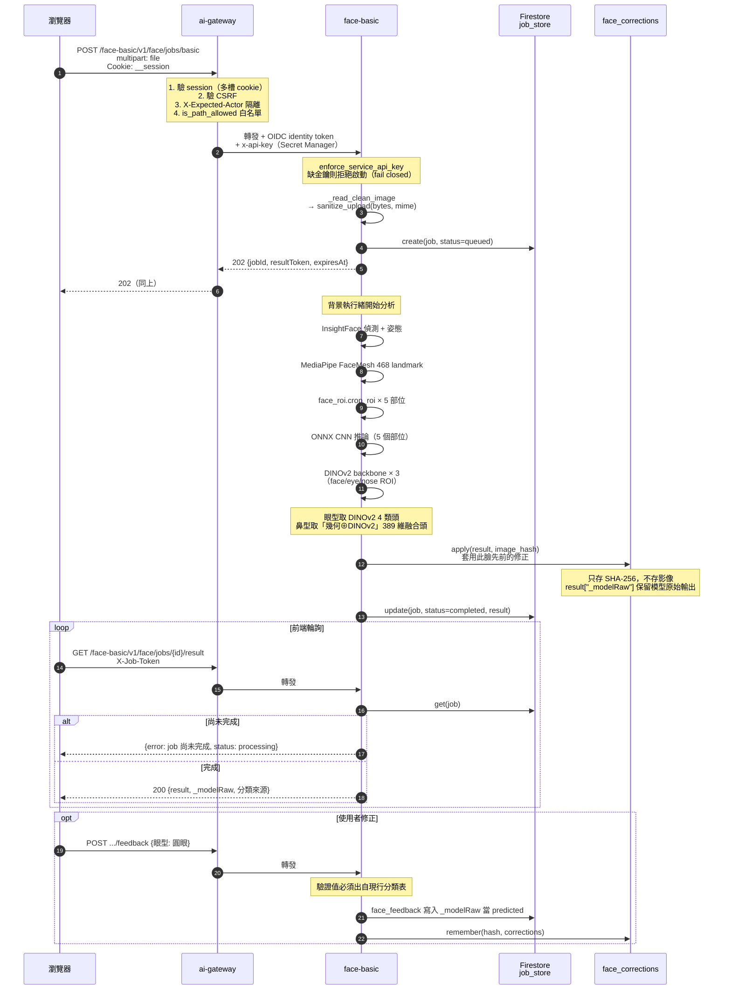
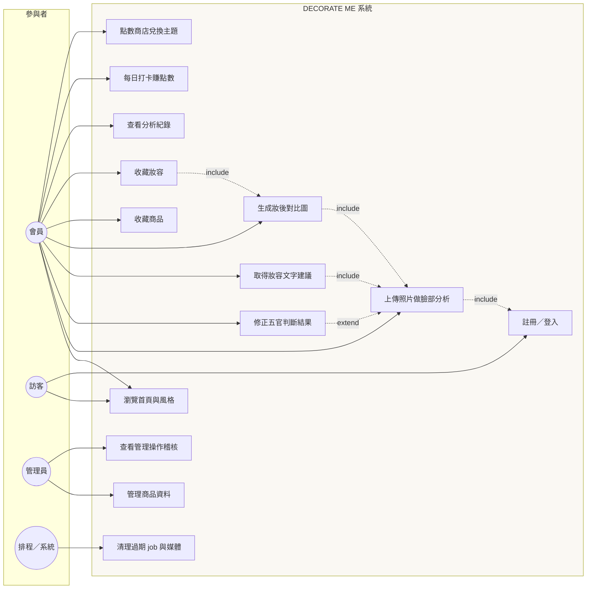
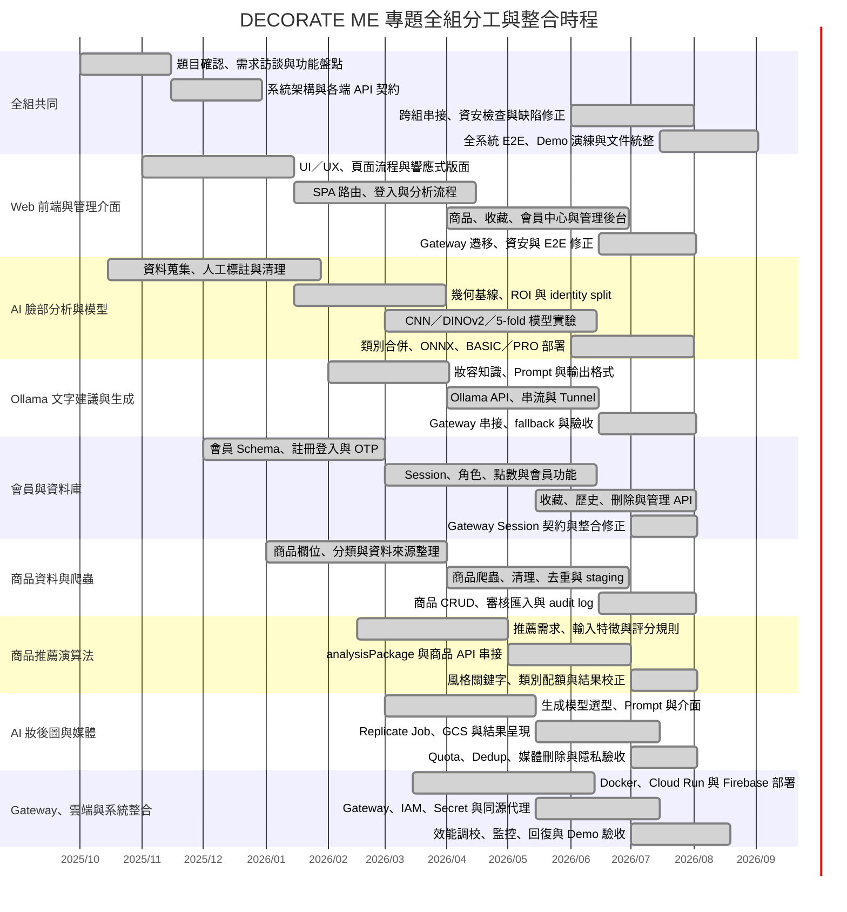
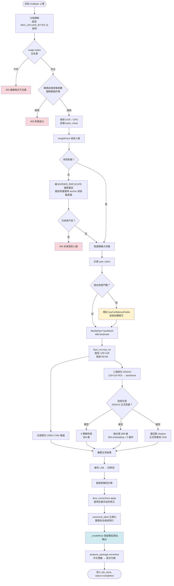

# DECORATE ME · 六大系統圖

**基準日：** 2026-07-31
**用途：** 專題面試／口試答辯
**繪圖語法：** Mermaid（GitHub、VS Code、Typora 皆可直接渲染）

> 這裡的每一張圖都對應**實際存在的模組與端點**，不是示意圖。
> 服務名對應 Cloud Run 服務、路徑對應 `ai_gateway.UPSTREAMS` 的 `allowed_paths`、
> 函式名對應原始碼。面試被追問「這個箭頭實際是哪一行」時要答得出來。

---

## 一、系統架構圖

### 關鍵設計決定

| 決定 | 理由 |
| --- | --- |
| **三個分析服務都不開 `allUsers`** | IAM 只綁 `ai-gateway@decorate-me.iam.gserviceaccount.com` 的 `roles/run.invoker`。外面打得到的只有 Gateway，繞過 Gateway 就繞過了 session／CSRF／actor 驗證 |
| **Gateway 用路徑白名單而非黑名單** | `is_path_allowed()` 用 `re.fullmatch`，沒列進 `allowed_paths` 的一律 404。上游新增端點時必須顯式放行 |
| **上游金鑰放 Secret Manager** | `FACE_API_KEY` 以 `secretKeyRef` 注入，不進映像也不進版控 |
| **face-basic 與 face-pro 共用同一個映像** | 靠 `SERVICE_NAME` 環境變數在 `cloud_start.py` 分派（`basic` / `pro` / `suggestion`），一次建置兩支同時更新 |

---

## 二、使用者流程圖

---

## 三、API 串接圖（非同步分析的完整時序）

### 為什麼是非同步

同步 `/v1/face/analyze/basic` 仍然保留，但正式流程走 job：
完整分析含 InsightFace + MediaPipe + 5 次 ONNX + 3 次 DINOv2，
在 Cloud Run 的請求逾時下容易被砍。Job 立刻回 `jobId`，前端輪詢。

- Job TTL：`FACE_JOB_RETENTION_SECONDS = 3600`（1 小時）
- 併發上限：`FACE_JOB_MAX_COUNT = 200`
- 單次分析逾時：`FACE_JOB_TIMEOUT_SECONDS = 180`

---

## 四、使用案例圖

| 使用案例 | 前置條件 | 主要流程 | 例外 |
| --- | --- | --- | --- |
| U3 臉部分析 | 已登入、有正面照 | 上傳 → 安全檢查 → 姿態檢查 → 建 job → 輪詢 → 顯示五官 | 無臉／多臉／姿態超標／檔案超限 → 4xx 並給提示 |
| U4 修正判斷 | 已有 job 結果 | 選新類別 → 驗證屬現行分類表 → 寫 `face_feedback` | 撤回修正必須**刪除**紀錄，不能只是不寫 |
| U6 妝後圖 | 已有分析與風格 | 建 render job → Replicate → 下載進私有 GCS → 回短效網址 | 第三方失敗需回收孤兒物件 |

---

## 五、甘特圖（專題開發歷程）

> 此甘特圖呈現全組各端的平行工作與整合節點，不代表單一成員的個人開發歷程。模型逐代實驗的詳細時程另見模型開發歷程分冊。

---

## 六、活動圖（一次完整分析的內部流程）

### 活動圖裡三個非顯而易見的設計

**1. `BORDER_REPLICATE` 重試（B3）**
資料集是截圖裁出的大頭照，臉常貼齊畫面邊緣。RetinaFace 這類 anchor-based 偵測器
需要臉周圍留餘裕才框得住，直接餵原圖**實測有四成漏掉（545/1297）**。
補一圈複製邊框等於把臉「縮小」回偵測器習慣的比例，實測全數救回。

**2. `_modelRaw` 必須保留（G3）**
套用修正快取後，畫面顯示的是使用者的答案。若回饋面板把那個值當成 `predicted`
送回去，訓練資料會變成**模型在確認自己**——集合被自我循環的假資料填滿，
重訓分數憑空變好，而且從外面完全看不出來。

**3. `canonical_label` 在入口正規化（G2）**
`face_corrections` 存的是使用者當初送出的標籤，而分類表後來合併過。
不換的話，一個已經不存在的類別會被寫進結果，一路流到建議 prompt 與渲染 prompt——
那些對照表只認現行類別，查不到就整句略過，**不報錯**。
