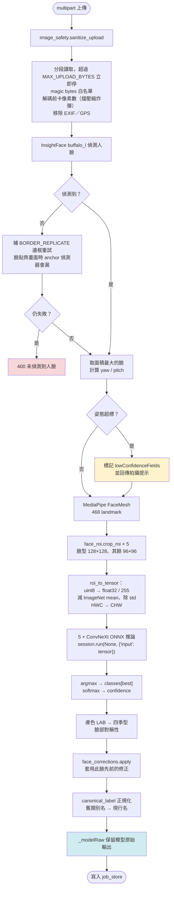

# 最終模型 · 推理流程、選型依據與部署

**基準日：** 2026-07-31
**線上版本：** `face-basic-00038-x2x`，映像 `backend:20260731-060135`
**用途：** 專題面試技術答辯

---

## 一、最終選型

### 1.1 結論

```
五個部位全部使用 ConvNeXt-Tiny（ImageNet 預訓練 + 全網路微調）
DINOv2 完全退場，backbone 不進映像
幾何決策樹與手寫規則式完全退場，僅保留最後一層 fallback
```

| 部位 | 類別數 | macro accuracy | ±std | 亂猜 | 比亂猜好 |
| --- | --- | --- | --- | --- | --- |
| face_shape | 5 | 0.561 | 0.038 | 0.20 | +0.361 |
| brow_shape | 3 | 0.603 | 0.022 | 0.33 | +0.270 |
| eye_shape | 4 | 0.693 | 0.041 | 0.25 | +0.443 |
| nose_shape | 2 | 0.881 | 0.056 | 0.50 | +0.381 |
| lip_shape | 4 | 0.640 | 0.032 | 0.25 | +0.390 |

### 1.2 選型依據：十四種方法的同組比較

同一組 5-fold、按身分分組切分（`split_kfold_by_identity`, seed=42），
所有方法看到的是**完全相同的訓練／驗證切分**，逐 fold 可直接比較。

| 模型 | face | brow | eye | nose | lip |
| --- | --- | --- | --- | --- | --- |
| **ConvNeXt-Tiny** | 0.561 | 0.603 | **0.693** | **0.881** | **0.640** |
| ResNet-50 | **0.604** | 0.587 | 0.660 | 0.877 | 0.578 |
| EfficientNet-B0 | 0.564 | **0.612** | 0.607 | 0.855 | 0.561 |
| MobileNetV3-small | 0.521 | 0.511 | 0.562 | 0.849 | 0.553 |
| AlexNet | 0.494 | 0.422 | 0.628 | 0.867 | 0.396 |
| simple_cnn（無預訓練）| 0.414 | 0.515 | 0.583 | 0.801 | 0.542 |
| DINOv2 ViT-S/14 + SVM | 0.424 | 0.531 | 0.625 | 0.846 | 0.511 |
| DINOv2 ViT-B/14 + SVM | 0.454 | 0.507 | 0.613 | 0.858 | 0.503 |
| 幾何規則（決策樹）| 0.462 | 0.424 | 0.439 | 0.730 | 0.422 |
| 幾何⊕DINOv2 融合 | — | — | — | 0.884 | — |
| 臉輪廓遮罩 224 | 0.520 | — | — | — | — |
| 部位形狀遮罩 | — | 0.452 | — | — | 0.448 |
| 階層式決策樹 | 0.435 | — | — | — | — |

### 1.3 三個支撐這個決定的證據

**證據一：大架構在五個部位全勝，15/15**

三個大架構（EfficientNet／ResNet／ConvNeXt）在**每一個部位**都贏過 MobileNetV3。
這推翻了本專案從世代 1 起的核心假設「資料太少所以要用小模型」。

錯在把「參數量 > 樣本數 → 過擬合」套到**遷移學習**上。
遷移學習微調的是**已經學好的表示**，不是從零學——更好的 backbone 提供更好的起點，
這個效果大於容量帶來的過擬合風險。

> **15/15 的一致性不需要統計檢定。** 五個部位是五個不同的資料集、
> 不同類別數、不同難度，同時往同一方向動，很難用運氣解釋。

**證據二：同時變準又變快**

```
切換前  MobileNet×5 (3ms) + DINOv2×3 (330ms)  =  333 ms
切換後  ConvNeXt×5，完全不用 DINOv2            =   99 ms
```

DINOv2 那 330ms 買到的眼型 0.625，ConvNeXt 用 20ms 就做到 0.693。
**這種情況很少見**——換大模型通常要在準確度與延遲之間取捨。

**證據三：ConvNeXt 的標準差最小**

```
ConvNeXt   std 0.022 ~ 0.056
AlexNet    std 0.136 ~ 0.145   ← 過擬合的樣貌
```

AlexNet 不是平均低，是**不穩定**（臉型有一折崩到 0.213）。
57M 參數裡有 58M 在最後三層全連接層，那正是小資料最容易過擬合的地方。

### 1.4 為什麼不是 ResNet-50（臉型分數更高）

ResNet-50 臉型 0.604 > ConvNeXt 0.561，差距 0.043。但：

- 兩者的 std 是 0.047 / 0.038，**差距落在標準差內**，依 §9.2 只能算「不下定論」
- 要用它就得同時載入兩種架構，多 94MB 與一套推論路徑
- ConvNeXt 在其餘四個部位是最佳或接近最佳

**單一架構的維護成本低於 0.043 的不確定收益。**

### 1.5 ⚠️ 一個不能一般化的結論

PRO 側臉任務上，**ConvNeXt 是四種架構裡最差的**（0.461，還輸 MobileNet 的 0.469），
ResNet-50 才是最佳（0.541）。

```
BASIC（ROI 裁切、96/128px）   ConvNeXt 最佳
PRO（整張側臉、224px）        ConvNeXt 最差
```

**最佳架構是任務相依的。** 成立的一般結論只有「大架構 > MobileNetV3」，
不是「ConvNeXt 最好」。

---

## 二、推理流程逐步

### 2.1 完整路徑



### 2.2 前處理必須與訓練完全一致

```python
IMAGENET_MEAN = np.array([0.485, 0.456, 0.406], dtype=np.float32)
IMAGENET_STD  = np.array([0.229, 0.224, 0.225], dtype=np.float32)

img = roi.astype(np.float32) / 255.0        # 已是 RGB
img = (img - IMAGENET_MEAN) / IMAGENET_STD
tensor = img.transpose(2, 0, 1)[None]        # HWC → NCHW
```

**任何一步不一致，分類器就會拿到偏掉的輸入分佈，而且不會報錯。**
訓練端在 `RoiDataset.__getitem__`、推論端在 `face_roi.roi_to_tensor`，
兩邊用同一組常數（`face_roi.IMAGENET_MEAN` / `IMAGENET_STD`）。

### 2.3 三個非顯而易見的設計

**（1）`BORDER_REPLICATE` 重試**

資料集是截圖裁出的大頭照，臉常貼齊畫面邊緣。RetinaFace 這類 anchor-based 偵測器
需要臉周圍留餘裕才框得住，**實測直接餵原圖有四成漏掉（545/1297）**。
補一圈複製邊框等於把臉「縮小」回偵測器習慣的比例，實測全數救回。

**（2）`_modelRaw` 必須保留**

套用修正快取後，畫面顯示的是使用者的答案。若回饋面板把那個值當成 `predicted`
送回去，訓練資料會變成**模型在確認自己**——集合被自我循環的假資料填滿，
重訓分數憑空變好，而且從外面完全看不出來。

代價（設計時就知道）：**線上準確率不能再從使用者看到的結果推估**，
要量真實表現得看 `_modelRaw` 或跑離線評估。

**（3）`canonical_label` 在入口正規化**

`face_corrections` 存的是使用者當初送出的標籤，而分類表後來合併過。
不換的話，一個已經不存在的類別會被寫進結果，一路流到建議 prompt 與渲染 prompt——
那些對照表只認現行類別，**查不到就整句略過，不報錯**。

---

## 三、部署上的問題

### 3.1 記憶體：最容易低估的

實測跑完整分析路徑後的行程記憶體：

```
WorkingSet   3,805 MB
Peak         4,074 MB
```

**遠超模型檔本身的 556MB。** 差額來自 ONNX Runtime 的記憶體 arena（中間張量）、
InsightFace buffalo_l 三個模型、MediaPipe、以及 Python/numpy/opencv。

原本的 `2Gi` **必定 OOM**，`4Gi` 太貼邊。最終設 **8Gi**。

> 有確認過容器裡沒有 torch（`requirements.txt` 只有 onnxruntime／mediapipe／
> insightface／opencv-headless），所以 3.8GB 是真實需求，不是本機 venv 灌水。

### 3.2 映像體積

| 項目 | 舊 | 新 |
| --- | --- | --- |
| 五個 CNN ONNX | 30 MB | **556 MB** |
| DINOv2 backbone | 88 MB | **0**（移出白名單）|
| 合計 | ~119 MB | ~557 MB |

**ONNX 匯出的陷阱：** `torch.onnx.export(..., dynamo=False)`。
torch 2.12 的新 exporter 預設會把權重另存成 `<name>.onnx.data`，
**拆成兩個檔就多一個「少複製一個檔就靜默壞掉」的機會**。
ConvNeXt 是 111MB，已實際確認仍是單一自帶權重檔。

### 3.3 冷啟動

```
線上第 1 次分析   10.26 s   ← 含載入 5 × 111MB
線上第 2 次        1.97 s
線上第 3 次        1.84 s
```

**10 秒是使用者絕對不能撞到的。** 解法是 `minScale = 1` 讓實例常駐。

### 3.4 部署過程實際踩到的三個坑

**坑一：新增 import 但 Dockerfile 沒 COPY**

```
face_corrections.py:36  from analysis_package import canonical_label
ModuleNotFoundError: No module named 'analysis_package'
```

該檔在 `.dockerignore` 白名單裡（上傳得到），但 **Dockerfile 沒有 COPY 它**。
**白名單放行與進映像是兩件事，兩邊都要做。**

容器因此拒絕啟動——但這是**正確行為**：流量留在舊 revision，線上沒有中斷。

**坑二：規則樹檔案從來沒進過映像**

白名單只放行 `*.onnx` / `*_classes.json` / `*.npz`，
`*_rule_tree.joblib` 與 `.json` 兩份都沒放行。
`basic_rule_trees._load()` 找不到就記一行 warning、回空 dict——
**線上的臉型與眼型「一直都是 CNN 在答」**，跟架構圖不一致，撐了好幾個世代沒人發現。

**坑三：PRO 忘了解包 tuple，壞了一週**

```python
# image_safety.sanitize_upload 回傳 (bytes, mime)
# BASIC:  contents, _mime = await sanitize_upload(...)   ← 有解包
# PRO:    return await sanitize_upload(...)              ← 直接回 tuple
```

型別註記寫著 `-> bytes` 卻回傳 tuple，**沒有任何靜態檢查攔下來**；
端點回 400（看起來像使用者傳錯東西）而非 500，**錯誤率告警也不會叫**。

> **通則：`/health` 只證明程序活著，不證明它做得對事情。**
> 部署後必須打實際的業務端點。這三個坑有兩個是靠打分析端點才發現的。

---

## 四、怎麼控制前端 loading

### 4.1 使用者實際等待的是什麼

線上一次分析約 1.8–2.0 秒，拆解：

| 階段 | 佔比 |
| --- | --- |
| 網路往返（台灣 ↔ asia-east1）+ multipart 上傳 | 大宗 |
| 影像安全檢查（分段讀取、EXIF 移除）| 小 |
| InsightFace + MediaPipe | ~70 ms |
| 五個 ConvNeXt 推論 | ~99 ms |

**模型推論只佔一小部分。** 這一點很重要——換模型能改善的上限有限，
真正的體感由網路與架構決定。

### 4.2 五個控制手段

**（1）非同步 job + 輪詢（最重要）**

```
POST /v1/face/jobs/basic  →  202 {jobId, resultToken}  立刻回
GET  /v1/face/jobs/{id}/result  →  前端輪詢
```

同步端點在 Cloud Run 的請求逾時下容易被砍。非同步讓前端**立刻拿到 jobId**，
可以馬上顯示進度條，而不是一個轉圈到逾時的畫面。

Job 有 `stage` 與 `progress` 欄位（`upload` → `face_analysis` → …），
前端可以顯示「正在偵測人臉」而不是乾等。

**（2）`minScale = 1`：消除冷啟動**

沒有它，第一個使用者要等 10 秒。這是**用錢換體感**，而且是最划算的一筆。

**（3）`containerConcurrency = 6`：防止互相拖慢**

原本是 160——一個實例同時接 160 個請求但只有 2 顆 CPU。
平常自己測沒感覺，但**口試現場五六個人同時上傳，他們會共搶 CPU**，
而 `maxScale = 10` 完全用不到，因為 Cloud Run 認為一個實例還吃得下。

ML 推論是計算密集（CPU-bound），不像 Web API 多數時間在等 I/O，
所以 concurrency 要設在 CPU 數的 2～4 倍：4 CPU × 1.5 ≈ 6。

**（4）姿態預檢：把失敗提早**

`/v1/face/pose` 是獨立的輕量端點。前端可以在**正式送出前**先檢查角度，
不合格就直接提示「請正對鏡頭」，**不必等完整分析跑完才知道白等**。

**（5）移除 DINOv2：省下 330ms**

這是這次換模型的附帶收益。DINOv2 backbone 每次分析跑三次
（臉型／眼型／鼻型各裁一次 224 ROI），單次前向 110ms。

### 4.3 還沒做、但可以做的

| 手段 | 預期效果 | 代價 |
| --- | --- | --- |
| **模型量化（INT8）** | 111MB → 約 28MB，推論更快 | 精度損失，**必須量過再決定** |
| 前端先壓縮再上傳 | 減少上傳時間（目前佔大宗）| 影像品質可能影響判斷 |
| 增加 CPU（4 → 8）| 推論再快一些 | 費用 |
| 部署到更近的區域 | 減少 RTT | asia-east1 已是台灣最近的 |

> **優先順序建議：前端上傳前壓縮 > 量化 > 加 CPU。**
> 因為量測顯示網路與上傳佔的比例最大，而模型推論只有 99ms。

---

## 五、面試可能被問到的

**Q：為什麼最後選 ConvNeXt 而不是分數更高的 ResNet-50（臉型）？**
臉型差 0.043 落在兩者的標準差內（0.047/0.038），依專案的判定規則算「不下定論」。
而 ConvNeXt 在其餘四個部位最佳或接近最佳，用單一架構省下 94MB 與一套推論路徑。

**Q：556MB 的映像不會太大嗎？**
會影響冷啟動，但 `minScale=1` 讓實例常駐，使用者撞不到。
真正的限制是記憶體（8Gi）與 Artifact Registry 儲存費。

**Q：怎麼確認線上真的用了新模型？**
回應的 `分類來源` 欄位每個部位都標 `roi_cnn`，而且 revision 名稱與映像 tag
可以用 `gcloud run services describe` 對照。**不能只看部署指令說成功。**

**Q：使用者等 2 秒會不會太久？**
拆解顯示模型推論只佔 99ms，多數是網路與上傳。要再快，該優化的是上傳
（前端壓縮）而不是模型。非同步 job 讓使用者看到進度而非空白等待。

**Q：如果模型檔載入失敗會怎樣？**
`basic_roi_shadow` 的設計是**任何一步失敗就永久停用該路徑並記 log**，
不影響服務啟動；分析會退回手寫規則式 fallback。
但那個 fallback 只有 0.42～0.44，**明顯較差——所以載入失敗必須被監控到，
不能當成「反正有 fallback」**。
