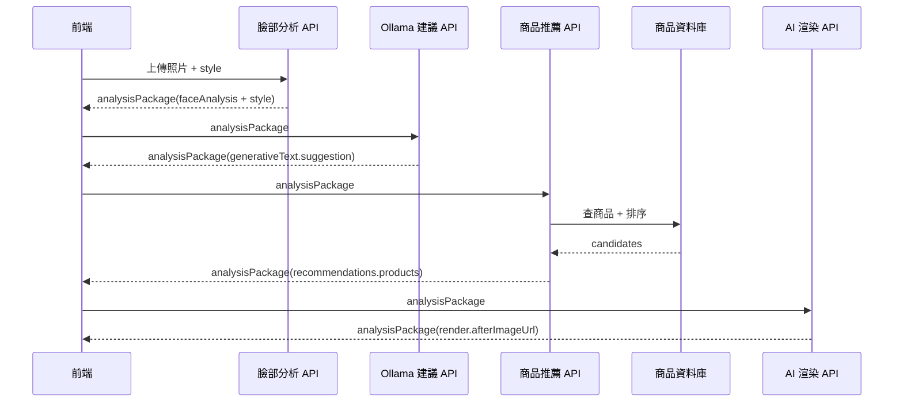

# 演算法端接口規格書：Analysis Package、Ollama 建議與商品推薦

> 文件版本：`2026-07-13-v1`
> 對象：臉部分析演算法端、Ollama 文字建議端、商品推薦演算法端、商品資料庫維護端
> 核心原則：前端只負責上傳、輪詢、顯示；推薦計算、Ollama 語意萃取、商品資料庫查詢都應由後端完成。

## 0. 總覽

本系統的核心資料單位是 `analysisPackage`。它應封裝：

- 臉部分析結果：臉型、眉型、眼型、鼻型、唇型、膚色、唇色 Lab
- 使用者選擇風格：`style`
- Ollama 產生的文字建議：`generativeText.suggestion`
- 商品推薦結果：`recommendations.products`
- 渲染結果：`render.afterImageUrl`

前端理想上只需拿到一包完整資料：

```json
{
  "status": "completed",
  "analysisPackage": {
    "id": "AN_xxx",
    "faceAnalysis": {},
    "style": "韓系亞裔",
    "generativeText": {},
    "recommendations": {
      "products": []
    },
    "render": {}
  }
}
```

## 1. 整體流程



若要進一步提升前端效率，建議由後端整合成一支 orchestration API，讓前端只打一次：

```text
POST /v1/analysis/full
```

但就算服務拆開，所有服務也應統一吃 `analysisPackage`，避免前端重組欄位。

## 2. 共用規範

### 2.1 通訊

| 項目 | 規格 |
| --- | --- |
| Protocol | HTTPS |
| Request Content-Type | `application/json`，上傳圖片端點可用 `multipart/form-data` |
| Response Content-Type | `application/json; charset=utf-8` |
| Auth | 正式環境建議使用 `X-API-Key` 或後端內網服務認證 |
| Timeout | 前端互動 API 建議 10 秒內先回狀態；長任務用 job 輪詢 |
| Encoding | UTF-8 |

### 2.2 回應錯誤格式

所有演算法端 API 錯誤請固定回：

```json
{
  "status": "failed",
  "error": {
    "code": "INVALID_ANALYSIS_PACKAGE",
    "message": "缺少 analysisPackage.faceAnalysis.skinTone.lab",
    "retryable": false
  }
}
```

常用錯誤碼：

| code | 說明 | retryable |
| --- | --- | --- |
| `INVALID_IMAGE` | 圖片格式錯誤、沒有圖片或圖片太大 | false |
| `NO_FACE_DETECTED` | 偵測不到臉 | false |
| `INVALID_ANALYSIS_PACKAGE` | 資料包缺欄位或格式錯誤 | false |
| `OLLAMA_UNAVAILABLE` | Ollama 無法連線或模型未啟動 | true |
| `PRODUCT_DB_UNAVAILABLE` | 商品資料庫無法連線 | true |
| `RECOMMENDATION_EMPTY` | 有請求但找不到可推薦商品 | false |
| `RATE_LIMITED` | 超過限制 | true |

## 3. analysisPackage 資料包格式

### 3.1 最小必要格式

商品推薦演算法端至少需要以下欄位：

```json
{
  "id": "AN-abc123",
  "schemaVersion": "2026-06-v1",
  "mode": "BASIC",
  "client": "web",
  "userId": "user@example.com",
  "status": "completed",
  "style": "韓系亞裔",
  "createdAt": "2026-07-13T04:00:00Z",
  "updatedAt": "2026-07-13T04:00:00Z",
  "faceAnalysis": {
    "version": "BASIC",
    "faceShape": "oval",
    "browShape": "straight",
    "eyeShape": "almond",
    "noseFront": "standard",
    "lipShape": "m_shape",
    "skinTone": {
      "season": "spring",
      "level": "白皙自然色",
      "lab": [72.1, 10.4, 18.2],
      "labSource": "正面照"
    },
    "lipLab": [48.3, 22.1, 12.5],
    "sidePhotoUsed": false
  },
  "generativeText": {
    "status": "completed",
    "provider": "ollama",
    "model": "gemma3",
    "suggestion": "整體妝容方向...",
    "styleTags": ["sheer", "dewy", "soft"],
    "preferredColors": ["peach", "rose beige", "milk tea"],
    "avoidTags": ["heavy-smoky", "high-contrast"],
    "error": null
  },
  "recommendations": {
    "products": []
  }
}
```

### 3.2 重要欄位說明

| 欄位 | 型別 | 必填 | 說明 |
| --- | --- | --- | --- |
| `id` | string | 是 | 分析資料包 ID |
| `schemaVersion` | string | 是 | 資料包版本 |
| `style` | string | 是 | 使用者選的妝容風格 |
| `faceAnalysis.faceShape` | string | 是 | 臉型 enum |
| `faceAnalysis.eyeShape` | string | 是 | 眼型 enum |
| `faceAnalysis.lipShape` | string | 是 | 唇型 enum |
| `faceAnalysis.skinTone.season` | string | 是 | `spring` / `summer` / `autumn` / `winter` / `unknown` |
| `faceAnalysis.skinTone.lab` | number[3] | 是 | 膚色 Lab，粉底與部分色彩推薦使用 |
| `faceAnalysis.skinTone.labReliable` | boolean | 是（2026-08-03 起） | `false` 代表這次的膚色取樣被頭髮或陰影污染，**不可用於 ΔE 比色**。欄位缺漏時視為 `true` |
| `faceAnalysis.skinTone.labReliability` | object \| null | 否 | 判定細節 `{measured, reliable, spread, threshold, hint}`，供除錯與顯示用 |
| `faceAnalysis.lipLab` | number[3] | 建議必填 | 唇色 Lab，唇彩推薦使用 |
| `generativeText.suggestion` | string | 建議必填 | Ollama 文字建議 |
| `generativeText.styleTags` | string[] | 建議必填 | 從 style/Ollama 建議萃取出的商品風格 tags |
| `generativeText.preferredColors` | string[] | 建議必填 | 推薦色系 |
| `generativeText.avoidTags` | string[] | 否 | 應避免的風格或商品 tags |

### 3.3 enum 值

`style` 建議支援：

```json
[
  "日常自然妝",
  "Soft Baddie",
  "韓系亞裔",
  "日雜清透",
  "千金",
  "港風",
  "病嬌",
  "男士白開水"
]
```

臉部欄位建議 enum：

```json
{
  "faceShape": ["oval", "round", "square", "oblong", "heart", "diamond", "trapezoid", "unknown"],
  "browShape": ["straight", "curved", "drooping_tail", "unknown"],
  "eyeShape": ["narrow", "downturned", "round", "phoenix", "slender", "peach_blossom", "almond", "unknown"],
  "noseFront": ["standard", "wide", "narrow", "unknown"],
  "lipShape": ["full", "thin", "m_shape", "smile", "petal", "unknown"],
  "season": ["spring", "summer", "autumn", "winter", "unknown"]
}
```

## 4. 臉部分析 API

### 4.1 BASIC 分析

```text
POST /v1/face/analyze/basic
```

Request：`multipart/form-data`

| 欄位 | 型別 | 必填 | 說明 |
| --- | --- | --- | --- |
| `image` | file | 是 | 正臉自拍 |
| `style` | string | 是 | 使用者選擇風格 |
| `userId` | string | 否 | 會員 ID 或 email |
| `client` | string | 否 | `web` / `ios` |

Response：

```json
{
  "status": "completed",
  "analysisPackage": {
    "id": "AN-abc123",
    "mode": "BASIC",
    "style": "韓系亞裔",
    "faceAnalysis": {
      "faceShape": "oval",
      "browShape": "straight",
      "eyeShape": "almond",
      "noseFront": "standard",
      "lipShape": "m_shape",
      "skinTone": {
        "season": "spring",
        "level": "白皙自然色",
        "lab": [72.1, 10.4, 18.2],
        "labSource": "正面照"
      },
      "lipLab": [48.3, 22.1, 12.5]
    },
    "generativeText": {
      "status": "pending",
      "provider": "ollama",
      "model": null,
      "suggestion": null,
      "error": null
    },
    "recommendations": {
      "products": []
    }
  }
}
```

### 4.2 PRO 分析

```text
POST /v1/face/analyze/pro
```

Request：`multipart/form-data`

| 欄位 | 型別 | 必填 | 說明 |
| --- | --- | --- | --- |
| `frontImage` | file | 是 | 正臉照 |
| `sideImage` | file | 是 | 側臉照 |
| `style` | string | 是 | 使用者選擇風格 |
| `userId` | string | 否 | 會員 ID 或 email |
| `client` | string | 否 | `web` / `ios` |

Response 格式同 BASIC，但：

```json
{
  "analysisPackage": {
    "mode": "PRO",
    "faceAnalysis": {
      "sidePhotoUsed": true,
      "noseSide": "..."
    }
  }
}
```

## 5. Ollama 文字建議 API

### 5.1 產生建議

```text
POST /suggest
```

Request：

```json
{
  "analysisPackage": {
    "id": "AN-abc123",
    "style": "韓系亞裔",
    "faceAnalysis": {}
  },
  "language": "zh-TW",
  "userNote": "想要自然一點，不要太濃",
  "model": "gemma3"
}
```

Response：

```json
{
  "status": "completed",
  "analysisPackage": {
    "id": "AN-abc123",
    "style": "韓系亞裔",
    "generativeText": {
      "status": "completed",
      "provider": "ollama",
      "model": "gemma3",
      "suggestion": "整體妝容方向...",
      "styleTags": ["sheer", "dewy", "natural", "soft"],
      "preferredColors": ["peach", "rose beige", "milk tea"],
      "avoidTags": ["heavy-smoky", "high-contrast"],
      "renderPromptEn": null,
      "error": null
    }
  }
}
```

### 5.2 重要要求

Ollama 端除了自然語言建議，建議同時輸出結構化欄位：

| 欄位 | 說明 |
| --- | --- |
| `suggestion` | 給使用者看的繁體中文妝容建議 |
| `styleTags` | 給商品推薦端使用的風格 tags |
| `preferredColors` | 建議色系 |
| `avoidTags` | 不適合或應避免 tags |
| `renderPromptEn` | 若渲染端需要，可提供英文 prompt |

若短期內無法改成完整 `analysisPackage` 回應，至少需回：

```json
{
  "status": "completed",
  "provider": "ollama",
  "model": "gemma3",
  "suggestion": "整體妝容方向...",
  "styleTags": ["sheer", "dewy", "natural"],
  "preferredColors": ["peach", "rose beige"],
  "avoidTags": []
}
```

## 6. 商品推薦 API

### 6.1 主要端點

```text
POST /recommend-products
```

Request：

```json
{
  "analysisPackage": {
    "id": "AN-abc123",
    "style": "韓系亞裔",
    "faceAnalysis": {
      "faceShape": "oval",
      "eyeShape": "almond",
      "lipShape": "m_shape",
      "skinTone": {
        "season": "spring",
        "level": "白皙自然色",
        "lab": [72.1, 10.4, 18.2]
      },
      "lipLab": [48.3, 22.1, 12.5]
    },
    "generativeText": {
      "suggestion": "整體妝容方向...",
      "styleTags": ["sheer", "dewy", "natural", "soft"],
      "preferredColors": ["peach", "rose beige", "milk tea"],
      "avoidTags": ["heavy-smoky"]
    }
  },
  "limit": 12,
  "categories": ["base", "lip", "eye", "blush", "contour", "highlight", "brow"]
}
```

Response：

```json
{
  "status": "completed",
  "analysisPackage": {
    "id": "AN-abc123",
    "recommendations": {
      "products": [
        {
          "id": "P001",
          "category": "lip",
          "brand": "品牌名稱",
          "name": "商品名稱",
          "shadeName": "色號名稱",
          "imageUrl": "https://example.com/product.jpg",
          "productUrl": "https://example.com/product",
          "price": 980,
          "currency": "TWD",
          "tags": ["lip", "glossy", "rose", "natural"],
          "lab": [50.1, 23.2, 13.1],
          "score": 0.92,
          "scoreBreakdown": {
            "colorScore": 0.88,
            "styleScore": 0.95,
            "featureScore": 0.80,
            "availabilityScore": 1.0
          },
          "matchReason": "色調接近你的唇色，且符合韓系清透妝的低飽和玫瑰色方向。"
        }
      ]
    }
  }
}
```

### 6.2 商品推薦邏輯責任

商品推薦端必須同時考慮「顏色」與「風格」，不能只用膚色季型排序。

> **2026-08-03 新增 `labReliable`。**
> 臉部分析端會偵測「臉頰被頭髮或陰影蓋住」的情況。實測（`tools/measure_hair_contamination.py`，
> 40 張臉、160 組遮蔽案例）：棕髮與染髮平均有 53% 的像素通過既有的膚色範圍過濾，其中
> 19% 的案例膚色 ΔE 超過 5、最差達 45——足以跳到另一個膚色分級，而且不會有任何錯誤訊息。
>
> 加上紋理過濾後最差 ΔE 降到 22.41，仍未消除，所以另外用「頰部 ROI 內 L 的 MAD」標記可信度：
> 門檻 9.5 之下，所有實質算錯的案例都會被標出（零漏報），代價是 5% 的乾淨照片被誤標。
>
> **`lab` 值照樣回傳**，因為它仍是當下最好的估計；要不要拿它去比色號由推薦端決定。
> 建議做法：`labReliable === false` 時粉底改用季型與 `level` 排序，不要做 ΔE 比色，
> 否則會把使用者配到明顯錯誤的色號。

| 商品類別 | 主要依據 | 次要依據 |
| --- | --- | --- |
| `base` 粉底 | `skinTone.lab` 色差 ΔE（**`labReliable` 為 `false` 時不可用**，改以季型與 `level` 排序） | `skinTone.level`、季型 |
| `lip` 唇彩 | `lipLab` 色差 ΔE | `styleTags`、`preferredColors` |
| `eye` 眼影 | `styleTags`、`preferredColors` | `season`、`eyeShape` |
| `blush` 腮紅 | `styleTags`、`preferredColors` | `season`、`faceShape` |
| `contour` 修容 | `faceShape` | `styleTags`、妝容濃淡 |
| `highlight` 打亮 | `styleTags`、膚色明度 | `season` |
| `brow` 眉彩 | `browShape`、`styleTags` | 髮色資料若未提供可忽略 |

### 6.3 建議排序公式

分數可依類別調整，建議先用：

```text
finalScore =
  colorScore * 0.40 +
  styleScore * 0.35 +
  featureScore * 0.15 +
  availabilityScore * 0.10
```

但類別權重應不同：

| 類別 | 建議權重 |
| --- | --- |
| `base` | colorScore 0.75，styleScore 0.05，featureScore 0.10，availabilityScore 0.10 |
| `lip` | colorScore 0.55，styleScore 0.30，featureScore 0.05，availabilityScore 0.10 |
| `eye` | colorScore 0.25，styleScore 0.55，featureScore 0.10，availabilityScore 0.10 |
| `blush` | colorScore 0.35，styleScore 0.45，featureScore 0.10，availabilityScore 0.10 |
| `contour` | colorScore 0.20，styleScore 0.25，featureScore 0.45，availabilityScore 0.10 |
| `highlight` | colorScore 0.30，styleScore 0.45，featureScore 0.15，availabilityScore 0.10 |
| `brow` | colorScore 0.25，styleScore 0.35，featureScore 0.30，availabilityScore 0.10 |

### 6.4 商品資料庫候選商品格式

商品資料庫提供給推薦端的商品欄位至少需要：

```json
{
  "id": "P001",
  "category": "lip",
  "brand": "品牌名稱",
  "name": "商品名稱",
  "shadeName": "色號名稱",
  "imageUrl": "https://example.com/product.jpg",
  "productUrl": "https://example.com/product",
  "price": 980,
  "currency": "TWD",
  "inStock": true,
  "tags": ["lip", "glossy", "rose", "natural"],
  "styleTags": ["韓系亞裔", "日常自然妝", "日雜清透"],
  "colorFamily": "rose",
  "lab": [50.1, 23.2, 13.1]
}
```

必填欄位：

| 欄位 | 說明 |
| --- | --- |
| `id` | 商品唯一 ID |
| `category` | 商品類別 |
| `name` | 商品名稱 |
| `tags` | 商品 tags，風格推薦必需 |
| `inStock` | 是否可推薦 |
| `lab` | 有色號商品建議必填，粉底/唇彩強烈必填 |

## 7. 前端效率要求

為了前端體感速度，推薦演算法端需要配合：

1. `/recommend-products` 目標回應時間建議小於 1.5 秒。
2. 不要讓前端下載完整商品庫再自行排序。
3. 同一組 `style + skinTone.lab + lipLab + styleTags` 建議後端快取 10 到 30 分鐘。
4. Ollama 若超時，商品推薦端仍需能用 `style` fallback 推薦商品。
5. 回傳商品數量應由 `limit` 控制，預設 12，不要一次回大量商品。
6. 圖片請回 URL，不要回 base64。
7. 商品推薦結果應包含 `matchReason`，前端直接顯示，不要再二次生成文案。

## 8. Fallback 規則

若 `generativeText.suggestion` 或 `styleTags` 尚未產生，商品推薦端應使用 `style` 對應預設 tags。

```json
{
  "港風": ["bold", "dramatic", "smoky", "red", "defined"],
  "韓系亞裔": ["sheer", "dewy", "natural", "soft", "low-saturation"],
  "日常自然妝": ["natural", "light", "soft", "sheer"],
  "千金": ["luxury", "pearl", "champagne", "soft", "shimmer"],
  "Soft Baddie": ["smoky", "bold", "glossy", "defined"],
  "日雜清透": ["sheer", "dewy", "natural", "soft"],
  "病嬌": ["pale", "rosy", "soft", "misty"],
  "男士白開水": ["natural", "minimal", "no-makeup", "matte"]
}
```

Fallback 時 response 需標記：

```json
{
  "recommendations": {
    "fallbackUsed": true,
    "fallbackReason": "generativeText.styleTags missing; used style default tags",
    "products": []
  }
}
```

## 9. 驗收標準

演算法端完成後，至少要通過以下驗收：

1. 同一張臉、同一組膚色，只改 `style`，`eye` / `blush` / `highlight` / `contour` 推薦結果必須明顯不同。
2. `base` 粉底推薦主要跟 `skinTone.lab` 相關，不應因 style 大幅漂移。
3. `lip` 唇彩應同時受 `lipLab` 與 `styleTags` 影響。
4. `generativeText.suggestion` 缺失時，仍能依 `style` 回傳商品。
5. 商品缺 `inStock` 或 `inStock=false` 時不得推薦。
6. 每個商品必須有 `matchReason`。
7. response 必須保持 `analysisPackage` 結構，前端不需要重組資料。
8. `/recommend-products` 不應要求前端傳完整商品資料庫。

## 10. 建議最終接口清單

| 服務 | 方法 | 路徑 | 用途 |
| --- | --- | --- | --- |
| 臉部分析 | POST | `/v1/face/analyze/basic` | BASIC 正臉分析，回 analysisPackage |
| 臉部分析 | POST | `/v1/face/analyze/pro` | PRO 正臉+側臉分析，回 analysisPackage |
| Ollama 建議 | POST | `/suggest` | 接 analysisPackage，回 generativeText |
| Ollama 建議 | POST | `/suggest/stream` | 串流文字建議，前端需要逐字顯示時使用 |
| 商品推薦 | POST | `/recommend-products` | 接 analysisPackage，回 recommendations.products |
| 整合流程 | POST | `/v1/analysis/full` | 選配：一次完成分析、建議、推薦、渲染 |
| 健康檢查 | GET | `/health` | 每個服務都應提供 |

## 11. 給演算法端的重點結論

商品推薦端不要直接依賴前端 UI 狀態，也不要只看 `season`。正確輸入來源應是 `analysisPackage`。

推薦邏輯應分成兩層：

1. 精準色彩層：`skinTone.lab`、`lipLab`
2. 語意風格層：`style`、`generativeText.styleTags`、`generativeText.preferredColors`

Ollama 文字建議應封裝在 `analysisPackage.generativeText` 內，並盡量輸出結構化 tags，讓商品推薦端穩定查詢資料庫，而不是直接用一整段自然語言模糊搜尋商品。
