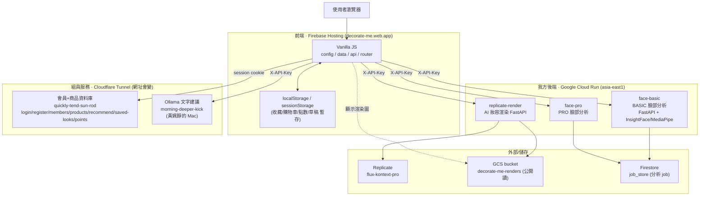
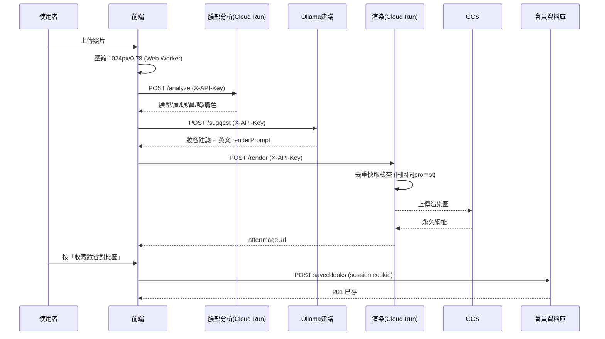
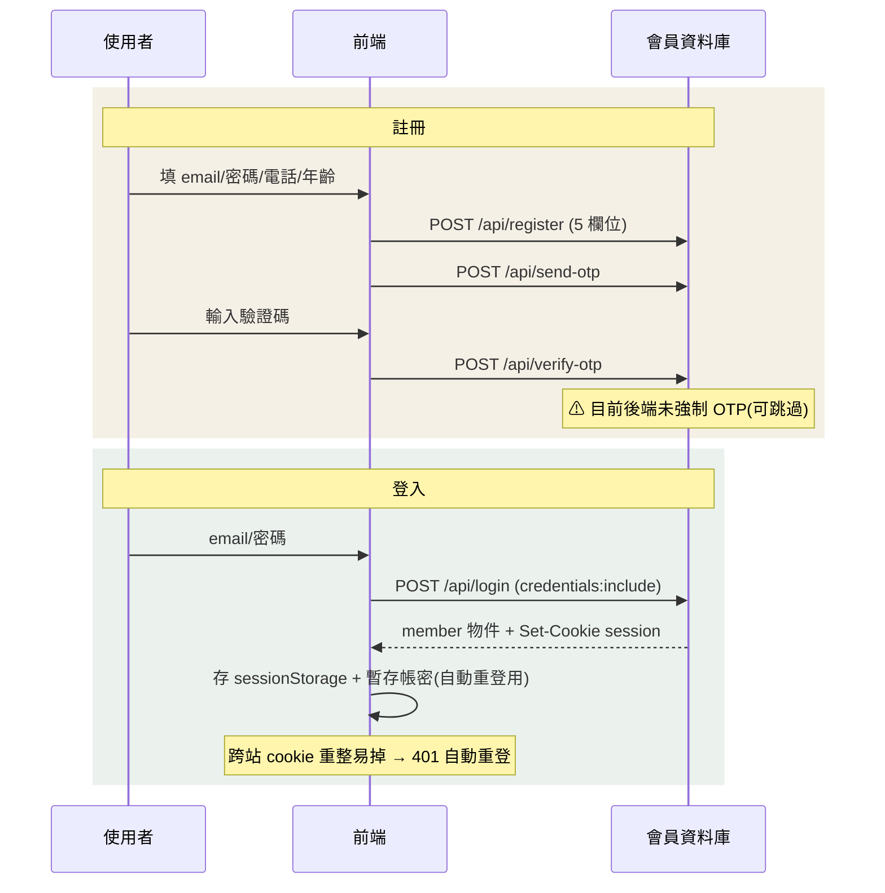
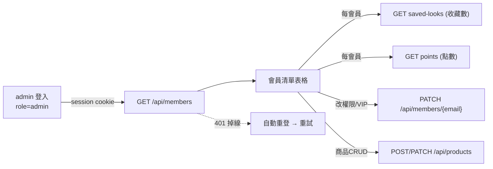
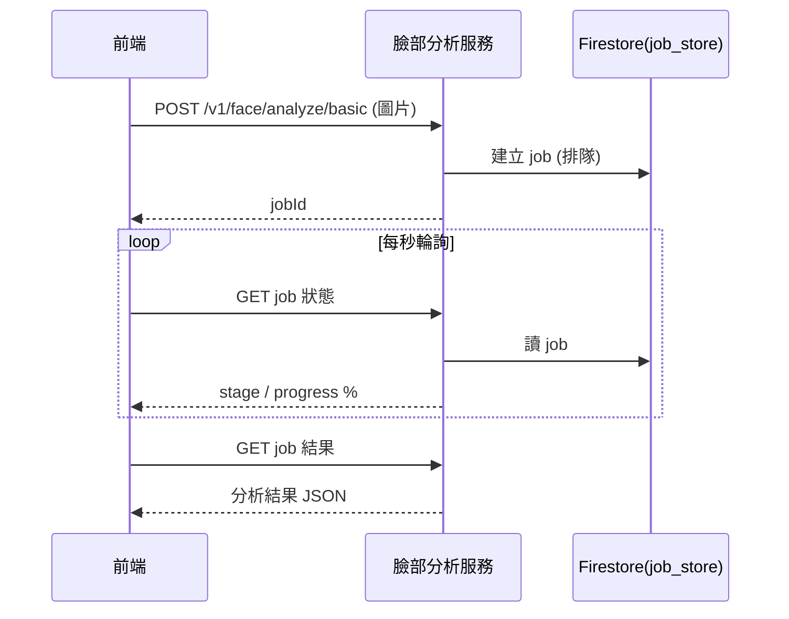
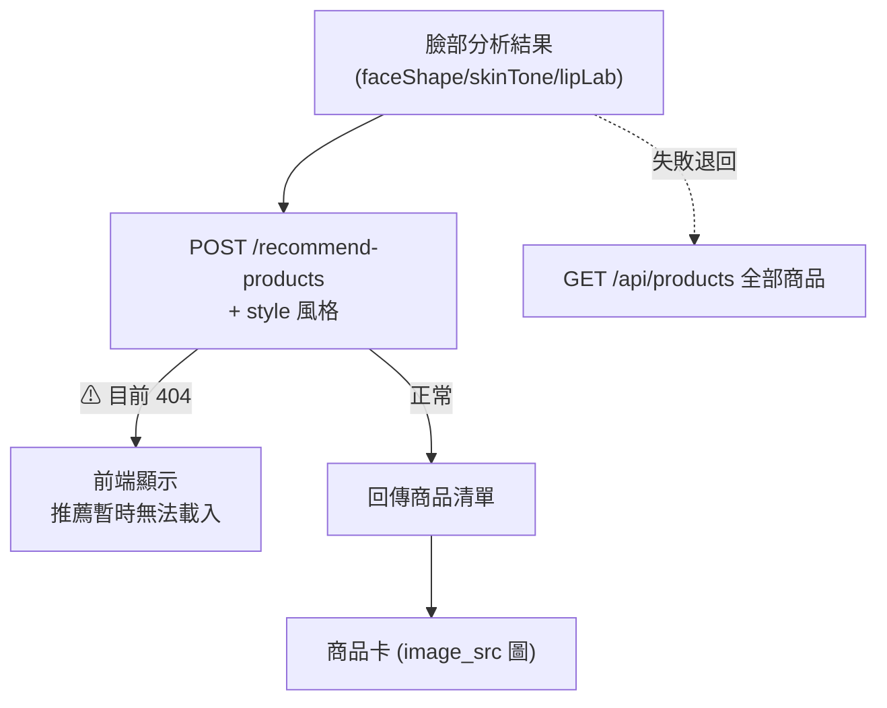

# Decorate Me 系統架構與串接流程圖

> 產出：2026-07-10
> 格式：Mermaid（GitHub / VS Code / mermaid.live 可直接渲染）
> 內容：① 整體技術架構　② 主流程（分析→建議→渲染→收藏）　③ 登入/註冊/OTP　④ 後台管理　⑤ 臉部分析 job　⑥ 商品推薦　⑦ 服務清單

---

## ① 整體技術架構

---

## ② 主流程：上傳 → 分析 → 建議 → 渲染 → 收藏

---

## ③ 登入 / 註冊 / OTP 流程

---

## ④ 後台管理串接

---

## ⑤ 臉部分析 job 流程（非同步）

---

## ⑥ 商品推薦流程

---

## ⑦ 服務與技術清單

| 元件 | 技術 | 位置 / 網址 | 認證 |
|---|---|---|---|
| 前端 | Vanilla JS | Firebase Hosting `decorate-me.web.app` | — |
| BASIC 分析 | FastAPI + InsightFace + MediaPipe | Cloud Run `face-basic-…run.app` | `X-API-Key` |
| PRO 分析 | FastAPI | Cloud Run `face-pro-…run.app` | `X-API-Key` |
| AI 渲染 | FastAPI + Replicate | Cloud Run `replicate-render-…run.app` | `X-API-Key` + 限流 + 去重 |
| 妝容建議 | Ollama | Cloudflare Tunnel `morning-deeper-kick…` | `X-API-Key` |
| 會員+商品庫 | 組員服務 | Cloudflare Tunnel `quickly-tend-sun-rod…` | session cookie |
| 渲染圖儲存 | GCS | bucket `decorate-me-renders` (公開讀) | — |
| 分析 job | Firestore | `job_store` | — |
| 外部 AI | Replicate | `flux-kontext-pro` | API token |

> ⚠ 標註：Cloudflare Tunnel 網址重啟就變（要同步改前端 `config.local.js`）；OTP 後端未強制、推薦端點 404、渲染圖公開——詳見《全系統審查_2026-07-10》與《資料庫端待辦_統一版》。
