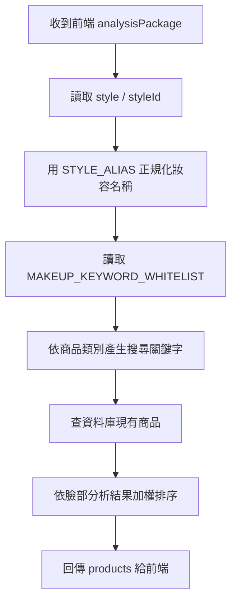

# 給演算法端：妝容風格關鍵字商品推薦串接規格

> 日期：2026-07-28  
> 對象：演算法端／Ollama 文字建議端／商品推薦端  
> 原則：以 Decorate Me 現有前端程式與現有 `analysisPackage` 規格為主，不重做資料包、不要求前端傳整包關鍵字字典。

---

## 1. 這次要解決什麼

目前前端流程已經會讓使用者：

1. 完成臉部分析
2. 選擇妝容風格
3. 產生 Ollama 文字建議
4. 依分析結果與妝容風格推薦商品
5. 需要時再做妝容渲染與收藏

所以演算法端不需要從前端拿完整的 `MAKEUP_KEYWORD_WHITELIST`。

正確做法是：

- 前端只傳「使用者選了哪個妝容」與「臉部分析資料包」
- 演算法端自己維護妝容風格對應的商品關鍵字字典
- 商品推薦端用這些關鍵字去搜尋資料庫既有商品
- 不要讓 Ollama 憑空推薦不存在的商品

這樣效率最高，前端 loading 最輕，也最不容易因為新增商品或調整字典而需要改前端。

---

## 2. 前端現有流程已經有傳妝容選擇

前端目前的核心狀態是：

```js
Router.selectedStyleId
```

這代表使用者選中的妝容 ID。

前端會用這個 ID 找到妝容資料：

```js
const style = STYLES.find(s => s.id === Router.selectedStyleId);
```

接著在產生文字建議時，已經把妝容名稱傳給 Ollama：

```js
Api.suggestMakeup({
    analysisPackage: pkg,
    faceAnalysis: ...,
    style: style?.name || fallback,
    userNote: style?.tags?.join('、') || ''
})
```

因此 Ollama 文字建議本來就可以依照使用者選的妝容產生內容。

---

## 3. 前端不應該做的事

前端不要做以下事情：

1. 不要把 `MAKEUP_KEYWORD_WHITELIST` 整包放在前端
2. 不要在前端硬編碼商品 ID
3. 不要讓前端直接決定推薦哪些商品
4. 不要讓 Ollama 文字直接變成商品名稱
5. 不要為了商品推薦多跑一次很重的前端 loading

原因：

- 商品資料會由資料庫持續更新
- 關鍵字策略是演算法邏輯，不應綁死在 UI
- 前端只負責收集使用者選擇與展示結果
- 推薦商品必須來自資料庫，不可由模型幻覺產生

---

## 4. 前端目前會傳給 Ollama 的資料格式

Endpoint 由 Gateway／前端設定決定，目前前端呼叫邏輯是：

```text
POST /text-suggestion/suggest
```

Request body：

```json
{
  "analysisPackage": {
    "schemaVersion": "2026-06-v1",
    "id": "AN-...",
    "mode": "BASIC",
    "client": "web",
    "status": "completed",
    "faceAnalysis": {
      "faceShape": "oval",
      "browShape": "straight",
      "eyeShape": "almond",
      "noseFront": "standard",
      "noseSide": null,
      "lipShape": "m_shape",
      "skinTone": {
        "season": "spring",
        "level": "warm",
        "lab": [72.1, 10.4, 18.2]
      },
      "lipLab": [48.3, 22.1, 12.5],
      "sidePhotoUsed": false
    }
  },
  "faceAnalysis": {
    "faceShape": "oval",
    "browShape": "straight",
    "eyeShape": "almond",
    "noseFront": "standard",
    "noseSide": null,
    "lipShape": "m_shape",
    "skinTone": {
      "season": "spring",
      "level": "warm",
      "lab": [72.1, 10.4, 18.2]
    },
    "lipLab": [48.3, 22.1, 12.5],
    "sidePhotoUsed": false
  },
  "style": "千金",
  "language": "zh-TW",
  "userNote": "高級感、精緻底妝、低調奢華、氣質妝容"
}
```

演算法端請以 `style` 作為目前使用者選擇妝容的主要依據。

---

## 5. 前端目前會傳給商品推薦端的資料格式

Endpoint 由 Gateway／前端設定決定，目前前端呼叫邏輯是：

```text
POST /recommend-products
```

Request body：

```json
{
  "analysisPackage": {
    "id": "AN-...",
    "style": "richGirl",
    "faceAnalysis": {
      "faceShape": "oval",
      "browShape": "straight",
      "eyeShape": "almond",
      "lipShape": "m_shape",
      "skinTone": {
        "season": "spring",
        "level": "warm",
        "lab": [72.1, 10.4, 18.2]
      },
      "lipLab": [48.3, 22.1, 12.5]
    },
    "generativeText": {
      "suggestion": "Ollama 產生的妝容文字建議"
    }
  },
  "limit": 12
}
```

注意：

- 商品推薦端目前收到的 `style` 是前端穩定使用的 `styleId`
- Ollama 文字建議端收到的 `style` 是妝容顯示名稱
- 演算法端建議同時支援 `styleId` 與中文／英文顯示名稱，避免未來資料來源不一致

---

## 6. 前端現有妝容風格

前端目前以 `STYLES` 為準。演算法端 dictionary 需要支援以下風格：

| 前端 styleId | 顯示名稱 | 備註 |
| --- | --- | --- |
| `softBaddie` | `Soft Baddie` | 甜酷、柔霧、微性感 |
| `richGirl` | `千金` | 高級感、低調奢華 |
| `hongKong` | `港風` | 復古、紅唇、立體輪廓 |
| `koreanClean` | `韓系亞裔` | 乾淨、低飽和、韓系 |
| `yandere` | `病嬌` | 莓果、血色感、脆弱氛圍 |
| `japaneseClear` | `日雜清透` | 清透、柔光、日雜感 |
| `mensPlain` | `男士白開水` | 乾淨、自然、低妝感 |

演算法端請建立一個 mapping，讓 `styleId` 與顯示名稱都能對到同一組 dictionary。

建議：

```python
STYLE_ALIAS = {
    "softBaddie": "Soft Baddie",
    "richGirl": "千金",
    "hongKong": "港風",
    "koreanClean": "韓系亞裔",
    "yandere": "病嬌",
    "japaneseClear": "日雜清透",
    "mensPlain": "男士白開水",
}
```

---

## 7. 關鍵字 dictionary 應該放在哪裡

`MAKEUP_KEYWORD_WHITELIST` 請放在演算法端或商品推薦端，不要放在前端。

原因：

- 商品搜尋策略屬於推薦邏輯
- 未來新增商品、改關鍵字，不需要重新部署前端
- 可避免前端 bundle 變重
- 可避免使用者直接看到或改寫推薦策略

---

## 8. 商品推薦邏輯建議

演算法端收到資料後，建議流程如下：



推薦時請遵守：

1. 商品一定要從資料庫查出來
2. 不要回傳資料庫不存在的商品
3. 沒有命中時可以放寬關鍵字，但要標示 fallback
4. 不要使用膚質與場合，這兩項目前前端與產品規格先不做
5. 每類商品至少嘗試搜尋一組關鍵字
6. 最終回傳最多 12 個商品

---

## 9. 商品類別對照

目前商品 API 使用的 type slug：

```text
foundations
lipsticks
blushes
eyeshadows
eyeliner_mascara
eyebrows
contouring
highlighters
```

目前使用者提供的 dictionary 主要有：

```text
eyeshadows
blushes
lipsticks
```

演算法端可以先以這三類為主：

- 眼影：`eyeshadows`
- 腮紅：`blushes`
- 唇彩：`lipsticks`

如果後續要補底妝、打亮、修容、眉彩、眼線／睫毛膏，再擴充 dictionary 即可。

---

## 10. 回傳格式

商品推薦端請維持前端已支援的格式。

建議格式：

```json
{
  "analysisPackage": {
    "id": "AN-...",
    "recommendations": {
      "products": [
        {
          "id": "lipsticks:123",
          "type": "lipsticks",
          "name": "商品名稱",
          "brand": "品牌",
          "price": 1200,
          "currency": "TWD",
          "imageUrl": "https://example.com/product.jpg",
          "sourceUrl": "https://example.com/product",
          "matchReason": "命中千金妝 lipsticks 關鍵字：水光、緞光"
        }
      ]
    }
  }
}
```

前端也相容以下格式：

```json
{
  "products": []
}
```

但正式建議使用：

```json
{
  "analysisPackage": {
    "recommendations": {
      "products": []
    }
  }
}
```

---

## 11. Ollama 文字建議與商品推薦的分工

Ollama 文字建議端負責：

- 根據臉部分析與妝容風格產生文字建議
- 產生可讀的妝容說明
- 可產生 `renderPromptEn` 給妝容渲染使用

商品推薦端負責：

- 根據妝容風格 dictionary 搜尋商品
- 根據臉部分析結果加權排序
- 回傳資料庫內真實存在的商品

不要讓 Ollama 直接決定商品清單。

推薦策略可以參考：

```text
style / styleId
→ STYLE_ALIAS
→ MAKEUP_KEYWORD_WHITELIST[styleName]
→ category keywords
→ 商品資料庫 keyword search
→ 排序
→ 回傳 products
```

---

## 12. 錯誤與 fallback

建議錯誤格式：

```json
{
  "success": false,
  "error": {
    "code": "RECOMMENDATION_EMPTY",
    "message": "目前找不到符合此妝容風格的商品",
    "retryable": false
  },
  "products": []
}
```

建議錯誤碼：

| code | 說明 | retryable |
| --- | --- | --- |
| `INVALID_ANALYSIS_PACKAGE` | 缺少臉部分析資料包 | false |
| `UNKNOWN_MAKEUP_STYLE` | 找不到妝容風格 | false |
| `RECOMMENDATION_EMPTY` | 查不到可推薦商品 | false |
| `PRODUCT_DB_UNAVAILABLE` | 商品資料庫暫時不可用 | true |
| `OLLAMA_UNAVAILABLE` | Ollama 暫時不可用 | true |

fallback 建議：

1. 先用該妝容該類別完整關鍵字搜尋
2. 沒結果時改用該妝容全部類別關鍵字搜尋
3. 還是沒結果時回傳空陣列，不要編造商品
4. 回傳 `fallbackUsed: true`

---

## 13. 前端目前不需要改的地方

以下前端邏輯目前已符合需求：

- 使用者選擇妝容後，前端已有 `Router.selectedStyleId`
- 產生 Ollama 建議時，前端已有傳 `style: style.name`
- 商品推薦時，前端已有傳 `style: styleId`
- 前端已有傳 `analysisPackage.faceAnalysis`
- 前端已有接收 `analysisPackage.recommendations.products`
- 前端已有 fallback 接收 `products`

因此，這次演算法端請不要要求前端改成傳整包 dictionary。

---

## 14. 驗收標準

演算法端完成後，至少要驗以下案例：

### A. 千金妝

輸入：

```json
{
  "style": "千金",
  "styleId": "richGirl"
}
```

應該：

- 使用 `MAKEUP_KEYWORD_WHITELIST["千金"]`
- 查 `eyeshadows`、`blushes`、`lipsticks`
- 回傳資料庫真實商品
- 不回傳不存在商品

### B. 英文風格

輸入：

```json
{
  "style": "Soft Baddie",
  "styleId": "softBaddie"
}
```

應該：

- 正確對應 `Soft Baddie`
- 不因大小寫或空白失敗

### C. 只收到 styleId

輸入：

```json
{
  "style": "richGirl"
}
```

應該：

- 能透過 alias 對到 `千金`
- 不直接把 `richGirl` 當商品關鍵字搜尋

### D. 查不到商品

應該：

- 回傳空陣列
- 不要請 Ollama 編商品
- 不要前端卡 loading

---

## 15. 給演算法端的結論

這次請實作在演算法／商品推薦端：

1. 接收前端現有 `analysisPackage`
2. 讀取 `style` 或 `styleId`
3. 用 alias 正規化妝容風格
4. 套用 `MAKEUP_KEYWORD_WHITELIST`
5. 查資料庫既有商品
6. 回傳 `analysisPackage.recommendations.products`

前端目前資料包格式已經可以支援，不需要前端傳整包 dictionary，也不需要把商品推薦邏輯搬到前端。

